# Building an Event-Driven Data Lake on AWS

An end to end serverless data lake project for an ecommerce scenario, built entirely on the **AWS Console**: a cart abandonment pipeline with `event-driven` processing, and fraud analysis on payment transactions with **Athena** (`schema-on-read` querying).

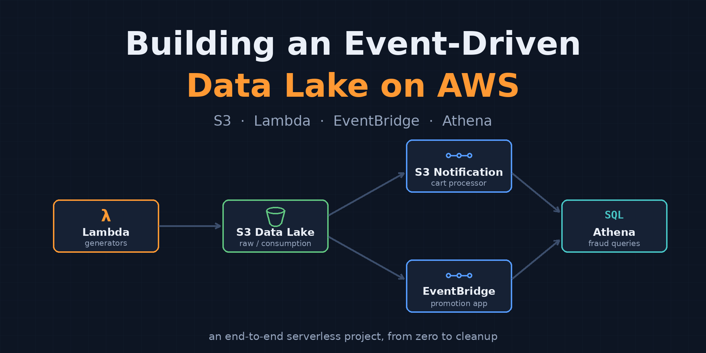
## What This Project Demonstrates

- Organizing a data lake into **zones** (raw / consumption) with S3 buckets and prefix isolation
- Writing **IAM execution roles** with least privilege applied at the prefix level
- Building and publishing a **custom Lambda layer** (Faker) alongside the managed pandas layer
- Distributing the same S3 event to two consumers through two mechanisms: **S3 Event Notification** (prefix filter) and **EventBridge** (content filtering)
- Reading event payloads inside Lambda (`Records[0].s3` vs `detail` structures)
- Querying the lake with **Athena**: external table (DDL), **CTAS** with Parquet output, saved fraud queries
- Full **cleanup** with the correct deletion order, leaving zero cost behind

## Architecture

Two Lambda generators write fake data to the raw zone (`cart/`, `transactions/`). A Put event under `cart/` triggers `cart-data-processor` through an S3 Event Notification and `promotion-app` through an EventBridge rule, both writing to the consumption zone. The `transactions/` prefix is queried directly with Athena; suspicious transactions are materialized into a Parquet table with CTAS.

## Services Used

`Amazon S3` · `AWS Lambda` · `AWS IAM` · `Amazon EventBridge` · `Amazon Athena` · `AWS Glue Data Catalog` · `Amazon CloudWatch`

## Prerequisites

- An AWS account (all resources fit comfortably in the free tier or cost only cents)
- Python 3.12 and `pip` on your local machine (only for building the Faker layer)
- Region: the walkthrough uses `eu-central-1` (Frankfurt); any region works if used consistently

## Task List

1. Creating 3 S3 buckets
2. Writing the IAM execution roles
3. Building and publishing the Faker custom layer
4. Creating the 4 Lambda functions (managed pandas layer + custom faker layer + environment variables)
5. Verifying the generators with a manual test (is data landing in the raw zone?)
6. S3 Event Notification (with a prefix filter) + processor verification
7. Enabling EventBridge on the bucket + creating the rule + verifying the promotion app
8. Athena setup: workgroup/result location, external table (DDL), CTAS, fraud queries, Glue Catalog review
9. End to end test + reviewing the architecture as a whole
10. Cleanup

## 1. Amazon S3

Amazon S3 is the **storage layer** of the data lake. Why S3: as an object store it scales virtually without limits, its durability is **11 nines** (99.999999999%), it is priced independently of compute (which is why it is the answer to the "store it cheaply instead of deleting it from the database" problem), and services such as Athena, Glue, and Lambda all work directly on top of it. The reason we place the zones in separate buckets is to manage lifecycle policies, access control, and cost tracking independently per zone.

### 1.1 Steps

- Go to S3 and create a bucket. The bucket name must be **globally unique**. Leave the following settings as they are: **Block all public access: On** (a data lake must never be public), **Default encryption: SSE-S3** (all objects are automatically encrypted at rest, at no extra cost).

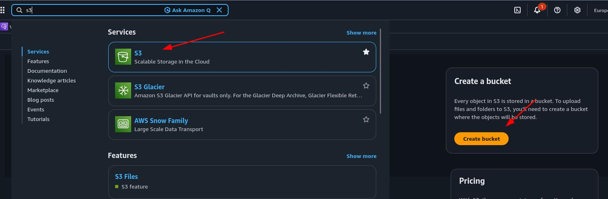
---
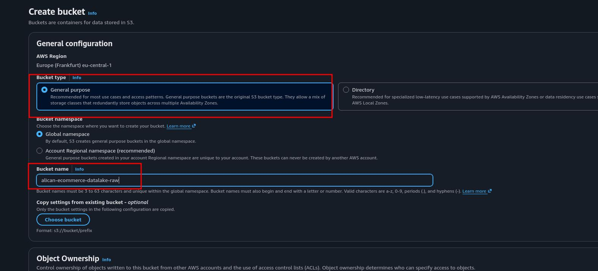

- Create the consumption and `-athena-results` buckets with the same settings.

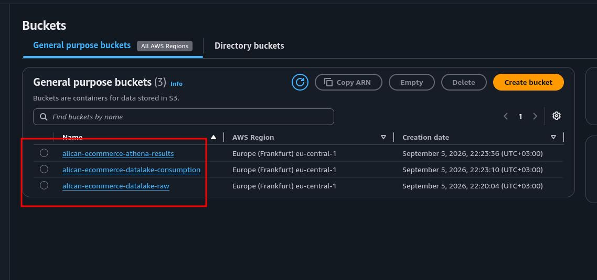

- Inside the raw bucket, create two prefixes named `cart` and `transactions`. Our event notification filter and our Athena `LOCATION` will rely on these prefixes.

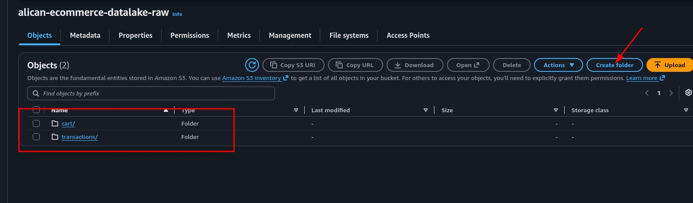

## 2. AWS IAM (Execution Roles)

While AWS Lambda runs your code on your behalf, it uses an **execution role** to access other AWS services. An execution role is an IAM role that provides temporary credentials to the function, and it consists of two parts: the **trust policy** (defines who can assume this role; in our case, the Lambda service) and the **permissions policy** (defines which actions the service assuming the role can perform, for example writing an object to S3).

Following the principle of **least privilege**, each role should contain only the permissions it needs. The permission needs of our four functions fall into two groups, so we will create two roles:

**lambda-generator-role:** For the data generating functions (cart-data-generator, transaction-generator). It can only perform `PutObject` on the raw bucket.

**lambda-processor-role:** For the data processing functions (cart-data-processor, promotion-app). It can perform `GetObject` on the raw bucket and `PutObject` on the consumption bucket.

Both roles will also get the AWS managed policy **AWSLambdaBasicExecutionRole**. This policy lets the function write logs to CloudWatch Logs (`logs:CreateLogGroup`, `logs:CreateLogStream`, `logs:PutLogEvents`). Without this permission the function still runs, but you cannot see any logs, and debugging becomes impossible.

### 2.1 Steps

- Go to the IAM service in the console.
- Select Roles from the left menu.
- Click Create role.
- Choose AWS service as the trusted entity type.
- Choose Lambda as the use case and click Next.

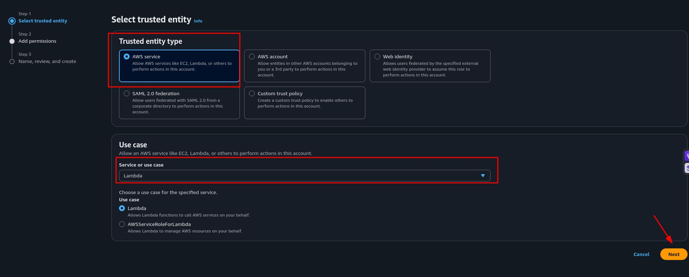

- On the Permissions screen, type `AWSLambdaBasicExecutionRole` into the search box and check this policy's checkbox.
- Click Next.

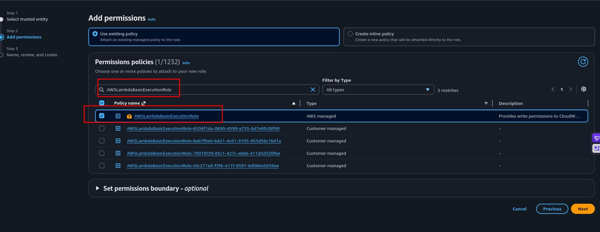

- Type `lambda-generator-role` as the role name and click Create role.

Now let's add the S3 permission to this role as an inline policy:

- Click `lambda-generator-role` in the Roles list.
- On the Permissions tab, from the Add permissions dropdown, select Create inline policy.
- In the policy editor, select the JSON tab.
- Paste the following policy (replace the bucket name with your own raw bucket name):

```json
{
  "Version": "2012-10-17",
  "Statement": [
    {
      "Sid": "AllowPutToRawZone",
      "Effect": "Allow",
      "Action": "s3:PutObject",
      "Resource": [
        "arn:aws:s3:::alican-ecommerce-datalake-raw/cart/*",
        "arn:aws:s3:::alican-ecommerce-datalake-raw/transactions/*"
      ]
    }
  ]
}
```

- Click Next.
- Type `raw-zone-put-policy` as the policy name.
- Click Create policy.

**IMPORTANT:** Note that in the Resource lines we grant access only to the `cart/*` and `transactions/*` prefixes instead of the whole bucket. This guarantees that the generator functions can write only to their own prefixes in the raw zone; it is **least privilege applied at the prefix level**.

Let's create the processor role using the same method:

- Start a new role with Create role (Trusted entity: AWS service, Use case: Lambda).
- Add the `AWSLambdaBasicExecutionRole` managed policy.
- Type `lambda-processor-role` as the role name and create the role.
- Click the role and add the following JSON with Create inline policy (replace the bucket names with your own bucket names):

```json
{
  "Version": "2012-10-17",
  "Statement": [
    {
      "Sid": "AllowReadFromRawZone",
      "Effect": "Allow",
      "Action": "s3:GetObject",
      "Resource": "arn:aws:s3:::alican-ecommerce-datalake-raw/*"
    },
    {
      "Sid": "AllowPutToConsumptionZone",
      "Effect": "Allow",
      "Action": "s3:PutObject",
      "Resource": "arn:aws:s3:::alican-ecommerce-datalake-consumption/*"
    }
  ]
}
```

- Type `processor-s3-policy` as the policy name and create it.

## 3. Lambda Layers (Faker Custom Layer)

A **Lambda layer** is a .zip archive that contains additional code and dependencies, packaged independently of the function code. Using a layer has two main benefits: you can share dependencies across multiple functions (all four of our functions use pandas, but we do not deploy the package four times), and since the deployment package stays small, you can view and edit the function code directly in the console's code editor.

The layer archive has one critical rule: Python dependencies must live under a directory named `python/` inside the archive. At runtime, Lambda extracts the layer into the `/opt` directory, and the Python runtime adds only the `/opt/python` path to `sys.path`. If the directory name is wrong, the function fails with `ModuleNotFoundError`; this is the most common mistake with custom layers.

### 3.1 Steps

First, let's build the layer archive on the local machine. Open your terminal and run the following commands in order:

```bash
# Create a working directory:
mkdir -p ~/faker-layer/python
cd ~/faker-layer

# Download Faker into the python/ directory:
pip install faker -t python/ --no-cache-dir

# Create the archive
zip -r faker-layer.zip python/

# Check the archive size
ls -lh faker-layer.zip
```

The direct upload limit through the console is **50 MB**. If the archive exceeds 50 MB, you must first upload it to S3 and provide the S3 URL when creating the layer.

Now let's publish the layer:

- Go to the Lambda service in the console.
- Select Layers from the left menu.
- Click Create layer.
- Type `faker-layer` as the name.
- Choose the Upload a .zip file option and upload the `faker-layer.zip` file.
- In the Compatible runtimes section, select Python 3.12.
- Click Create.

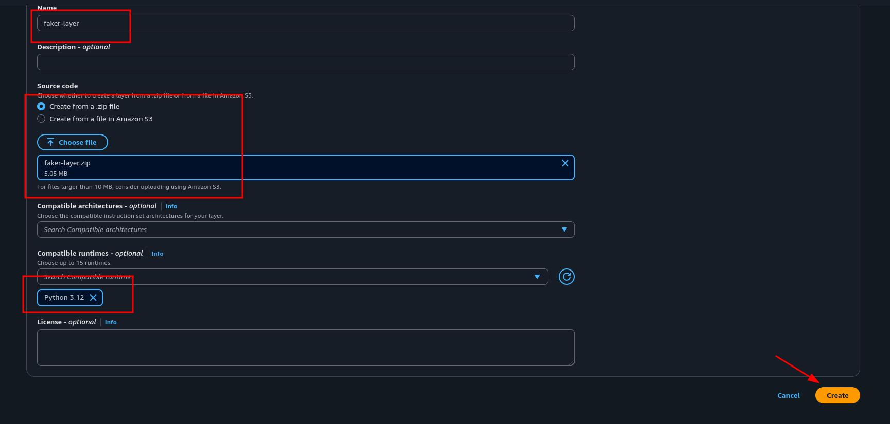

When the layer is created, a **version ARN** is generated (for example `arn:aws:lambda:eu-central-1:<account-id>:layer:faker-layer:1`). Layers are **immutable**: to change the content, a new version is published, and functions are pinned to a specific version. Note down this ARN; we will use it in the next step when attaching it to the functions.

## 4. AWS Lambda (Creating the Functions)

AWS Lambda is a **serverless compute** service that runs code without managing servers. The reason we choose Lambda in this architecture is that the workload is `event-driven` and short lived: for jobs that run for a few seconds when data arrives and then terminate, a continuously running EC2 instance makes no sense cost wise. With Lambda you pay only for execution time (billed per millisecond) and the number of invocations.

We will create four functions:

- `cart-data-generator`: Generates cart abandonment data with Faker and writes it to the `cart/` prefix of the raw zone.
- `cart-data-processor`: Triggered by an S3 Event Notification, aggregates the data by product_id, and writes it to the consumption zone.
- `promotion-app`: Triggered by an EventBridge rule, produces the top abandoned products per customer.
- `transaction-generator`: Generates fake credit card transaction data and writes it to the `transactions/` prefix of the raw zone.

### 4.1 Steps Common to All Four Functions

The creation flow is the same for all four functions; the differences (role, layer, environment variable, code) are specified in each function's own section.

#### 4.1.1 Common creation steps:

- Go to the Lambda service in the console.
- Click Create function.
- Keep Author from scratch selected.
- Type the relevant function's name in the Function name field.
- Choose Python 3.12 as the runtime.
- Under Additional settings, switch the custom execution role option to on.
- Select Use an existing role and pick the relevant role from the dropdown.
- Click Create function.

#### 4.1.2 Layer attachment steps (after the function is created):

- Click Layers under the Function overview section.
- Click Add a layer.
- For pandas: choose AWS layers as the layer source, select `AWSSDKPandas-Python312` and the latest version from the dropdown, click Add.
- For functions that need Faker, click Add a layer again: choose Custom layers as the layer source, select `faker-layer` and version 1, click Add.

#### 4.1.3 General configuration steps (for every function):

- Go to the Configuration tab.
- Click Edit in the General configuration section.
- Set the Memory value to **512 MB**.
- Set the Timeout value to **1 minute**.
- Click Save.

#### 4.1.4 Environment variable steps (for every function):

- On the Configuration tab, select Environment variables.
- Click Edit.
- Enter the relevant key/value pairs with Add environment variable.
- Click Save.

#### 4.1.5 Code upload steps (for every function):

- Go to the Code tab.
- Delete the existing content in the editor and paste the relevant function's code.
- Click **Deploy**. (Changes that are not deployed do not run; this is the most frequently skipped step in the console.)

### 4.2 The cart-data-generator function

- Execution role: `lambda-generator-role`
- Layers: AWSSDKPandas-Python312 + faker-layer
- Environment variables: `input_bucket` = your raw bucket name

**code:**

```python
import os
import random
import logging
from collections import defaultdict

import boto3
from botocore.exceptions import ClientError
import pandas as pd
from faker import Faker
from faker.providers import currency

inputBucket = os.environ['input_bucket']

def lambda_handler(event, context):
    generate_data()
    upload_file(file_name='/tmp/cart_abandonment_data.csv',
                bucket=inputBucket,
                object_name='cart/cart_abandonment_data.csv')

def generate_data():
    fake = Faker()
    fake.add_provider(currency)

    fake_data = defaultdict(list)
    for _ in range(1000):
        fake_data["cart_id"].append(random.randint(0, 10))
        fake_data["customer_id"].append(random.randint(0, 10))
        fake_data["product_id"].append(random.randint(0, 10))
        fake_data["product_amount"].append(random.randint(1, 20))
        fake_data["product_price"].append(fake.pricetag())

    df_fake_data = pd.DataFrame(fake_data)
    print(df_fake_data.head())
    df_fake_data.to_csv("/tmp/cart_abandonment_data.csv")

def upload_file(file_name, bucket, object_name):
    s3_client = boto3.client('s3')
    try:
        s3_client.upload_file(file_name, bucket, object_name)
    except ClientError as e:
        logging.error(e)
        return False
    return True
```

Pay attention to the `object_name` parameter: we write with the `cart/` prefix. In S3 this does not mean writing into a `cart` folder; it creates a single object whose key is `cart/cart_abandonment_data.csv`, and the console displays it as if it were inside a folder.

### 4.3 The cart-data-processor function

- Execution role: `lambda-processor-role`
- Layers: only AWSSDKPandas-Python312 (Faker is not needed)
- Environment variables: `output_bucket` = your consumption bucket name

**code:**

```python
import os
import logging
import urllib.parse

import boto3
from botocore.exceptions import ClientError
import pandas as pd

outputBucket = os.environ['output_bucket']

def lambda_handler(event, context):
    record = event['Records'][0]
    source_bucket = record['s3']['bucket']['name']
    source_key = urllib.parse.unquote_plus(record['s3']['object']['key'])
    print(f"Triggered by: s3://{source_bucket}/{source_key}")

    local_file = '/tmp/' + os.path.basename(source_key)
    s3 = boto3.client('s3')
    s3.download_file(source_bucket, source_key, local_file)

    process_file(local_file)
    upload_file(file_name='/tmp/cart_aggregated_data.csv',
                bucket=outputBucket,
                object_name='aggregated/cart_aggregated_data.csv')

def process_file(local_file):
    raw_data = pd.read_csv(local_file, index_col=0)
    aggregate_data = raw_data.groupby('product_id')['product_amount'].sum().nlargest(50)
    aggregate_data = aggregate_data.reset_index()
    aggregate_data.columns = ['product_id', 'abandoned_amount']
    print(aggregate_data.head(15))
    aggregate_data.to_csv('/tmp/cart_aggregated_data.csv')

def upload_file(file_name, bucket, object_name):
    s3_client = boto3.client('s3')
    try:
        s3_client.upload_file(file_name, bucket, object_name)
    except ClientError as e:
        logging.error(e)
        return False
    return True
```

### 4.4 The promotion-app function

- Execution role: `lambda-processor-role`
- Layers: only AWSSDKPandas-Python312
- Environment variables: `output_bucket` = your consumption bucket name

**code:**

```python
import os
import logging

import boto3
from botocore.exceptions import ClientError
import pandas as pd

outputBucket = os.environ['output_bucket']

def lambda_handler(event, context):
    source_bucket = event['detail']['bucket']['name']
    source_key = event['detail']['object']['key']
    print(f"Triggered by: s3://{source_bucket}/{source_key}")

    local_file = '/tmp/' + os.path.basename(source_key)
    s3 = boto3.client('s3')
    s3.download_file(source_bucket, source_key, local_file)

    process_file(local_file)
    upload_file(file_name='/tmp/promotion_data.csv',
                bucket=outputBucket,
                object_name='promotions/promotion_data.csv')

def process_file(local_file):
    raw_data = pd.read_csv(local_file)
    aggregate_data = raw_data.groupby(['customer_id', 'product_id']).agg({'product_amount': 'sum'})
    group_data = aggregate_data['product_amount'].groupby('customer_id', group_keys=False).nlargest(10)
    print(group_data.head(15))
    group_data.to_csv('/tmp/promotion_data.csv')

def upload_file(file_name, bucket, object_name):
    s3_client = boto3.client('s3')
    try:
        s3_client.upload_file(file_name, bucket, object_name)
    except ClientError as e:
        logging.error(e)
        return False
    return True
```

### 4.5 The transaction-generator function

- Execution role: `lambda-generator-role`
- Layers: AWSSDKPandas-Python312 + faker-layer
- Environment variables: `ingest_bucket` = your raw bucket name

**code:**

```python
import os
import logging
from collections import defaultdict

import boto3
import pandas as pd
from faker import Faker
from faker.providers import bank, credit_card, date_time, profile, currency, user_agent

logger = logging.getLogger()
logger.setLevel(logging.INFO)

ingest_bucket = os.environ.get('ingest_bucket')

def lambda_handler(event, context):
    fake = Faker()
    fake.add_provider(bank)
    fake.add_provider(credit_card)
    fake.add_provider(profile)
    fake.add_provider(date_time)
    fake.add_provider(currency)
    fake.add_provider(user_agent)

    fake_data = defaultdict(list)
    for _ in range(1000):
        fake_data["first_name"].append(fake.first_name())
        fake_data["last_name"].append(fake.last_name())
        fake_data["transaction_date"].append(fake.date_this_month())
        fake_data["card_number"].append(fake.credit_card_number())
        fake_data["card_expire"].append(fake.credit_card_expire())
        fake_data["card_type"].append(fake.credit_card_provider())
        fake_data["card_sec_code"].append(fake.credit_card_security_code())
        fake_data["transaction_amount"].append(fake.pricetag())
        fake_data["user_agent"].append(fake.user_agent())

    df_fake_data = pd.DataFrame(fake_data)
    df_fake_data["transaction_amount"] = df_fake_data["transaction_amount"].str.replace("[$,]", "", regex=True)

    print(df_fake_data.head())
    df_fake_data.to_csv("/tmp/dataexport.csv")

    s3 = boto3.client('s3')
    try:
        s3.upload_file('/tmp/dataexport.csv',
                       Bucket=ingest_bucket,
                       Key='transactions/dataexport.csv')
        logger.info('File Uploaded Successfully')
    except Exception as e:
        logging.error(e)
        logger.info('File Not Uploaded')
```

With that, we have created all 4 functions. Now it is time to test them.

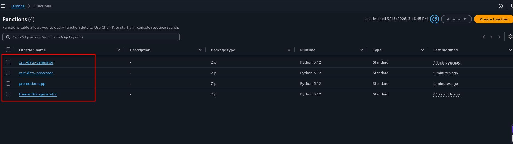

## 4.6 Testing the Generator Functions

You can invoke Lambda functions in the console with a **test event**. A test event is a JSON document passed to the function as input. Since our generator functions do not use the event content, an empty document (`{}`) is sufficient. When you run a test in the console, Lambda invokes the function **synchronously** and shows the execution result, the log output, and the duration/memory metrics directly on the screen.

The purpose of this step is to verify two things: that the functions' layer and environment variable configuration is correct (imports and S3 access work without errors), and that the data lands in the correct prefixes of the raw zone.

An important ordering note: we run this test **before** creating the event notification and the EventBridge rule. This way we verify the generators in isolation; if something fails, we avoid the problem of figuring out whether the source is the generator or the trigger chain.

### 4.6.1 Steps

Let's test the cart-data-generator function:

- Go to the `cart-data-generator` function in the Lambda console.
- Go to the Test section and select the create new event tab.
- Type `EmptyEvent` as the event name.
- Leave `{}` in the Event JSON field (or replace the existing template with `{}`).
- Click Save.
- Click the Test button.
- Expand the Executing function details section.
- In the Log output section, you should see the `df_fake_data.head()` output (the first 5 rows).

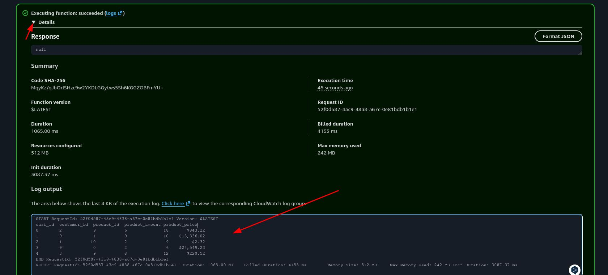

Let's verify the S3 side:

- Go to your raw bucket in the S3 console.
- Click the `cart/` prefix.
- Verify that the `cart_abandonment_data.csv` object was created and that its Last modified value shows the time of the test you just ran.

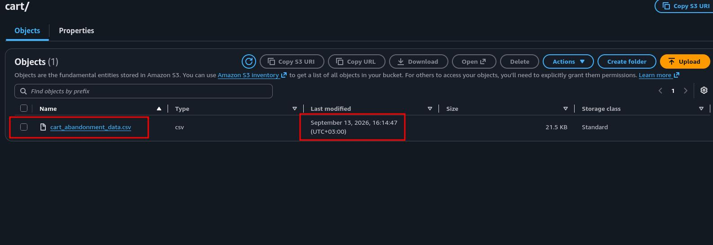

Let's test the transaction-generator function:

- Go to the `transaction-generator` function in the Lambda console.
- Create an empty test event named `EmptyEvent` in the same way and click Test.
- Verify that the status is **Succeeded** and that the log output contains the line `File Uploaded Successfully`.
- In the S3 console, verify that the `dataexport.csv` object was created under the `transactions/` prefix of the raw bucket.

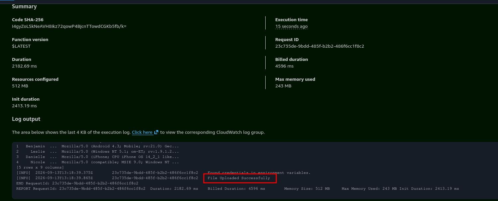
---
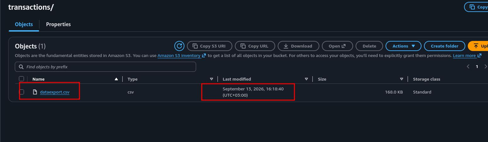

## 5. S3 Event Notification (Triggering the Processor)

**S3 Event Notifications** is the feature that lets you receive notifications when certain events happen in a bucket (object creation, deletion, and so on). A Lambda function, an SQS queue, or an SNS topic can be selected as the notification destination. This configuration is stored in the **notification subresource** attached to the bucket, and when the event occurs, S3 invokes the destination directly. We will configure the `cart-data-processor` function to be invoked when an object is created (a **Put** event) under the `cart/` prefix in the raw bucket, and we use a **prefix filter** for two reasons:

1. Two different data streams live in our raw bucket (`cart/` and `transactions/`). Without a filter, `cart-data-processor` would also be triggered every time the transaction generator ran, which means both unnecessary invocation cost and meaningless processing.
2. Prefix/suffix filtering is also a fundamental tool for preventing **recursive invocation** accidents in `event-driven` architectures. For example, if the processor wrote its output to the same bucket, every output would produce a new event and could trigger the function in an infinite loop. By writing the output to a separate bucket (consumption), we already eliminated this risk at the architecture level; the filter is a second safety layer.

Something important also happens behind the scenes in this step: while saving the event notification, the console automatically adds a permission to the **resource-based policy** of the `cart-data-processor` function (`lambda:InvokeFunction`, principal: `s3.amazonaws.com`, source: your bucket ARN). While the execution role governs the function's access to the outside world, the resource-based policy governs **who can invoke this function**. This permission is mandatory for S3 to be able to invoke the function.

### 5.1 Steps

- Go to your raw bucket in the S3 console.
- Click the Properties tab.
- Scroll down to the Event notifications section.
- Click Create event notification.
- Type `CartProcessorEvent` as the event name.
- Type `cart/` in the Prefix field. (You can also type `.csv` in the Suffix field; it guarantees that only CSV objects trigger the notification.)
- In the Event types section, under Object creation, check the **Put** checkbox.
- In the Destination section, choose Lambda function.
- For Specify Lambda function, keep Choose from your Lambda functions selected.
- Select `cart-data-processor` from the Lambda function dropdown.
- Click Save changes.

Let's verify that the resource-based policy was added:

- Go to the `cart-data-processor` function in the Lambda console.
- In the Function overview section, verify that S3 is listed as the trigger on the left.

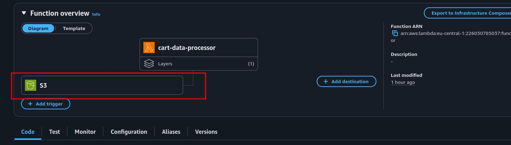

- On the Configuration tab, select Permissions.
- In the Resource-based policy statements section at the bottom of the page, review the statement that grants S3 permission to invoke the function. Note that the Principal is `s3.amazonaws.com` and the Source ARN is your raw bucket. This Source ARN condition ensures that **only your bucket** can trigger the function.

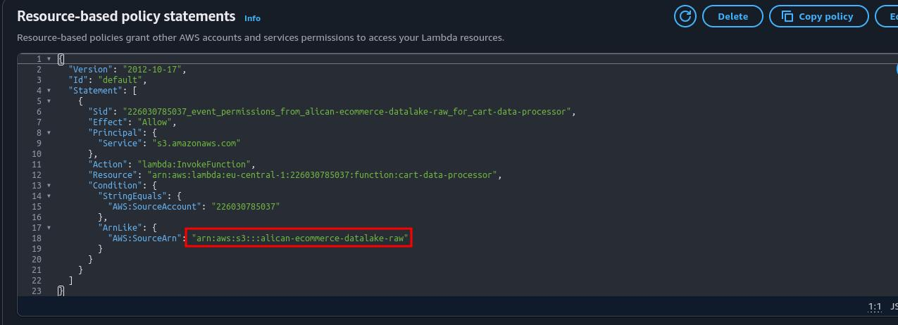

Let's test the chain end to end:

- Go to the `cart-data-generator` function in the Lambda console and click Test.
- Wait about 10 to 15 seconds (including the processor's cold start).
- Go to your consumption bucket in the S3 console.
- Verify that the `cart_aggregated_data.csv` object was created under the `aggregated/` prefix.

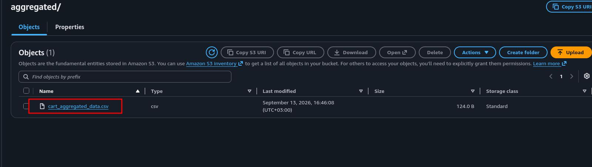

## 6. Amazon EventBridge (Triggering the Promotion App)

Amazon EventBridge is a serverless **event bus** service that connects your applications with events coming from a variety of sources. Event producing sources send events to the bus; you define **rules**, and when an event matches a rule's **event pattern**, EventBridge delivers it to the defined **targets**. A single rule can send an event to multiple targets in parallel.

At this point a fair question arises: why EventBridge when S3 Event Notification already exists? The two solve the same job at different scales, and their difference is one of the main lessons of this project:

S3 Event Notification is a point to point mechanism attached to the bucket. Its critical limitation is this: for the same bucket, the same event type, and an overlapping prefix, **only a single destination** can be defined. We already bound the Put event on the `cart/` prefix to `cart-data-processor`; we cannot bind the same event to a second Lambda with an S3 notification.

EventBridge, on the other hand, is a distribution layer: S3 sends events to the bus, and you can fan out to as many consumers as you want with as many rules as you want. Its pattern matching is also much richer than S3's prefix/suffix filter (you can match on object size, key patterns, multiple buckets), and the target range is not limited to Lambda/SQS/SNS; dozens of targets are supported, including Step Functions, ECS tasks, and other event buses.

In our architecture, we deliberately use the two mechanisms side by side: the same "object created" event will reach `cart-data-processor` through the S3 notification and `promotion-app` through EventBridge. The two consumers will run in parallel, unaware of each other. In production, a single mechanism is usually chosen (EventBridge is the standard in architectures with many consumers); here we set up both to observe the difference.

### 6.1 Steps

First, let's enable the EventBridge integration on the bucket:

- Go to your raw bucket in the S3 console.
- Click the Properties tab.
- Scroll down to the Event notifications section.
- In the Amazon EventBridge subsection, click Edit.
- Switch Send notifications to Amazon EventBridge for all events in this bucket to **On**.
- Click Save changes.

Now let's create the rule:

- Go to the Amazon EventBridge service in the console.
- Select Rules from the left menu.
- Click Create rule and select the Advanced Builder.
- Type `PromotionAppRule` in the Name field.
- Select default as the event bus.
- Click Next.
- Scroll down to the Event pattern section, select Custom Pattern, and copy the following JSON, adapted to your bucket name:

```json
{
  "source": ["aws.s3"],
  "detail-type": ["Object Created"],
  "detail": {
    "bucket": {
      "name": ["alican-ecommerce-datalake-raw"]
    },
    "object": {
      "key": [{ "prefix": "cart/" }]
    }
  }
}
```

**Let's read the pattern:** `source` and `detail-type` require the event to be an Object Created event coming from S3. `detail.bucket.name` limits the event to our raw bucket. The `{ "prefix": "cart/" }` under `detail.object.key` is one of EventBridge's **content filtering** operators: only objects whose key starts with `cart/` match. Events that do not match (for example, objects written under `transactions/`) are silently discarded by the rule; the target is never invoked.

- Click Next.
- In the Select target(s) step, choose AWS service as the target type.
- Select Lambda function from the Select a target dropdown.
- Select `promotion-app` from the Function dropdown.
- Click Next, pass the Configure tags step with Next, and click Create rule in the Review step.
- Then go to Lambda, and on the `promotion-app` function's page, click Add trigger in the Function overview section.
- Select EventBridge (CloudWatch Events) from the Trigger source dropdown.
- In the Rule section, select Existing rules.
- Select `PromotionAppRule` from the dropdown.
- Click Add.

Verify the permission:

- Go to the `promotion-app` function in the Lambda console.
- On the Configuration tab, select Permissions.
- In the Resource-based policy statements section, a statement should now be visible: principal `events.amazonaws.com`, action `lambda:InvokeFunction`, and the ARN of `PromotionAppRule` as the source ARN.
- In the Function overview section, verify that EventBridge (CloudWatch Events) is listed as the trigger.

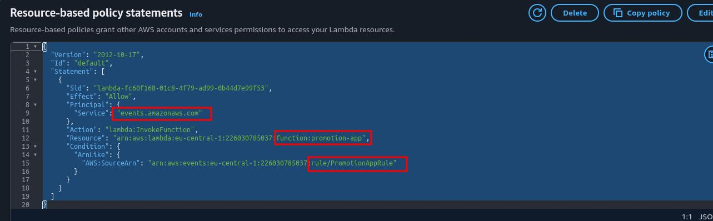

### 6.2. Positive Test (cart data should trigger)

- Go to the `cart-data-generator` function in the Lambda console.
- Click Test and see that the status is Succeeded.
- Wait 15 to 20 seconds (including the promotion app's cold start).
- Go to the `promotion-app` function and click the Monitor tab.
- Click View CloudWatch logs and open the most recent log stream.
- Verify that a new invocation occurred and that the log contains the line `Triggered by: s3://.../cart/cart_abandonment_data.csv`.
- Go to your consumption bucket in the S3 console.
- Verify that the `promotion_data.csv` object was created under the `promotions/` prefix.
- Also check that the Last modified value of `cart_aggregated_data.csv` under the `aggregated/` prefix in the same bucket was updated as well: a single generator invocation triggered two processors in parallel through two independent mechanisms (S3 Event Notification + EventBridge).

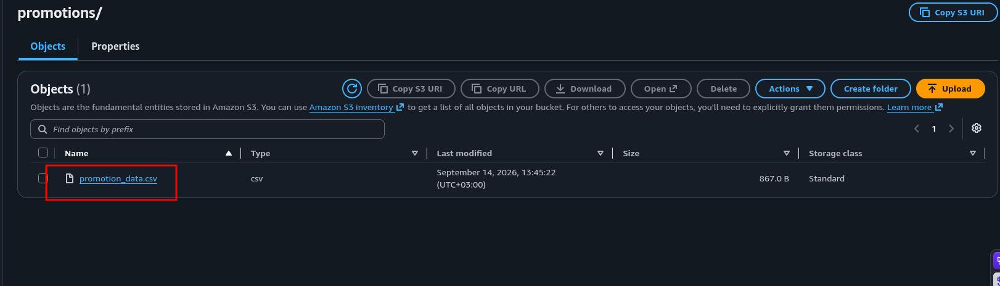

### 6.3. Negative Test (transaction data should not trigger)

- On the CloudWatch log group page of `promotion-app`, note the time of the most recent log stream; this is your reference point.
- Go to the `transaction-generator` function in the Lambda console and click Test.
- Wait 15 to 20 seconds.
- Refresh the `promotion-app` log group page.
- Verify that **no new invocation** occurred. If there is no activity in the logs, it means the rule correctly filtered out the event under the `transactions/` prefix thanks to the content filter.

## 7. Athena (Fraud Analysis)

Amazon Athena is an interactive query service that lets you analyze data in Amazon S3 with standard SQL. The reason we choose Athena is its **schema-on-read** approach: the data stays where it is in S3 and is never loaded or moved anywhere; you only define the schema and the location of the data, and when a query runs, the data is read and interpreted according to the schema. There is no server management, queries automatically run in parallel, and you pay only for the amount of data scanned (priced per TB). It is the exact match for a fraud department's need for "fast, scalable SQL access to logs in S3"; analysis starts without loading the data into a data warehouse.

**Two components work behind the scenes of Athena:**

1. **AWS Glue Data Catalog:** When you create a "database" and a "table" in Athena, you are actually writing metadata to the Glue Data Catalog: column names, types, and the data's location in S3. This is the fundamental difference from traditional databases: the data is not stored together with the schema definition. A table is a **pointer + schema definition**; the data lives independently in S3.
2. **Query result location:** Athena writes the result of every query to an S3 bucket as CSV. We will use our third bucket (`athena-results`) for this. This setting is configured on the **workgroup**; a workgroup is the Athena concept used to isolate queries, set cost limits, and manage shared settings. We will configure the default workgroup's setting.

### 7.1 Setting the Query Result Location

- On the Athena welcome page, check the Query your data in Athena console option (the radio button described as "Use Query editor to analyze data on S3, on premises, or on other clouds").
- When you check this option, the orange button changes to **Launch query editor**; click the button.
- When the query editor opens, verify at the top left that the region is eu-central-1 (Frankfurt).
- On the query editor page, click Query Settings among the tabs at the top.
- Click Manage.
- In the Location of query result field, click Browse S3.
- Select the `alican-ecommerce-athena-results` bucket and click Choose.
- Check the Encrypt query results checkbox.
- Choose **SSE_S3** as the encryption type.

### 7.2 Creating the External Table

- Go back to the Editor tab from Settings.
- In the Data pane on the left, verify that AwsDataCatalog is selected as the data source and default as the database. (If your account is new, the `default` database comes ready in the list; since our DDL writes into `default`, there is no need to create a separate database.)
- Paste the following DDL into the query field (replace the bucket name in `LOCATION` with your own raw bucket name; the trailing `/` is mandatory):

```sql
CREATE EXTERNAL TABLE IF NOT EXISTS `default`.`cc_transactions` (
  `record_number` int,
  `first_name` string,
  `last_name` string,
  `transaction_date` date,
  `card_number` bigint,
  `card_expire` string,
  `card_type` string,
  `card_sec_code` int,
  `transaction_amount` decimal(7,2),
  `user_agent` string
)
ROW FORMAT SERDE 'org.apache.hadoop.hive.serde2.lazy.LazySimpleSerDe'
WITH SERDEPROPERTIES (
  'serialization.format' = ',',
  'field.delim' = ','
)
LOCATION 's3://alican-ecommerce-datalake-raw/transactions/'
TBLPROPERTIES ('skip.header.line.count'='1');
```

- Click Run.
- In the Query results section, verify that the query completed successfully.
- In the left Data pane, verify that the `cc_transactions` table appears under Tables. (If it is not visible, click the refresh icon next to the Tables heading.)

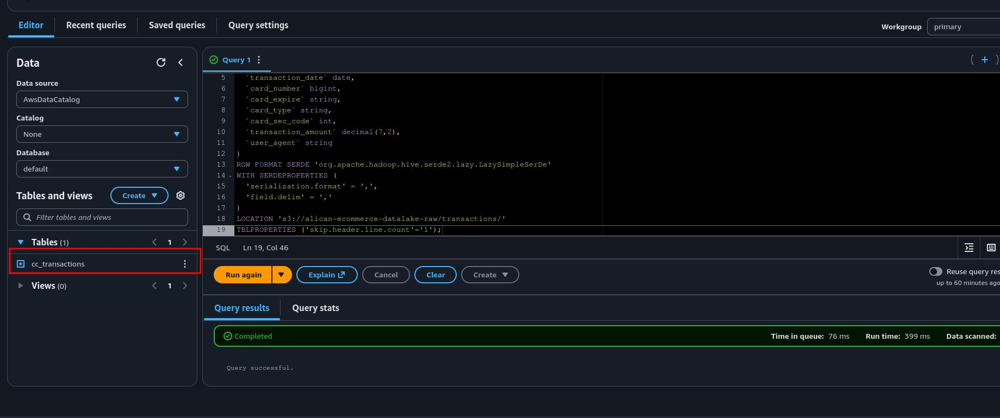

Let's test the table:

- Open a new Query tab with the + sign above the query field.
- Run the following query:

```sql
SELECT * FROM "default"."cc_transactions" LIMIT 10;
```

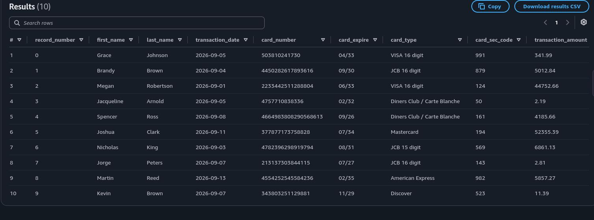

CTAS and sus_transactions

- Open a new Query tab and run the following query (replace the bucket name with your own athena-results bucket name):

```sql
CREATE TABLE "default"."sus_transactions"
WITH (
  external_location = 's3://alican-ecommerce-athena-results/ctas/sus_transactions/'
) AS
SELECT * FROM "default"."cc_transactions"
WHERE transaction_amount > 5000;
```

- Verify in the Data pane that the `sus_transactions` table was created.

Fraud Queries

- Open a new Query tab, save the following query as `Invalid_Security_Codes` (three dots → Save as), and run it:

```sql
SELECT * FROM "default"."sus_transactions"
WHERE transaction_amount > 5000
AND card_sec_code < 100;
```

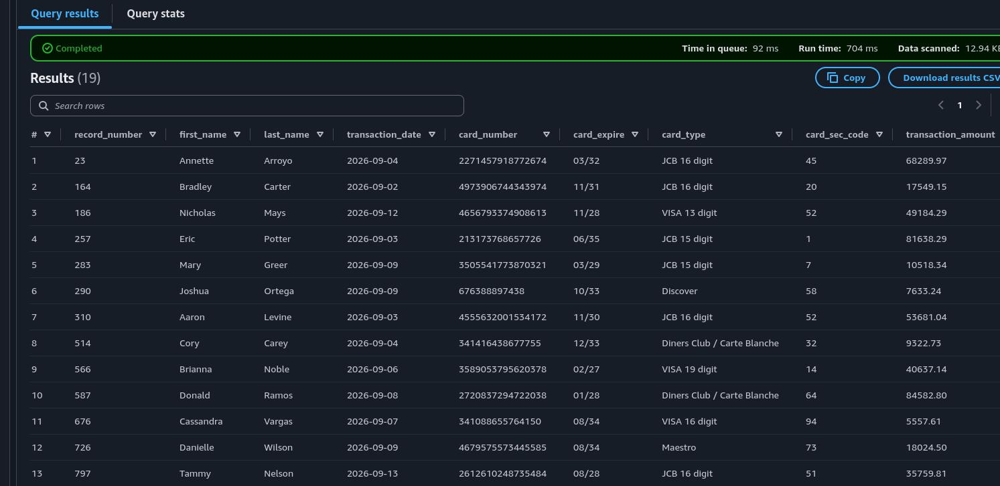

- Open a new Query tab, save the following query as `Diners_Club_Suspected`, and run it:

```sql
SELECT * FROM "default"."sus_transactions"
WHERE transaction_amount > 10000
AND card_type LIKE '%Diner%';
```

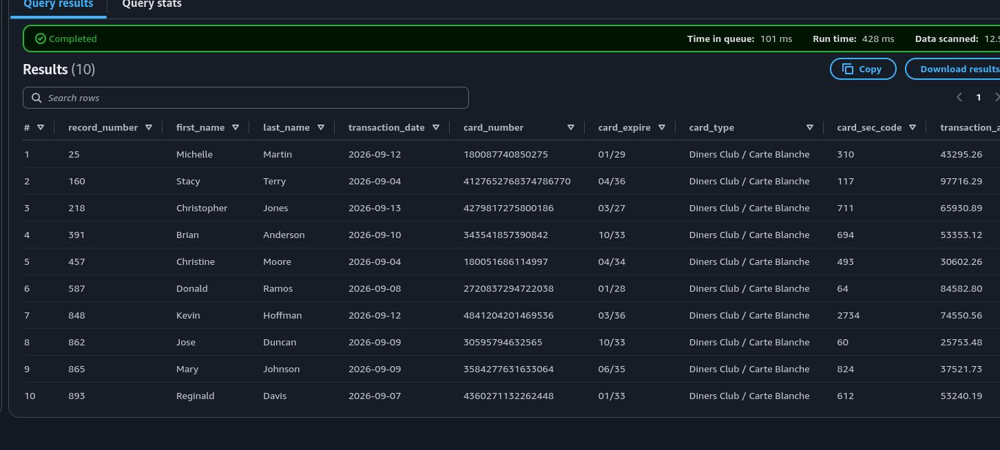

## 8. End to End Test and Reviewing the Architecture

Until now we tested each component as we added it; in this step we will verify the system as a whole through a single scenario: both data sources will produce new data, and we will prove that both lines, the `event-driven` cart pipeline and the Athena fraud analysis, work end to end with fresh data.

This test will also demonstrate the fundamental difference between two architectural approaches: the external table (`cc_transactions`) reads S3 **live on every query**, so new data is reflected in queries instantly; this is the natural consequence of `schema-on-read`. The table created with CTAS (`sus_transactions`), on the other hand, is a **snapshot** of the data at the moment it was created; even if the source data changes, its content does not. In production, this distinction determines which table type you choose, based on the answer to the question "an always current view, or a consistent copy at a specific point in time?"

Let's note the initial state:

- Run the following query in the Athena editor and note the returned number:

```sql
SELECT count(*) AS toplam_kayit FROM "default"."cc_transactions"; 
--- 10000
```

Let's run the cart line:

- Go to the `cart-data-generator` function in the Lambda console and click Test.
- Wait 20 to 30 seconds.
- Go to the consumption bucket in the S3 console.
- Verify that the Last modified values of the `aggregated/cart_aggregated_data.csv` and `promotions/promotion_data.csv` objects show the time of the test you just ran: a single invocation triggered two processors through two independent mechanisms.

Let's run the transaction line:

- Go to the `transaction-generator` function in the Lambda console and click Test.
- Quickly confirm in the CloudWatch logs of the `promotion-app` function that no new invocation occurred (the negative filtering is still working).
- Return to the Athena editor and run the count query from the beginning again. To see that the records belong to the newly generated data, you can also run this query:

```sql
SELECT * FROM "default"."cc_transactions" LIMIT 5;
```

You will see that the names and card data differ from the previous query results: the external table read the current file in S3; no refresh, reload, or re-import operation was needed.

Let's verify the snapshot behavior:

- Run the following query:

```sql
SELECT count(*) FROM "default"."sus_transactions";
```

See that the returned number stays the same as the result at the moment you ran the CTAS. The source data just changed completely, but `sus_transactions` was not affected, because it lives independently in the athena-results bucket as the Parquet copy of the data at CTAS time.

## 9. Evaluating the Architecture as a Whole

At this point, the complete system we built is the following:

**Ingestion:** Two independent Lambda generators write data to the isolated prefixes of the raw zone (`cart/`, `transactions/`). The IAM inline policies guarantee that each generator can write only to its own prefix (**least privilege at the prefix level**).

**Event-driven processing:** The Put event on the `cart/` prefix is distributed in parallel through two mechanisms: the S3 Event Notification (prefix filter) triggers `cart-data-processor`, and the EventBridge rule (content filtering) triggers `promotion-app`. Both processors learn which file to process from the **event payload**; the payload structures of the two delivery mechanisms are different (`Records[0].s3` vs `detail`). The outputs are written to the consumption zone; keeping the source and destination buckets separate eliminates the recursive invocation risk at the architecture level.

**Schema-on-read analytics:** The `transactions/` prefix is queried with Athena through the `cc_transactions` external table definition in the Glue Data Catalog. The data is never moved anywhere. `sus_transactions`, derived with CTAS, is the working table of the fraud analysis and owns its data in Parquet format.

## 10. Cleanup (Deleting the Resources)

The project is complete; now we will delete all resources without leaving anything in the account that could generate cost. First, let's clarify the cost reality: the only continuous cost item in this architecture is **S3 storage** (plus a negligible amount of CloudWatch Logs storage). Lambda, EventBridge, and Athena are priced per use; unless they are invoked and no queries are run, they generate zero cost. Still, leaving unused resources in the account is not a good practice: they occupy service quotas and create "what was this?" confusion later on.

The deletion order is the reverse of the dependency logic: first the consumers of the data (Athena tables), then the data (S3), then compute and the event chain, and finally the permissions (IAM). One reason for this order is also practical: for example, deleting the Lambdas before the buckets causes no problem, but if you keep the tables and delete the S3 data underneath them, broken pointers (**dangling metadata**) remain in the Glue Catalog.

1. Athena Tables and Saved Queries

Pay attention to the different behavior of DROP TABLE on the two table types; it is the final teaching detail of the project: `cc_transactions` is an **external table**; DROP deletes only the metadata in the Glue Catalog and does not touch the `transactions/` data in S3. `sus_transactions` was created with CTAS; its DROP also deletes only the metadata, and the Parquet files under the `ctas/` prefix remain in S3 and must be deleted separately. **Athena never deletes S3 data on your behalf.**

- Run the following two queries in order in the Athena query editor:

```sql
DROP TABLE `default`.`sus_transactions`;
DROP TABLE `default`.`cc_transactions`;
```

- Verify in the left Data pane that the Tables list is empty.
- Go to the Saved queries tab.
- Select and delete the `Invalid_Security_Codes` and `Diners_Club_Suspected` queries.

2. S3 Buckets

A non empty bucket cannot be deleted in S3; the content is emptied first (**Empty**), then the bucket is deleted (**Delete**). The same operation applies to all three buckets.

3. EventBridge Rule

- Go to Rules in the EventBridge console.
- Select `PromotionAppRule`.
- Click Delete and confirm.

4. Lambda Functions and the Layer

- Go to the Functions list in the Lambda console.
- Select the four functions: `cart-data-generator`, `cart-data-processor`, `promotion-app`, `transaction-generator`.
- Select Delete from the Actions dropdown, type `delete` in the confirmation field, and delete them.
- Go to Layers from the left menu. Select `faker-layer` and delete it with Delete. (The AWSSDKPandas managed layer belongs to AWS; it is not a resource in your account, and there is nothing to delete.)

5. CloudWatch Log Groups

When a Lambda function is deleted, its log groups are **not deleted automatically**; this is the most frequently forgotten resource during cleanup. Logs generate negligible cost but accumulate indefinitely.

- In the CloudWatch console, go to Log management from the left menu.
- Select the following four log groups: `/aws/lambda/cart-data-generator`, `/aws/lambda/cart-data-processor`, `/aws/lambda/promotion-app`, `/aws/lambda/transaction-generator`.
- Delete them with Delete log group(s) from the Actions dropdown.

6. IAM Roles

- Go to Roles in the IAM console.
- Select `lambda-generator-role` and delete it with Delete (you are asked to type the role name in the confirmation field).
- Delete `lambda-processor-role` in the same way.
- Type `Amazon_EventBridge` in the search box; since you chose "create a new role" when creating the rule, a role with a name like `Amazon_EventBridge_Invoke_...` may have been created automatically, and if it exists, delete it as well. (Since this role is never used with Lambda targets, deleting it is completely safe.)

## 11. Result

At the end of this project, a fully working serverless data lake is running on a personal AWS account, built from scratch on the console with no prebuilt resources. A single invocation of the cart generator writes raw data to S3 and, without any manual intervention, fans out to two independent consumers: `cart-data-processor` through an **S3 Event Notification** with a prefix filter, and `promotion-app` through an **EventBridge rule** with content filtering. In parallel, the transaction data landing in its own isolated prefix is queried in place with **Athena**, filtered into a Parquet based `sus_transactions` table with **CTAS**, and analyzed with saved fraud queries.

Beyond the working pipeline, the project makes several concepts concrete that are easy to miss when infrastructure comes preconfigured:

- **Two permission models, two directions:** the execution role governs what a function can reach, while the **resource-based policy** governs who can invoke the function. When a trigger silently fails, the second one is where to look.
- **One event, two delivery mechanisms:** S3 Event Notification is point to point with a single destination per event and prefix, while EventBridge is a fan out layer with richer pattern matching. The two payload structures (`Records[0].s3` vs `detail`) are not interchangeable.
- **`schema-on-read` vs snapshot:** the external table reflects new S3 data instantly on every query, while the CTAS table remains a consistent copy of a specific moment. Choosing between them is choosing between a live view and a frozen one.
- **Least privilege works at the prefix level:** IAM resource ARNs scoped to `cart/*` and `transactions/*` keep each function inside its own lane, and the same prefix isolation is what makes both event filtering and the Athena `LOCATION` clean.
- **Cleanup is part of the architecture:** deletion follows the reverse of the dependency order, `DROP TABLE` never removes S3 data, and CloudWatch log groups outlive their functions.

The entire setup costs only cents while it exists and leaves nothing behind once the cleanup is complete, which makes it a repeatable exercise: the same architecture can be rebuilt, extended with partitioned keys, a DLQ, or Glue Crawlers, and torn down again at any time.