# Deploying a Containerized Application on AWS with ECS, ECR and Fargate

An end to end container deployment project built entirely on the **AWS Console**: producing Docker images on an EC2 build server, pushing them to an **Amazon ECR** private repository, running them serverless on **AWS Fargate** through an **Amazon ECS** task definition and verifying access from the internet; including the release of a second application over the same pipeline and a cleanup that leaves zero cost behind.


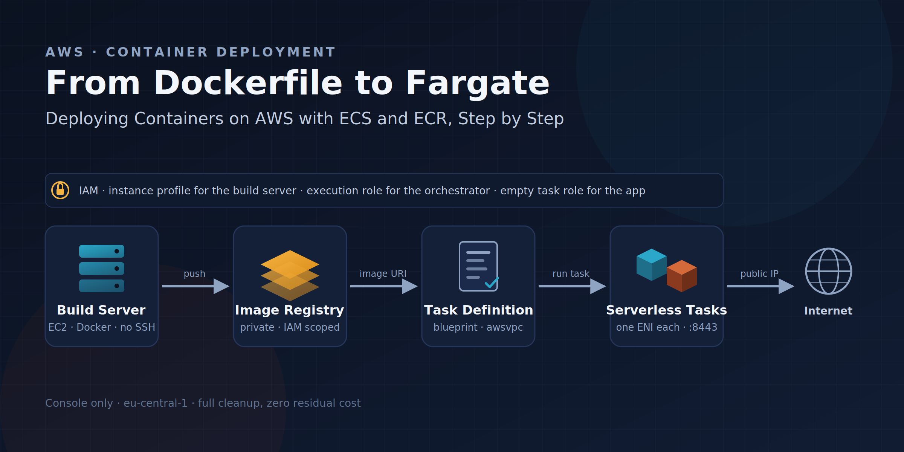

## What This Project Demonstrates

- Granting ECR push permission to EC2 with an **IAM instance profile** instead of access keys, and reaching a terminal with **Session Manager** without opening any inbound port
- Turning an application into an image with a **Dockerfile** and sending it to an **Amazon ECR** private repository with `docker push`
- Understanding the **task definition** concept (image, CPU/memory, port mapping, log driver, IAM roles) and the `awsvpc` network mode that Fargate requires
- Seeing the difference between the **task execution role** and the **task role**, and why leaving the latter empty is least privilege
- Making a Fargate task reachable from the internet with the public subnet + public IP + security group trio, and following the lifecycle up to the `RUNNING` state
- Repeating the same pipeline for a second image to make the **blueprint** nature of a task definition concrete
- A complete **cleanup** in the correct deletion order: task → task definition → cluster → ECR → EC2 → CloudWatch → IAM

## Architecture

An EC2 build server, accessed through Session Manager, turns two small web applications into Docker images and pushes them to two private repositories in ECR. An ECS task definition is written for each image; the tasks run inside a single ECS cluster with the Fargate launch type, in a public subnet of the default VPC and with a public IP. Users reach the applications directly at `http://<public-ip>:8443`; ECS pulls the image from ECR with the task execution role and writes the container logs to CloudWatch Logs.

## Services Used

`Amazon ECS` · `AWS Fargate` · `Amazon ECR` · `Amazon EC2` · `AWS Systems Manager (Session Manager)` · `Amazon VPC` · `AWS IAM` · `Amazon CloudWatch Logs` · `Docker`

## Prerequisites

- An AWS account (the EC2 build server runs for a few hours, the Fargate tasks are measured in minutes; the total cost is in the range of cents)
- Region: the guide uses `eu-central-1` (Frankfurt); any region works as long as it is used consistently
- No tooling is needed on the local machine: Docker and the AWS CLI are used on EC2 through Session Manager

## Problem (Solution Request)

A medical research center has decided to package the applications used by its research teams as Docker containers for portability and deployment efficiency. There are two needs: a **container registry** where images can be stored securely and shared between teams, and an **orchestration** environment that will run these containers without the burden of managing the servers underneath.

**Why a plain `docker run` on EC2 is not enough:** Running a container by hand on an EC2 instance leaves the patching, scaling, restarting and capacity management of that instance to the team; which server the container runs on, who restarts it when it crashes and where the image is kept all remain undefined. ECS answers these three questions: with a task definition, "what will run" becomes declarative; with Fargate, the question "where will it run" disappears; with ECR, the source of the image becomes a single, access controlled place.

**Why not Kubernetes (EKS):** EKS is powerful in environments with many teams and many services; however, the control plane itself is billed hourly and the conceptual load (pod, deployment, ingress, node group) is far above what this scenario needs. For running a handful of applications serverless, ECS + Fargate is the path with the lowest operational burden on AWS.

## Task List

1. IAM: instance role for the EC2 build server and task execution role for ECS
2. VPC and security groups: default VPC verification, a security group open on port `8443`
3. EC2 build server: Amazon Linux 2023, no inbound port, connection through Session Manager
4. Docker installation, turning the two applications into images with a Dockerfile, local test
5. Amazon ECR: two private repositories, login, tag, push, console verification
6. Amazon ECS cluster
7. Task definition for the first application (Fargate, `awslogs`, empty task role)
8. Running the task and testing access from the internet
9. Second application: task definition + task + access test
10. Evaluating the architecture as a whole
11. Cleanup

## 1. AWS IAM (Instance Role and Task Execution Role)

There are two points in this project where AWS services need to speak on our behalf, and both require an IAM role: the EC2 build server will push images to ECR and will be managed through Session Manager; ECS will pull the image from ECR and write logs to CloudWatch while starting the Fargate task. Without these roles, neither the Connect button of EC2 works, nor `docker push`, nor does the task reach the `RUNNING` state; that is why they come first in the setup order.

An IAM role consists of two parts: a **trust policy** (who can assume this role; here the EC2 service and ECS tasks) and a **permissions policy** (what the one assuming the role can do). On the EC2 side, the role is attached to the instance through a wrapper called an **instance profile**; the console creates it automatically. The alternative to an instance profile is copying access keys onto the EC2 instance; that is both a security hole (if the key leaks, the account is exposed) and a rotation burden. With an instance profile, the instance receives **temporary credentials** and these are renewed automatically.

Why two separate roles: EC2 needs push (write), ECS needs pull (read) and log writing. A single broad role gives both sides more permission than necessary; the **least privilege** principle requires a separate role for each service whose set of needs is different.

**`ec2-build-role`:** For the build server. Session Manager access through the `AmazonSSMManagedInstanceCore` managed policy, and push permission limited to the project's two repositories through an inline policy.

**`ecsTaskExecutionRole`:** The role ECS uses while starting a task. The `AmazonECSTaskExecutionRolePolicy` managed policy contains the permissions for pulling images from ECR (`ecr:GetAuthorizationToken`, `ecr:BatchGetImage`, `ecr:GetDownloadUrlForLayer`) and writing to CloudWatch Logs. The role name must be **exactly** `ecsTaskExecutionRole`; the ECS console looks for this name by default.

### 1.1 Steps: `ec2-build-role`

- In the console, go to the IAM service.
- Select Roles from the left menu.
- Click Create role.
- Select AWS service as the Trusted entity type.
- Select EC2 as the Use case and click Next.
- On the Permissions screen, type `AmazonSSMManagedInstanceCore` in the search box and check the checkbox of this policy.
- Click Next.
- Enter `ec2-build-role` as the Role name and click Create role.

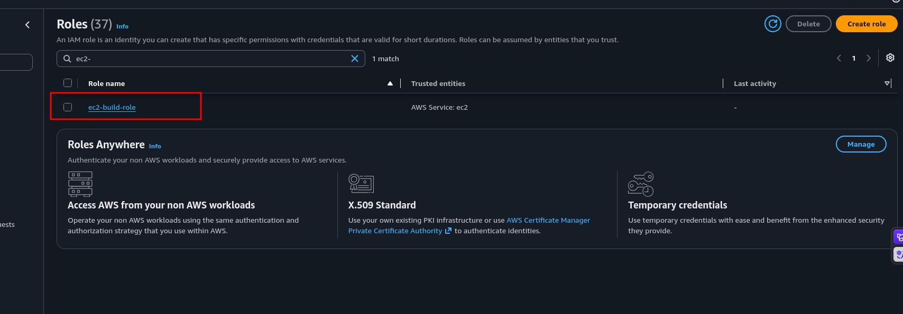

Now let's add the ECR push permission as an inline policy:

- In the Roles list, click `ec2-build-role`.
- On the Permissions tab, select Create inline policy from the Add permissions dropdown.
- Select the JSON tab in the Policy editor.
- Paste the following policy (replace `<account-id>` with your 12 digit account number; it is visible in the account menu at the top right):

```json
{
  "Version": "2012-10-17",
  "Statement": [
    {
      "Sid": "AllowECRLogin",
      "Effect": "Allow",
      "Action": "ecr:GetAuthorizationToken",
      "Resource": "*"
    },
    {
      "Sid": "AllowCreateAndPushProjectRepos",
      "Effect": "Allow",
      "Action": [
        "ecr:CreateRepository",
        "ecr:DescribeRepositories",
        "ecr:BatchCheckLayerAvailability",
        "ecr:InitiateLayerUpload",
        "ecr:UploadLayerPart",
        "ecr:CompleteLayerUpload",
        "ecr:PutImage",
        "ecr:DescribeImages"
      ],
      "Resource": [
        "arn:aws:ecr:eu-central-1:<account-id>:repository/first-app",
        "arn:aws:ecr:eu-central-1:<account-id>:repository/second-app"
      ]
    }
  ]
}
```

- Click Next.
- Enter `ecr-push-policy` as the Policy name.
- Click Create policy.

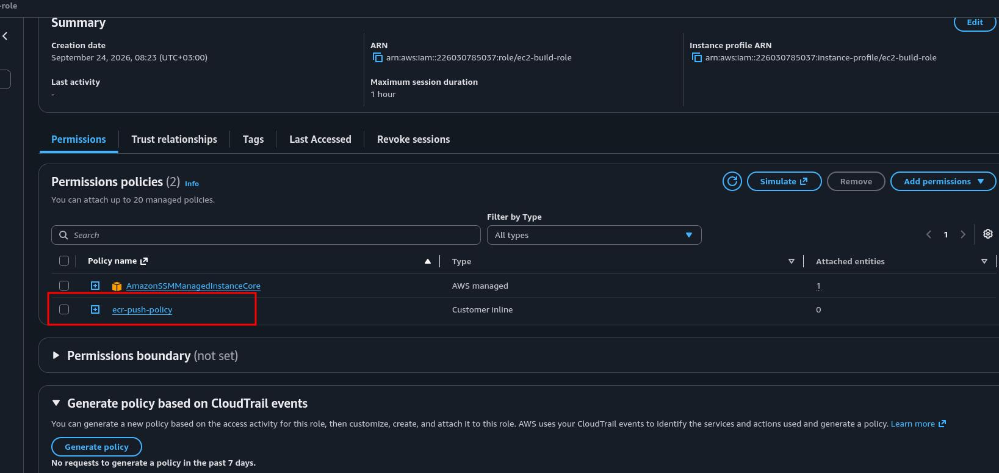


**IMPORTANT:** `ecr:GetAuthorizationToken` does not support resource level restriction; that is why `Resource: "*"` is mandatory, and it only produces a login token, granting no access to any repository on its own. The real permission is in the second statement and is bound only to the `first-app` and `second-app` repository ARNs: the build server cannot push to any other repository in the account. 

### 1.2 Steps: `ecsTaskExecutionRole`

- Click Create role from the Roles list.
- Select AWS service as the Trusted entity type.
- In the Use case section, select Elastic Container Service from the Service or use case dropdown.
- Among the options that appear below, check **Elastic Container Service Task** and click Next. (This choice writes the `ecs-tasks.amazonaws.com` principal into the trust policy; if "Elastic Container Service" is selected by mistake, the principal becomes `ecs.amazonaws.com` and the Fargate task cannot assume this role.)
- On the Permissions screen, type `AmazonECSTaskExecutionRolePolicy` in the search box and check its checkbox.
- Click Next.
- Enter exactly `ecsTaskExecutionRole` as the Role name.
- Click Create role.

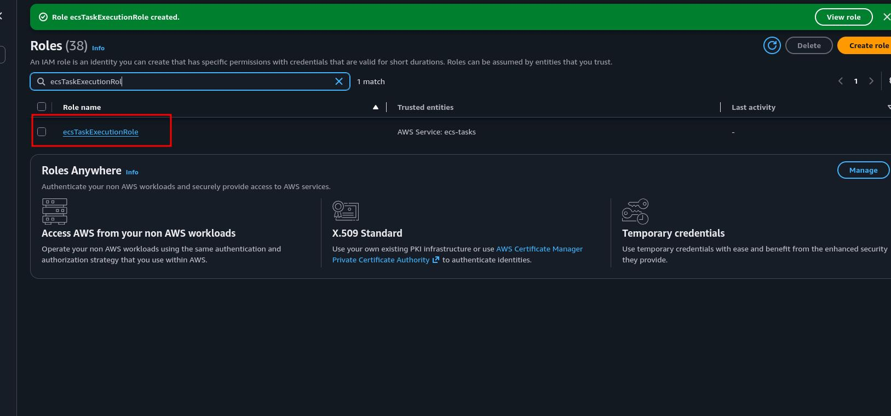

### 1.3 Verification

- In the Roles list, click `ecsTaskExecutionRole` and open the Trust relationships tab; see the `"Service": "ecs-tasks.amazonaws.com"` line.
- Click `ec2-build-role`; on the Trust relationships tab see the `"Service": "ec2.amazonaws.com"` line, and on the Permissions tab see two rows: one managed policy (`AmazonSSMManagedInstanceCore`) and one inline policy (`ecr-push-policy`).

## 2. Amazon VPC (Network Verification and Security Groups)

Amazon VPC is an isolated virtual network that belongs to you inside AWS: the IP address range, subnets, route tables and the internet gateway are parts of this network. In this project two resources will live inside the VPC: the EC2 build server and the Fargate tasks. This is where Fargate's particular nature shows: even though you manage no servers, every Fargate task gets its own **Elastic Network Interface** (ENI) in your subnet as required by the `awsvpc` network mode; in other words, which subnet the task runs in, whether it gets a public IP and which security group it is attached to are your decisions.

Every AWS account comes with a ready **default VPC** in every region: the `172.31.0.0/16` range, one public subnet in each Availability Zone, an attached internet gateway and the **auto assign public IPv4** setting enabled on the subnets. In this project we use the default VPC instead of building a VPC from scratch, because the focus of the project is the container lifecycle, and the three conditions required for internet access (public subnet, public IP, correct security group) are ready in the default VPC. A custom VPC would make sense together with private subnets + a NAT Gateway or a load balancer; the NAT Gateway is billed hourly and nothing in this project is kept private. 

A **security group** is a **stateful** virtual firewall that works at the instance or ENI level: when you open an inbound rule, the return traffic of that connection is automatically allowed; outbound is fully open by default. We will create two separate security groups, because the access needs of the two resources are different:

**`ec2-build-sg`:** For the build server. It contains no inbound rule. Session Manager does not connect to the instance from outside; the SSM Agent inside the instance reaches Systems Manager over outbound HTTPS and the session is established over this channel. This is exactly what providing terminal access without opening the SSH port means.

**`fargate-app-sg`:** For the Fargate tasks. Only `8443/TCP` inbound. Our applications will listen on this port; no other port is opened to the outside.

### 2.1 Steps: Default VPC Verification

- In the console, verify at the top right that the region is **Frankfurt (`eu-central-1`)**.
- Go to the VPC service.
- Select Your VPCs from the left menu.
- In the list, see a VPC whose Default VPC column is **Yes**; the IPv4 CIDR value should be `172.31.0.0/16`. Note the VPC ID (`vpc-...`).
- Select Subnets from the left menu.
- See the three subnets belonging to the default VPC (`eu-central-1a`, `1b`, `1c`). Click any of them and verify in the Details section below that the `Auto-assign public IPv4 address` value is **Yes**.
- Switch to the Route table tab of the same subnet. Among the routes, see the row with Destination `0.0.0.0/0` and Target `igw-...`: this row is what makes the subnet **public**; a subnet without a route to the internet gateway cannot be reached from the internet even if it carries a public IP.

If there is no VPC in the list whose Default VPC column is Yes (it may have been deleted earlier): on the Your VPCs page, select Create default VPC from the Actions dropdown; AWS recreates the structure above within a minute.

### 2.2 Steps: `ec2-build-sg`

- In the VPC console, select Security groups from the left menu.
- Click Create security group.
- Enter `ec2-build-sg` as the Security group name.
- Enter `Build server, no inbound, Session Manager only` as the Description.
- Verify that the default VPC is selected in the VPC field.
- Leave the Inbound rules section **empty**.
- In the Outbound rules section, leave the default rule (All traffic, `0.0.0.0/0`) as it is; Docker pulling base images, `dnf` package installation, ECR push and the SSM Agent's connection are all outbound traffic.
- Click Create security group.

### 2.3 Steps: `fargate-app-sg`

- On the Security groups page, click Create security group.
- Enter `fargate-app-sg` as the Security group name.
- Enter `Fargate tasks, inbound 8443 from internet` as the Description.
- Verify that the default VPC is selected in the VPC field.
- In the Inbound rules section, click Add rule.
- Select Custom TCP as the Type.
- Enter `8443` in the Port range field.
- Select `Anywhere-IPv4` as the Source (`0.0.0.0/0`).
- Leave the Outbound rules section at its default (the task pulling images from ECR and writing logs to CloudWatch is outbound traffic).
- Click Create security group.

**NOTE:** `0.0.0.0/0` is a deliberate choice in this project: the scenario requires verifying access to the application from the internet. If you want to test only from your own connection, you can select My IP as the Source; the console writes your current public IP address as a `/32`. In production, an Application Load Balancer sits in front of this security group and the tasks accept traffic only from the load balancer's security group.

### 2.4 Verification

- In the Security groups list, filter by the VPC ID column without typing `sg` in the search box; see the `ec2-build-sg` and `fargate-app-sg` rows under the default VPC.
- Click the `fargate-app-sg` row; verify on the Inbound rules tab that there is a single row (Custom TCP, 8443, `0.0.0.0/0`).
- Click the `ec2-build-sg` row; verify that the Inbound rules tab is empty.

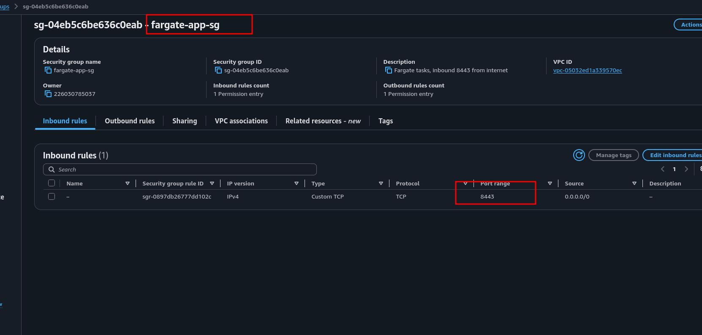
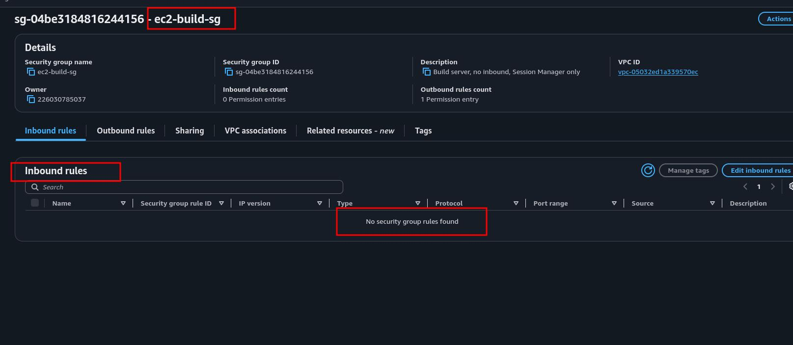

## 3. Amazon EC2 (Build Server) and Session Manager

Producing a Docker image requires a Docker daemon, and in this project we run the daemon on an EC2 instance. The alternatives and why they were not chosen: **AWS CloudShell** offers a ready terminal but a Docker daemon cannot run inside it; the **local machine** works but does not fit the goal of keeping the project entirely inside the AWS Console, and every reader's setup is different; **AWS CodeBuild** is the correct answer in production (a pipeline produces the image) but in this project we want to see the inside of the build step. EC2 is the place that shows most transparently what Docker does, and it is deleted when the work is done.

The reasons behind the choices made for the instance:

**Amazon Linux 2023:** The Docker package comes in the default repository, the **SSM Agent** and **AWS CLI v2** come preinstalled; in other words, no extra installation is needed for Session Manager and the ECR commands.

**t3.micro:** Sufficient for building a few small images and its hourly price is in the range of cents; the instance will live only for the duration of the build.

**No key pair:** We will connect to the instance with **Session Manager**. Session Manager is a capability of AWS Systems Manager: the SSM Agent inside the instance registers with the Systems Manager service over outbound HTTPS, and the terminal in the browser opens over this channel. There is no inbound port, there is no SSH key, access is controlled with IAM and sessions can be audited. Unlike classic SSH or EC2 Instance Connect, there is no need to open port 22 in the security group; this is why we created `ec2-build-sg` without inbound rules in step 2.

**Public IP enabled:** The instance serves nothing private; it needs a public IP so that it can reach the internet itself. Since we are not using a NAT Gateway, an instance in a public subnet can reach the internet only through its own public IP. Without a public IP, the SSM Agent cannot reach Systems Manager, the Connect button stays disabled, and `dnf` and Docker base image downloads fail. This is the most common mistake.

**IAM instance profile:** The `ec2-build-role` we created in step 1. It is attached at launch; the AWS CLI inside the instance automatically uses this role's temporary credentials without any access key.

### 3.1 Steps: Creating the Instance

- In the console, go to the EC2 service; verify at the top right that the region is `eu-central-1`.
- Select Instances from the left menu and click Launch instances.
- Enter `build-server` in the Name field.
- In the Application and OS Images section, select **Amazon Linux**; in the AMI dropdown verify that the Amazon Linux 2023 AMI is selected and that the Architecture is **`64-bit (x86)`**. (The architecture matters: we will build the image on this instance and select `Linux/X86_64` in the Fargate task definition; an image produced on an ARM instance does not run on x86 Fargate.)
- Select `t3.micro` as the Instance type.
- In the Key pair (login) section, select **Proceed without a key pair (Not recommended)** from the dropdown. (The warning is aimed at SSH usage; since we will connect with Session Manager, no key is needed.)
- In the Network settings section, click Edit.
- Verify that the default VPC is selected in the VPC field.
- In the Subnet field, select any default subnet (for example `eu-central-1a`).
- Verify that the `Auto-assign public IP` field is **Enable**.
- In the Firewall (security groups) section, check **Select existing security group** and select `ec2-build-sg` from the dropdown.
- In the Configure storage section, change the size to `16` GiB and keep the type as gp3. (The default 8 GiB would also be enough for Docker image layers and the build cache; 16 GiB completely removes disk pressure during the build of the second application, and the cost difference is close to nothing.)
- Expand the Advanced details section.
- Select `ec2-build-role` from the IAM instance profile dropdown.
- Click Launch instance in the Summary panel on the right.
- Return to the Instances list and wait for the Instance state to be **Running** and the Status check to be **3/3 checks passed** (1 to 2 minutes).

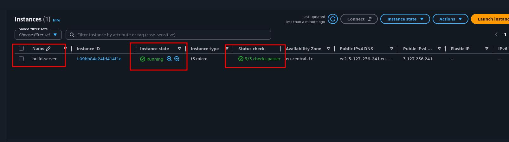


### 3.2 Steps: Connecting with Session Manager

- In the Instances list, check the checkbox of the `build-server` row.
- Click Connect.
- Select the **SSM Session Manager** tab.
- Click Connect. A terminal opens in a new browser tab.

Run the following commands in order in the terminal:

```bash
# Switch to the standard user of Amazon Linux
sudo su - ec2-user

# Verify which identity the instance is running with
aws sts get-caller-identity
```

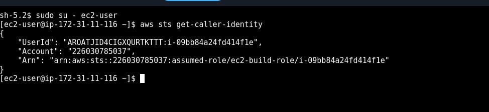

In the output, the `Arn` field should have the form `arn:aws:sts::<account-id>:assumed-role/ec2-build-role/i-...`: the instance has assumed `ec2-build-role` without any access key. Note the 12 digit number in the `Account` field; it should be the same as the number you wrote in the policy in step 1.

The AWS CLI comes preinstalled but no default region is set; set the region permanently so that the ECR commands go to Frankfurt:

```bash
aws configure set region eu-central-1

# Verify
aws configure get region
```

### 3.3 Verification

- You saw the `assumed-role/ec2-build-role` expression in the output of `aws sts get-caller-identity`.
- The output of `aws configure get region` is `eu-central-1`.
- In the EC2 console, on the instance's Security tab, see `ec2-build-sg` as the only security group and see that Inbound rules is empty: you connected to this terminal without opening any port.

## 4. Docker (Installation, Dockerfile and Image Production)

A Docker image is an immutable file system snapshot that packages an application's code, runtime and dependencies as **layers**. The **Dockerfile** is the recipe that defines line by line how this image is produced; each line produces a layer and the layers are cached. Every instance run from an image is a **container**. What Fargate will run is exactly this image; that is why we will verify here, on the build server, that the image listens on the correct port and starts without problems before sending it to ECR. If there is an error, this is the cheapest place to discover it: seeing the same error on Fargate requires waiting through the task's PROVISIONING, PENDING and STOPPED steps.

We will write two applications. Both are small web services that serve HTTP on port `8443` using only the Python standard library and show which application they are, the container's hostname and the time. The reason they use no external package is to keep the image as small and the build as fast as possible; in a real application, a `requirements.txt` copy and a `pip install` layer are added to the Dockerfile, and everything else stays the same.

The reasons behind the decisions in the Dockerfile:

**`python:3.12-slim`:** The full `python:3.12` image is about 1 GB with compilers and documentation tools; `slim` is about 150 MB. A small image is pushed faster, the Fargate task starts faster and it takes less space in ECR. `alpine` is even smaller but `musl` libc causes incompatibilities with some Python packages; `slim` is the safest middle ground.

**Listening on `0.0.0.0`:** If the application listened on `127.0.0.1`, it would be reachable only from inside the container itself; traffic from outside arrives at the container's network interface. This is the most common cause of "the container is running but the port does not respond" errors.

**`EXPOSE 8443`:** It does not open a port; it is metadata documenting which port the image listens on. The actual port opening is done by `docker run -p` (locally) and by the port mapping in the task definition (on Fargate).

**`CMD` exec form (`["python", "app.py"]`):** The shell form (`CMD python app.py`) runs the command under a `/bin/sh`, and the `SIGTERM` signal goes to the shell rather than to Python; the container does not shut down cleanly. With the exec form, Python becomes PID 1 directly and receives the signal ECS sends while stopping the task.

### 4.1 Steps: Docker Installation

In the Session Manager terminal (as `ec2-user`), run the following commands in order:

```bash
# Update the package list and install Docker from the default repository
sudo dnf update -y
sudo dnf install -y docker

# Start the Docker daemon and make it start automatically on reboots
sudo systemctl enable --now docker

# Add ec2-user to the docker group so it can run docker commands without sudo
sudo usermod -aG docker ec2-user

# Open a new shell so the group membership takes effect in this session
newgrp docker

# Verify
docker --version
docker ps
```

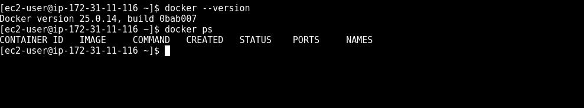

`docker ps` should return an empty table (a header row, no containers). If you get a "permission denied" error, you skipped the `newgrp docker` command; alternatively, leave with `exit` and enter again with `sudo su - ec2-user`.

### 4.2 Steps: First Application (`first-app`)

```bash
# Create the project directories
mkdir -p ~/apps/first-app ~/apps/second-app
cd ~/apps/first-app
```

Create the application file:

```bash
cat > app.py << 'EOF'
import os
import socket
from datetime import datetime, timezone
from http.server import BaseHTTPRequestHandler, HTTPServer

APP_NAME = os.environ.get("APP_NAME", "unnamed-app")
APP_COLOR = os.environ.get("APP_COLOR", "#333333")
PORT = 8443


class Handler(BaseHTTPRequestHandler):
    def do_GET(self):
        if self.path == "/health":
            body = b'{"status": "ok"}'
            content_type = "application/json"
        else:
            body = f"""<!doctype html>
<html><head><title>{APP_NAME}</title></head>
<body style="font-family: sans-serif; background: {APP_COLOR}; color: white; padding: 40px;">
<h1>{APP_NAME}</h1>
<p>Container hostname: <strong>{socket.gethostname()}</strong></p>
<p>Server time (UTC): <strong>{datetime.now(timezone.utc).isoformat()}</strong></p>
<p>Served on port {PORT} by AWS Fargate</p>
</body></html>""".encode()
            content_type = "text/html"

        self.send_response(200)
        self.send_header("Content-Type", content_type)
        self.send_header("Content-Length", str(len(body)))
        self.end_headers()
        self.wfile.write(body)

    def log_message(self, fmt, *args):
        print(f"[{APP_NAME}] {self.client_address[0]} {fmt % args}", flush=True)


if __name__ == "__main__":
    print(f"[{APP_NAME}] starting on 0.0.0.0:{PORT}", flush=True)
    HTTPServer(("0.0.0.0", PORT), Handler).serve_forever()
EOF
```

Create the Dockerfile:

```bash
cat > Dockerfile << 'EOF'
FROM python:3.12-slim

ENV APP_NAME="Research Portal (first-app)" \
    APP_COLOR="#1f6f8b" \
    PYTHONUNBUFFERED=1

WORKDIR /app
COPY app.py .

EXPOSE 8443
CMD ["python", "app.py"]
EOF
```

`PYTHONUNBUFFERED=1` makes Python write stdout without buffering; this is the condition for seeing the logs in CloudWatch without delay on Fargate.

Build the image:

```bash
docker build -t first-app .
```

The first build takes about a minute because it downloads the `python:3.12-slim` base image; subsequent builds finish within seconds from the cache.

### 4.3 Steps: Second Application (`second-app`)

The second application uses the same code with a different identity; the name and color change so that it can be visually distinguished as a different application.

```bash
cd ~/apps/second-app
cp ../first-app/app.py .

cat > Dockerfile << 'EOF'
FROM python:3.12-slim

ENV APP_NAME="Lab Scheduler (second-app)" \
    APP_COLOR="#8b3a1f" \
    PYTHONUNBUFFERED=1

WORKDIR /app
COPY app.py .

EXPOSE 8443
CMD ["python", "app.py"]
EOF

docker build -t second-app .
```

This build finishes in a few seconds: the base image and `WORKDIR` layers are cached from the first build, only the `ENV` and `COPY` layers are produced again.

### 4.4 Steps: Local Test 

```bash
# List both images
docker images
```
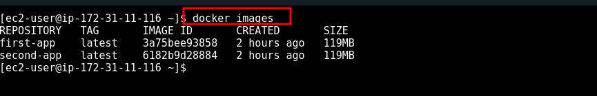

See the `first-app` and `second-app` rows and that both are around 120 MB.

```bash
# Run the first application in the background; bind the host's port 8443 to the container's port 8443
docker run -d --name first-test -p 8443:8443 first-app

# Verify from the log that the application started
docker logs first-test

# Send an HTTP request
curl -s http://localhost:8443/health
curl -s http://localhost:8443/ | grep '<h1>'
```

The first curl should return `{"status": "ok"}`, the second `<h1>Research Portal (first-app)</h1>`. Stop and remove the test container and repeat for the second application:

```bash
docker stop first-test && docker rm first-test

docker run -d --name second-test -p 8443:8443 second-app
curl -s http://localhost:8443/ | grep '<h1>'
docker stop second-test && docker rm second-test
```

The second `<h1>` line should show `Lab Scheduler (second-app)`.

**NOTE:** You cannot run this test from the browser at `http://<build-server-ip>:8443`; `ec2-build-sg` opens no inbound port, and that is deliberate. The build server's job is to produce images, not to serve applications. We will see the application from the internet for the first time in step 8, on Fargate. The host port concept in the `-p 8443:8443` syntax also exists only here, in Docker's own network; on Fargate there is no host port because every task gets its own ENI, and the container port is opened directly on the task's IP.

### 4.5 Verification

- `first-app` and `second-app` in the output of `docker images`, both with the `latest` tag.
- The correct `<h1>` text in the `curl` output for both containers.
- `docker ps` is empty again: the test containers were cleaned up.

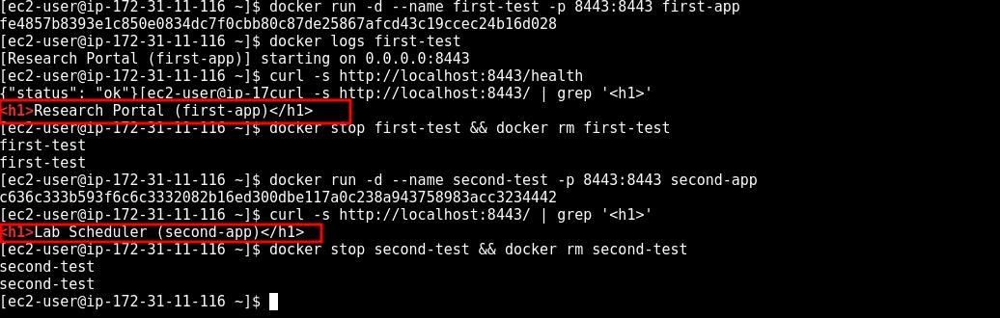

## 5. Amazon ECR (Image Registry)

Amazon Elastic Container Registry is a fully managed **container registry** that stores, manages and distributes container images. The images we produced on the build server currently live only on that instance's disk; for Fargate to pull them, they must be in a registry reachable over the network. The alternatives and why they were not chosen: **Docker Hub** subjects anonymous pulls to rate limits on its free tier, limits the number of private repositories and requires a separate identity management outside AWS; your own **self hosted registry** means managing servers, disks and TLS. ECR's advantages in this scenario correspond directly to the scenario's requests: access control is done with **IAM** (in this step we will see the policy from step 1 at work), images are encrypted at rest with `AES-256`, data transfer to ECS and Fargate within the same region is free, and for new accounts 500 MB of private storage per month is covered by the free tier for the first 12 months.

There are three mechanisms to learn in this step:

**Authentication:** The Docker CLI cannot talk to ECR directly with IAM credentials. The `aws ecr get-login-password` command produces a token valid for 12 hours from your IAM identity, and `docker login` uses this token. The token is derived from the instance profile on the build server; we write no password anywhere.

**Registry URI:** Every account has one private registry in every region, and its address has the form `<account-id>.dkr.ecr.<region>.amazonaws.com`. To send an image to ECR, it must first be retagged with a tag containing this address; `docker push` reads the destination from the image name.

**Tags:** `latest` is a convention with no special meaning; it does not mean "the most recently pushed", it only means "pushed under the name `latest`". In production, images are tagged with a git commit hash or a version number and the repository is protected with **tag immutability**; since this project is learning oriented, we proceed with `latest`.

### 5.1 Steps: Creating the Repositories

We will create the repositories with the AWS CLI on the build server; this shows that the `ecr:CreateRepository` permission we gave to `ec2-build-role` in step 1 works only for these two names. (They can also be created from the console: ECR → Private registry → Repositories → Create repository.)

In the Session Manager terminal (as `ec2-user`):

```bash
# Capture the account number and the registry address in variables
account=$(aws sts get-caller-identity --query Account --output text)
region=eu-central-1
registry="${account}.dkr.ecr.${region}.amazonaws.com"
echo $registry

# Create the two private repositories
aws ecr create-repository --repository-name first-app
aws ecr create-repository --repository-name second-app
```

Each command returns the JSON definition of the created repository; pay attention to the `repositoryUri` field, this is our push destination. See that the `encryptionType` field is `AES256`: encryption at rest is enabled by default.

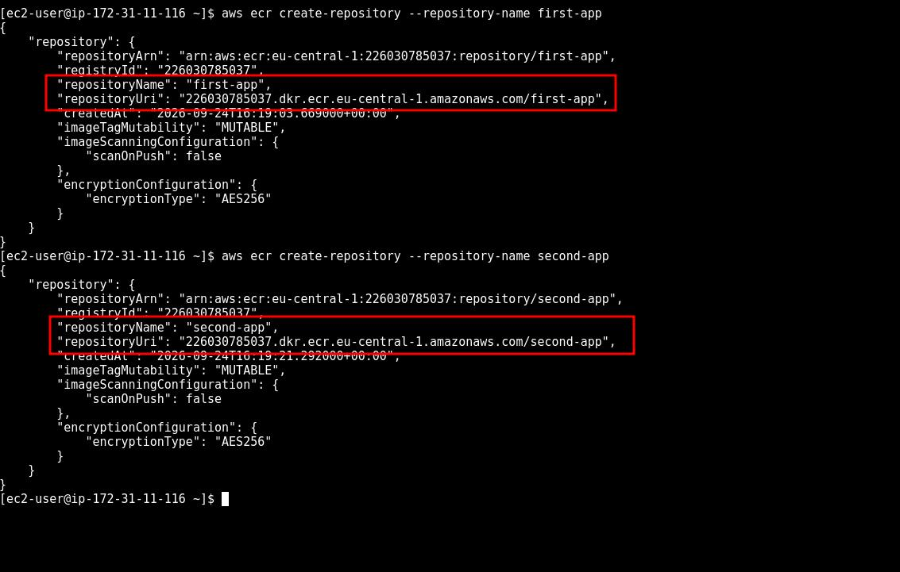

If you want to see the permission boundary, try with a name outside the policy:

```bash
aws ecr create-repository --repository-name third-app
```

You should get an `AccessDeniedException`: the role is authorized only for the `first-app` and `second-app` ARNs. This is concrete proof of least privilege.

### 5.2 Steps: Login, Tag and Push 

```bash
# Get the ECR token and authenticate Docker to the registry
aws ecr get-login-password --region $region | docker login --username AWS --password-stdin $registry
```

See `Login Succeeded` in the output. The warning about the token being saved in `~/.docker/config.json` is normal; the token becomes invalid after 12 hours, and the build server will be deleted after this step.

```bash
# Retag the images with the registry address
docker tag first-app:latest ${registry}/first-app:latest
docker tag second-app:latest ${registry}/second-app:latest

# See the new tags: same IMAGE ID, two different names
docker images

# Push
docker push ${registry}/first-app:latest
docker push ${registry}/second-app:latest
```

Notice in the output of `docker images` that the `first-app` and `<registry>/first-app` rows carry the same IMAGE ID: `docker tag` does not create a copy, it gives a second name to the same image.

In the push output you see a `Pushed` line for each layer. In the second push, it says `Layer already exists` for the base image layers: ECR deduplicates layers, the layers of `python:3.12-slim` are stored only once and storage is charged only once.

```bash
# Verify the pushed images with the CLI
aws ecr describe-images --repository-name first-app --query 'imageDetails[].{tags:imageTags,sizeMB:imageSizeInBytes}' --output table
aws ecr describe-images --repository-name second-app --query 'imageDetails[].{tags:imageTags,sizeMB:imageSizeInBytes}' --output table
```
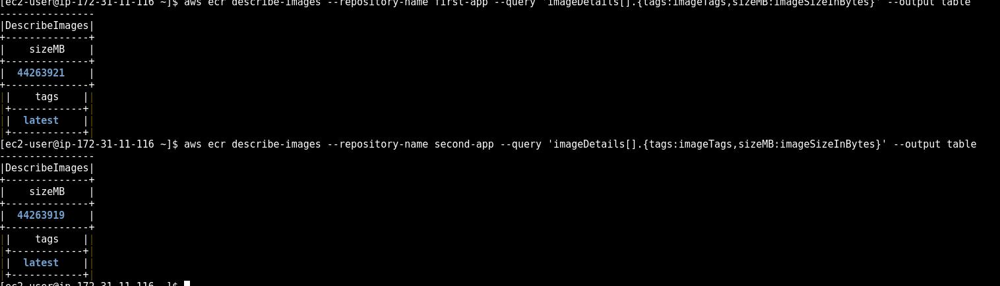

### 5.3 Steps: Console Verification and Image URI

We take the full image address that we will use in the task definition from the console:

- In the console, go to the Amazon ECR service.
- From the left menu, select Repositories under Private registry.
- See the `first-app` and `second-app` repositories in the list.
- Click `first-app`.
- In the Images table, see a single image with the `latest` tag; the Size column is around 50 MB (ECR shows the compressed size; the 150 MB in `docker images` is the uncompressed size).
- Click Copy URI next to the Image URI value in the image row and paste it into a text editor. Its form is as follows:

`<account-id>.dkr.ecr.eu-central-1.amazonaws.com/first-app:latest`

- Repeat the same for `second-app` and note the second URI as well.

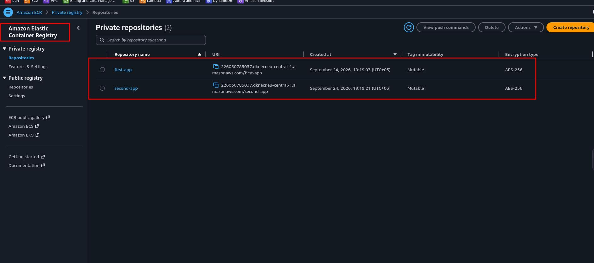

### 5.4 Verification

- Two repositories in the ECR console, one image with the `latest` tag in each.
- Both Image URIs noted; they will be pasted into the task definitions in steps 7 and 9.
- `AccessDeniedException` on the `third-app` attempt: the build server is authorized only for the project's repositories.

The build server's job ends here. We do not delete the instance right away; let it stay at hand in case a change is needed for the second application in step 9. But keep in mind that it produces cost while waiting; it is among the first things to be deleted in cleanup.

## 6. Amazon ECS (Cluster)

Amazon Elastic Container Service is a fully managed **container orchestration** service that handles the deployment, scheduling and scaling of containers. The top level concept of ECS is the **cluster**: a boundary where tasks and services are logically grouped. What this boundary means changes according to the type of **capacity** under the cluster. In the **EC2 launch type**, the cluster is a real pool of servers; you set up the instances, you run the ECS agent, you plan the capacity. In the **Fargate launch type**, the cluster is only a namespace: there is no server inside it to manage, AWS allocates the compute needed for each task at that moment and takes it back when the task ends.

Why Fargate: the scenario's request is to run "without the burden of managing the underlying infrastructure". The cases where the EC2 launch type makes sense are clear: a need for GPUs, daemons that must run on every instance, the unit cost advantage of EC2 at very high and constant load, or a compliance requirement for host access. None of these exist in this scenario. The third option, **ECS Anywhere** (external), is for attaching on premises servers to the cluster and is outside the scope of this project.

The cluster itself is free; the Fargate charge applies only while a task is running, per second, based on the allocated vCPU and memory. Two more options will appear while creating the cluster and we will leave both off: **Container Insights** (sends task and container level metrics to CloudWatch; useful, but billed per metric and unnecessary for a single task) and **EC2 capacity** (not needed when Fargate is selected).


### 6.1 Steps

- In the console, go to Elastic Container Service; verify that the region is `eu-central-1`.
- Select Clusters from the left menu.
- Click Create cluster.
- Enter `research-cluster` as the Cluster name.
- In the Infrastructure section, verify that the **AWS Fargate Only** checkbox is checked.
- In the Monitoring section, leave the Use Container Insights option off.
- Leave the Tags section empty.
- Click Create.
- Return to the Clusters list. The cluster row first appears as being created with an informational message; within a minute the Status becomes **Active**. If the page does not refresh itself, click the refresh icon.

### 6.2 Verification

- In the Clusters list, `research-cluster` with Status **Active**, Services 0, Tasks 0.
- Click the cluster name; on the Infrastructure tab, see the **FARGATE** and **FARGATE_SPOT** rows in the Capacity providers table. These are attached to Fargate clusters automatically; FARGATE_SPOT is discounted capacity of up to about 70 percent for interruption tolerant workloads, and we will not use it in this project.

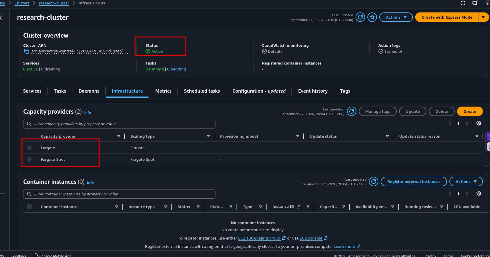


## 7. Amazon ECS (Task Definition)

A **task definition** is the JSON document that defines how ECS will run a container; it is the declarative and versioned form of all the parameters of the `docker run` command in the Docker world. It states which image will be used, how much CPU and memory will be allocated, which ports will be opened, where the logs will go and which IAM roles will be used. A task definition runs nothing on its own; it is a **blueprint**. Every instance run from this blueprint is a **task**, and we will see it in step 8. Task definitions are **immutable**: every save produces a new **revision** (`first-app:1`, `first-app:2` ...) and old revisions remain until deleted; thanks to this, if a change causes a problem, it is possible to start a task with the previous revision.

The reasons behind the decisions in this step:

**0.5 vCPU / 1 GB:** Fargate accepts CPU and memory only in specific combinations and allocates and charges exactly that resource. For a small Python web service, even the smallest combination (0.25 vCPU / 0.5 GB) is more than enough; 0.5 vCPU / 1 GB is a comfortable choice that keeps the cold start short and the hourly cost in the range of cents.

**Task execution role vs task role:** These two fields sit side by side in the console and are the most frequently confused concept. The **task execution role** is the role ECS uses while bringing the task up: it must have permission to pull images from ECR and write logs to CloudWatch; this is the `ecsTaskExecutionRole` we created in step 1. The **task role**, on the other hand, is the role the application code inside the container assumes when accessing AWS services: if the application will read files from S3 or write to DynamoDB, a role goes here. Our application accesses no AWS service; the task role will stay **empty**. Writing the same role in both fields is a common shortcut, but it means giving the application code ECR pull and log writing permission; least privilege does not require that.

**`awslogs` log driver:** The container's stdout and stderr output flows to CloudWatch Logs. It is possible to turn this off, but then if the container crashes before starting, you have no diagnostic information at all; these logs are the only remedy for the "the task became STOPPED, the reason is unclear" situation. The console brings the `awslogs-create-group: true` setting by default so that the log group is created automatically; for this setting to work, the execution role needs the `logs:CreateLogGroup` permission, and the managed policy does not include it. We add this permission now, as an inline policy limited to log groups that start with `/ecs/`.

**No health check:** A container health check requires a command that runs inside the image (such as `curl`); there is no `curl` in the `python:3.12-slim` image, and for a single standalone task a health check adds nothing to the verification we will do from the browser in step 8. The picture changes for services behind a load balancer; we will return to this in section 10.

### 7.1 Steps: Log Group Permission for the Execution Role

- In the console, go to the IAM service and click `ecsTaskExecutionRole` under Roles.
- On the Permissions tab, select Create inline policy from the Add permissions dropdown.
- Select the JSON tab and paste the following policy (replace `<account-id>` with your account number):

```json
{
  "Version": "2012-10-17",
  "Statement": [
    {
      "Sid": "AllowCreateEcsLogGroups",
      "Effect": "Allow",
      "Action": "logs:CreateLogGroup",
      "Resource": "arn:aws:logs:eu-central-1:<account-id>:log-group:/ecs/*"
    }
  ]
}
```

- Click Next, enter `ecs-create-log-group-policy` as the Policy name and click Create policy.

### 7.2 Steps: Task Definition

- In the console, go to Elastic Container Service.
- Select Task definitions from the left menu.
- From the Create new task definition dropdown, select Create new task definition (not the JSON option; we will proceed through the form and examine the generated JSON at the end).

Task definition configuration section:

- Enter `first-app` in the Task definition family field.

Infrastructure requirements section:

- Verify that **AWS Fargate** is selected as the Launch type.
- Select **`Linux/X86_64`** as the Operating system/Architecture. (The build server was x86; the image was produced for this architecture.)
- See that the Network mode field is **awsvpc**; it cannot be changed on Fargate.
- In the Task size section, select **.5 vCPU** as CPU and **1 GB** as Memory.
- Leave the Task role field empty.
- Select **ecsTaskExecutionRole** from the Task execution role dropdown.

Container 1 section:

- Enter `first-app` in the Name field.
- Paste the `first-app` Image URI you noted in step 5 into the Image URI field (`<account-id>.dkr.ecr.eu-central-1.amazonaws.com/first-app:latest`).
- Verify that the Essential container field is **Yes**. (If an essential container in the task stops, the whole task stops; in a task with a single container this is always Yes.)
- In the Port mappings section, enter `8443` in the Container port field and keep the Protocol as **TCP**. Select **HTTP** as the App protocol. 
- Leave the Read only root file system, Resource allocation limits and Environment variables sections empty. (The application name and color were embedded into the image with `ENV`; the Environment variables section of the task definition is where you can override them to run the same image with different settings.)
- In the Logging section, verify that the **Use log collection** checkbox is checked and that Amazon CloudWatch is selected as the destination. Check the automatically filled values: `awslogs-group` = `/ecs/first-app`, `awslogs-create-group` = `true`, `awslogs-region` = `eu-central-1`, `awslogs-stream-prefix` = `ecs`.
- Leave the HealthCheck, Startup dependency ordering, Container timeouts and Restart policy sections as they are.
- Leave the Storage, Monitoring and Tags sections at their defaults.
- Click Create.

### 7.3 Verification

- See in the green success message that the `first-app:1` revision was created.
- On the task definition page, Status **Active**.
- Click the JSON tab and read the document you produced with the form: `FARGATE` inside `requiresCompatibilities`, `networkMode` `awsvpc`, `cpu` `512` and `memory` `1024` (the API equivalents of the values the console shows as vCPU and GB: 1 vCPU = 1024 CPU units, memory in MiB), `executionRoleArn` filled and no `taskRoleArn` field. See the `awslogs` settings under `containerDefinitions[0].logConfiguration`. Every field you filled in the console corresponds to a key in this JSON; the same document could also have been registered with the AWS CLI or CloudFormation.

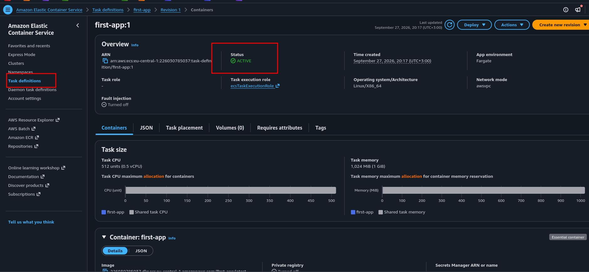


## 8. Running the Task and Testing Access

There are two ways to produce a running instance from a task definition, and both sit side by side in the console. **Run task** starts the specified number of tasks once; if a task stops, ECS does not restart it. **Create service**, on the other hand, defines a **desired count** and ECS maintains this number continuously: if a task crashes a new one is started, and a load balancer and auto scaling can also be attached to the service. In this step we use Run task, because our aim is to verify that the image comes up on Fargate and is reachable from the internet; not to serve a permanent application. The correct path in production is the service, and we will discuss the difference in section 10.

In this step we will follow the lifecycle of a Fargate task. The task starts with **PROVISIONING**: Fargate creates an ENI for the task in the subnet we selected and assigns a public IP. In the **PENDING** phase, the image is pulled from ECR with the execution role and the container is started. **RUNNING** is the state where the container runs and the task stays up as long as it is essential. If the container exits or cannot be started, the task becomes **STOPPED** and the reason for stopping is written in the task detail. On the first run, the transition from PROVISIONING to RUNNING usually takes 30 to 60 seconds; since the image is pulled for the first time, the PENDING phase is the longest one.

Three conditions must be satisfied at the same time for access, and we set them up one by one in the previous steps: the task is in a **public subnet** (step 2), the task has a **public IP** (we will enable it in this step) and the task's security group lets 8443 in (`fargate-app-sg`, step 2). If any one is missing, the task becomes RUNNING but the browser times out; there is no error message, because from ECS's point of view everything is fine. This is the classic example of the "the network layer works, the application layer works, but there is no connection between them" situation.

### 8.1 Steps: Run Task

- In the ECS console, select Task definitions from the left menu and click `first-app`.
- In the Revisions list, check the checkbox of the `first-app:1` row.
- Select **Run task** from the Deploy dropdown.

Environment section:

- Select `research-cluster` from the Existing cluster dropdown.
- Check **Launch type** as the Compute options.
- Select **FARGATE** as the Launch type.
- Leave the Platform version field as **LATEST**. (The platform version is the combination of the kernel and container runtime Fargate will run the task on; LATEST receives security patches automatically.)

Networking section:

- Verify that the default VPC is selected in the VPC dropdown.
- The subnets of the default VPC are listed in the Subnets field; since all of them are public, you can leave them as they are. Fargate places the task in one of them.
- In the Security group section, check **Use an existing security group**.
- In the Security group name list, `default` is selected by default; remove it with the X next to it and select `fargate-app-sg` from the dropdown. Only `fargate-app-sg` should remain in the list.
- Set the Public IP switch to the **Turned on** position.

Expand the Task overrides section and only review it: Task role should be empty, Task execution role should be `ecsTaskExecutionRole`. Leave the Container overrides and Tags sections empty.

- Click Create.

### 8.2 Steps: Following the Lifecycle

- The console takes you to the Tasks tab of `research-cluster`. See the new task row in the table; the Last status column starts with **Provisioning**.
- Click the refresh icon every 15 to 20 seconds and watch the status become **Pending** and then **Running**. The Desired status column is Running from the beginning; the moment the two columns become equal is the moment the task is ready.
- Click the Task ID in the task row.
- On the Configuration tab, read the fields in the Configuration section: Launch type FARGATE, the actual number of the Platform version (for example 1.4.0), Task definition `first-app:1`.
- In the Network section of the same page, click the copy icon next to the Public IP value. Notice that the Private IP is in the `172.31.x.x` range: the task has received its own ENI in the default VPC.

### 8.3 Steps: Access Test

- Open a new tab in your browser and type `http://<public-ip>:8443` in the address bar. Start the address with `http://`; some browsers upgrade an address entered without a protocol to `https`, and since our application does not speak TLS you would see a connection error.
- See the **`Research Portal (first-app)`** heading, the container hostname and the UTC time on a blue background.
- Add `/health` to the end of the address: see the `{"status": "ok"}` response.

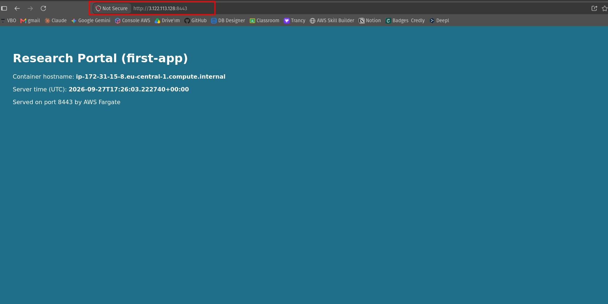
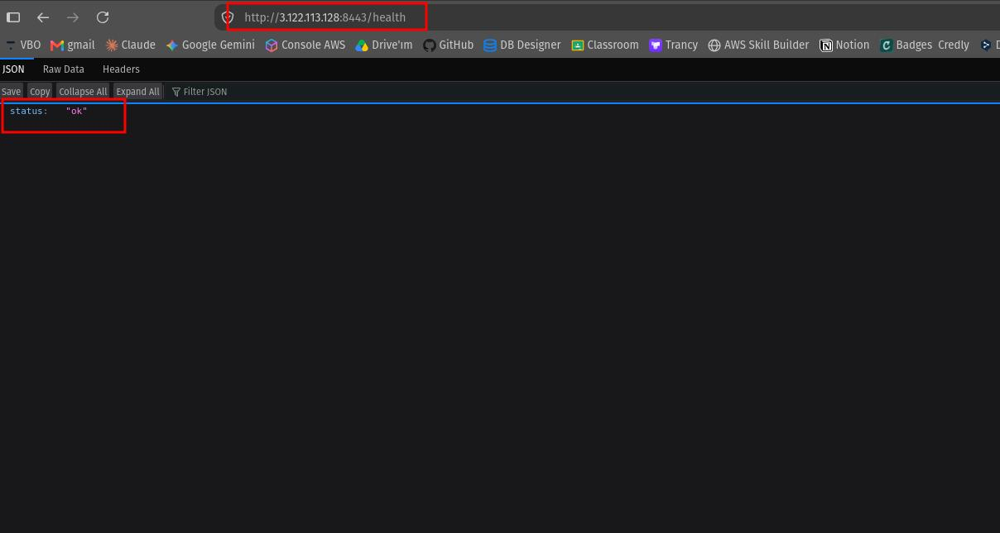


### 8.4 Verification

- Task Last status **Running**, Desired status **Running**.
- In the browser, `http://<public-ip>:8443` shows the application and `/health` shows the JSON response.
- There are request lines in the `/ecs/first-app` log group in CloudWatch.

Leave the task running for now; in step 9 we will place the second application next to it and see the two tasks together.


## 9. Second Application (`second-app`)

The thing that best shows that a task definition is a **blueprint** is how little work it takes to release a second application on the same pipeline as the first: we touch none of IAM, the network, the security group, the cluster or the execution role. We only write a new task definition pointing at a different image and run it in the same cluster. This is exactly what happens in a real team: the platform team that sets up the infrastructure once adds only a task definition (and in production a service) for each new application.

The second lesson of this step is on the network side. In step 4, on the build server, we could not bind two containers to `8443` at the same time; since both share the host's single IP, the second one would need a different host port such as `docker run -p 8444:8443`. On Fargate, since every task gets its own ENI and its own IP, both tasks listen on `8443` and do not conflict with each other. This is the practical meaning of the `awsvpc` network mode: there is no such problem as port sharing between containers.

### 9.1 Steps: Task Definition

- In the ECS console, Task definitions → Create new task definition → Create new task definition.
- Task definition family: `second-app`.
- Infrastructure requirements: exactly the same as step 7 (AWS Fargate, `Linux/X86_64`, .5 vCPU, 1 GB, Task role empty, Task execution role `ecsTaskExecutionRole`).
- Container 1: Name `second-app`; paste the `second-app` URI you noted in step 5 as the Image URI (`<account-id>.dkr.ecr.eu-central-1.amazonaws.com/second-app:latest`); Container port `8443`, TCP, App protocol HTTP.
- Logging: Use log collection checked; verify that the automatically filled `awslogs-group` value is `/ecs/second-app`. (No extra permission is needed, since the inline policy in 7.1 covers the `/ecs/*` pattern.)
- Other sections at their defaults; click Create.
- See that the `second-app:1` revision is Active.

### 9.2 Steps: Run Task

- On the `second-app` task definition page, select the `second-app:1` revision, Deploy → Run task.
- Environment: Existing cluster `research-cluster`, Launch type, FARGATE, Platform version LATEST.
- Deployment configuration: Application type Task, Desired tasks 1.
- Networking: default VPC, subnets as they are; in Security group remove `default` and select `fargate-app-sg`; Public IP **Turned on**.
- Click Create.

### 9.3 Steps: Seeing the Two Tasks Together

- On the Tasks tab of `research-cluster` there are now two rows: `first-app:1` (Running since step 8) and `second-app:1` (Provisioning → Pending → Running).
- When the second task is Running, click its Task ID and copy the Public IP from the Network section. Notice that it is a different IP from the first task.
- Open `http://<second-task-public-ip>:8443` in the browser: see the **`Lab Scheduler (second-app)`** heading on a brown background.
- Open the first task's address again as well: Research Portal is still up. Compare the container hostname values on the two pages; each task runs in its own isolated container.
- Return to the cluster's Tasks tab; note that both tasks show FARGATE in the Launch type column, that both run with the same `fargate-app-sg` and on the same port 8443, but are reached at different IPs.

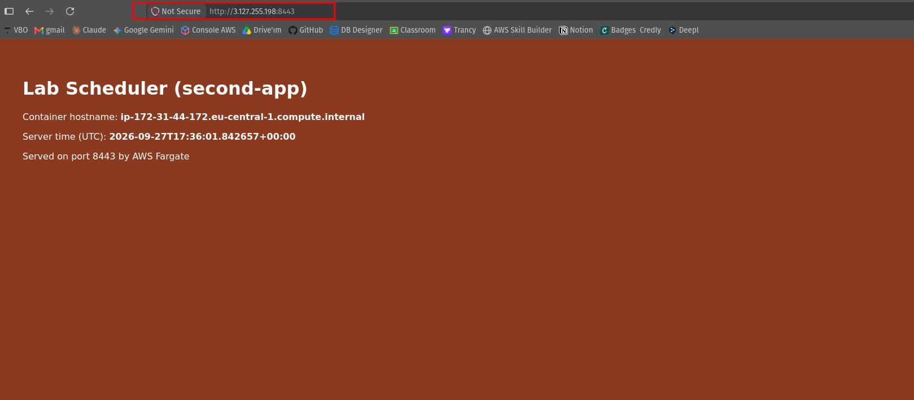

### 9.4 Verification

- Two tasks Running in the cluster.
- Two different applications responding at two different public IPs, on the same port 8443.
- Two log groups in CloudWatch: `/ecs/first-app` and `/ecs/second-app`.

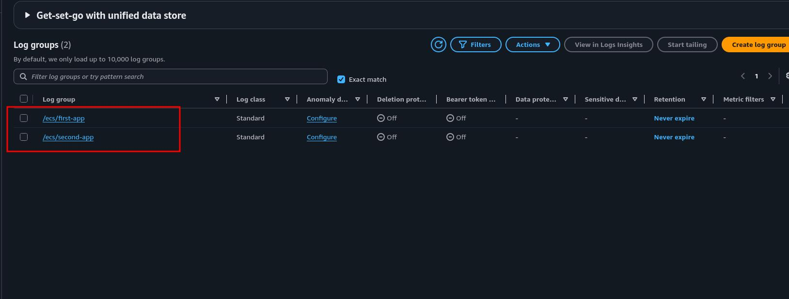

## 10. Evaluating the Architecture as a Whole

At this point, the system we have built is the following:

**Build:** An EC2 build server in a public subnet of the default VPC, with no inbound port. Access through Session Manager, authorization through the `ec2-build-role` instance profile; no SSH key and no access key. The Docker daemon runs on this instance, and the two applications are turned into images with a Dockerfile.

**Registry:** Two private repositories in ECR. The build server can push only to these two repositories (`ecr-push-policy`, bound to the repository ARNs); an attempt at a third repository is rejected with `AccessDeniedException`. Images are encrypted at rest, base image layers are deduplicated.

**Orchestration:** A single Fargate cluster, two task definitions, two running tasks. For each task, ECS pulls the image from ECR with `ecsTaskExecutionRole` and writes the logs to CloudWatch; the application code itself holds no AWS permission (empty task role). Every task gets its own ENI and public IP, listens on the same port 8443 without conflict, and is reached from the internet through `fargate-app-sg`.

There are three things this setup leaves out deliberately, as much as it is instructive, and the road to production passes through them:

**Service instead of task:** If the tasks running now crash, nobody restarts them. An **ECS service** maintains the desired count, distributes traffic to multiple tasks behind an **Application Load Balancer** and replaces unhealthy tasks with a **health check**. The application's address also becomes the load balancer's fixed DNS name instead of the task's changing public IP. The answer to the "high availability and automatic scaling" request in the scenario is the service, not the task; the task was chosen in this project to show that the blueprint works with the fewest parts.

**Private subnet instead of public task:** Giving tasks a public IP and protecting them with a security group is acceptable at small scale; in production, tasks run in a private subnet, only the load balancer is visible from the internet, and the tasks reach ECR and CloudWatch through a NAT Gateway or VPC endpoints (`ecr.api`, `ecr.dkr`, `s3`, `logs`). In this project we deliberately chose the public subnet + public IP path to avoid the hourly cost of a NAT Gateway.

**Pipeline instead of manual build:** Building and pushing the image by hand on an EC2 instance is right for learning and wrong for repeatability. In production, this work moves to a CI/CD pipeline (for example CodeBuild or GitHub Actions); images are tagged with a commit hash instead of `latest`, the repository is protected with **tag immutability** and a **lifecycle policy** deletes old images automatically.

In contrast, the concepts the project demonstrates are independent of scale: credential free authorization with an instance profile, least privilege at the prefix and ARN level, the separation of the execution role and the task role, one ENI per task with `awsvpc`, the immutable revisions of the task definition and the Fargate lifecycle. None of these change when a service and a load balancer are added; new layers come on top of them.

## 11. Cleanup (Deleting the Resources)

The project is complete; now we will delete all the resources without leaving anything in the account that could produce cost. Let's make the cost reality clear: there are three items in this architecture that produce continuous charges. **Fargate tasks** for every second they run (based on the allocated vCPU and memory), the **EC2 build server** for every hour it runs and, even when stopped, for the **EBS disk**, and **ECR** for the images it stores, per GB per month. The cluster, task definitions, security groups, IAM roles and CloudWatch log groups (apart from negligible storage) are free; still, leaving unused resources in the account is not good practice.

The deletion order is the reverse of the dependency logic: first the running things (tasks), then their definitions and the place they live in (task definition, cluster), then the images (ECR), then the build infrastructure (EC2), then the network resources (security groups; a security group attached to an ENI cannot be deleted, which is why it comes after the tasks and the instance), and finally the logs and permissions (CloudWatch, IAM).

### 11.1 Stopping the Tasks

- In the ECS console, Clusters → `research-cluster` → Tasks tab.
- Check the checkboxes of both tasks.
- Select **Stop selected** from the Stop dropdown and confirm.
- Wait for the Last status column to become **Stopped**. The Fargate charge stops at this moment; the ENIs are released within a minute.

### 11.2 Deregistering and Deleting the Task Definitions

Task definitions have a two stage deletion logic: **Deregister** makes the revision INACTIVE (no new task can be started, but the historical records remain); **Delete** removes the INACTIVE revision completely.

- Select Task definitions from the left menu and click `first-app`.
- In the Revisions list, check the `first-app:1` checkbox.
- Select **Deregister** from the Actions dropdown and confirm.
- Change the filter to Inactive (the Active/Inactive selector), select the `first-app:1` row and delete it with Actions → **Delete**; confirm.
- Repeat the same for `second-app`.
- Verify that the Task definitions list is empty.

### 11.3 Deleting the Cluster

- In the Clusters list, click `research-cluster`.
- Click **Delete cluster** at the top right.
- Type `delete research-cluster` in the confirmation field and click Delete.
- See that it disappears from the cluster list. (If there are running tasks or services in the cluster the deletion is rejected; since you completed 11.1 there will be no problem.)

### 11.4 Deleting the ECR Repositories

A repository that contains images is deleted after a confirmation; the deletion removes the images as well.

- Amazon ECR console → Private registry → Repositories.
- Check the `first-app` and `second-app` checkboxes.
- Click Delete, type `delete` in the confirmation field and click Delete.
- Verify that the list is empty. The ECR storage charge stops at this moment.

### 11.5 Terminating the Build Server

We use **Terminate** instead of Stop: a stopped instance continues to produce charges for the EBS disk, whereas terminate deletes the instance and its root volume completely.

- EC2 console → Instances → check the `build-server` checkbox.
- Select **Terminate (delete) instance** from the Instance state dropdown and confirm.
- Wait for the Instance state to become **Terminated**. (The row stays in the list in gray for a while; this is normal and produces no charge.)
- From the left menu go to Elastic Block Store → Volumes and verify that no 16 GiB volume remains in the list. The root volume's **Delete on termination** setting is enabled by default; if it remained, delete it by hand.

### 11.6 Deleting the Security Groups

- VPC console → Security groups.
- Check the `ec2-build-sg` and `fargate-app-sg` checkboxes.
- Actions → **Delete security groups**, type `delete` in the confirmation field and delete.
- If you get a "has a dependent object" error, the tasks' ENIs have not been released yet; wait a minute or two and try again. Do not touch the default security group; it is part of the VPC and cannot be deleted.

### 11.7 Deleting the CloudWatch Log Groups

Log groups are **not deleted** when the tasks and the cluster are deleted; they are the most frequently forgotten resource in cleanup. Their charge is negligible but accumulates indefinitely.

- CloudWatch console → Logs → Log management.
- Check the `/ecs/first-app` and `/ecs/second-app` checkboxes.
- Delete with Actions → **Delete log group(s)**.

### 11.8 Deleting the IAM Roles

- IAM console → Roles.
- Select `ec2-build-role` and delete it with Delete (type the role name in the confirmation field). The console also deletes the instance profile attached to the role automatically.
- Select `ecsTaskExecutionRole` and delete it the same way. (You may prefer to keep this role for future ECS projects; it is free and the ECS console looks for this name by default. If you aim for zero residue, delete it; in the next project the console recreates it in two clicks.)
- If you see a **service linked role** named `AWSServiceRoleForECS` in the Roles list, do not touch it: it is created automatically by ECS itself when the first cluster is created, it is free and it is required as long as ECS is used.


### 11.9 Final Check

- ECS: no cluster and no task definition.
- ECR: no repository.
- EC2: no Running instance, no volume belonging to the project in the Volumes list.
- VPC: no `ec2-build-sg` and no `fargate-app-sg`.
- CloudWatch: no log group starting with `/ecs/`.
- IAM: no project roles.

At this point, no billable resource from the project remains in the account. The total cost of the project consists of the hours the build server ran, the minutes the two Fargate tasks ran and the roughly 100 MB of images temporarily stored in ECR; in an account covered by the free tier almost all of this is free, otherwise it is in the range of cents.

## 12. Result

At the end of this project, a working end to end container deployment pipeline emerged in a personal AWS account, built from scratch through the console with no ready made resources. An EC2 build server with no inbound port was reached with **Session Manager**, two applications were turned into images with a **Dockerfile** and pushed to two private repositories in **Amazon ECR** through an instance profile, without using any access key. A **task definition** was written for each image and run with **AWS Fargate** in a single **Amazon ECS** cluster; the two tasks became reachable from the internet independently of each other, on the same port 8443, with their own ENIs and public IPs. ECS pulled the images with the execution role, wrote the logs to CloudWatch, and the application code itself carried no AWS permission.

Beyond the working pipeline, the project made concrete several concepts that are noticed not when container deployment is only read about but when it is built:

- **Two services, two roles, two directions:** `ec2-build-role` determines what the build server can write to ECR, `ecsTaskExecutionRole` determines what ECS can pull from ECR and write to CloudWatch. The managed policy not including `logs:CreateLogGroup` while the console brings the `awslogs-create-group` setting enabled by default is a small but real example showing that what is "managed" is not complete.
- **The execution role is not the task role:** One is the identity of the ECS that brings the task up, the other is the identity of the code inside the container. Giving both the same role is a common shortcut; leaving the task role empty means the application never receives permission it does not need.
- **Least privilege works at the ARN level:** The build server could push only to the `first-app` and `second-app` repositories; an attempt at a third repository was rejected with `AccessDeniedException`. The boundary of the policy was learned by seeing the proof.
- **A task definition is a blueprint:** The second application was released with only a new task definition, without touching any part of the infrastructure. Every save produces an immutable revision; a change can be rolled back.
- **With `awsvpc`, every task is an ENI:** While two containers on the build server could not share the same host port, on Fargate two tasks listened on the same port 8443 at different IPs without conflict. Each of the public subnet, public IP and security group trio is a separate condition of access; if one is missing the task stays RUNNING but nobody can reach it.
- **A terminal without opening an inbound port:** Session Manager made SSH unnecessary with the SSM Agent's outbound connection and one IAM policy; the build server's security group stayed empty throughout the project.
- **Cleanup is part of the architecture:** The deletion order is the reverse of the dependencies, a stopped EC2 instance keeps producing charges for its disk, task definitions are deleted in two stages and CloudWatch log groups outlive their tasks.