# Building an Enterprise RAG Assistant on AWS with Bedrock Knowledge Bases

A fully managed **RAG (Retrieval Augmented Generation)** pipeline built entirely on the **AWS Console**: natural language question answering over per product sales files with **Bedrock Knowledge Bases**, **Titan Text Embeddings V2**, and **OpenSearch Serverless**, including a deliberately triggered failure that exposes the sharpest limit of RAG (retrieval is not aggregation) and the corpus level fix that resolves it.

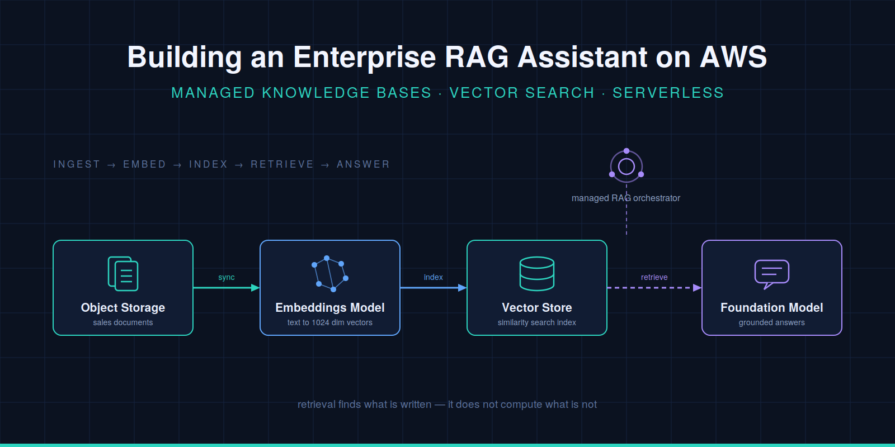

## What This Project Demonstrates

- Standing up a complete managed RAG pipeline (data source → chunking → embedding → vector store → retrieval) with **Bedrock Knowledge Bases**, without writing any pipeline code
- Enriching S3 documents with **`metadata.json`** attribute files for metadata filtering and embedding enrichment
- What **Quick create** provisions behind the scenes: an OpenSearch Serverless **vector search collection**, a **FAISS** index with 1,024 dimensions, and the IAM service role
- Verifying retrieval and generation with the **`built-in` test tool**, reading **source chunks**, and proving semantic search over keyword search with a "smart home" query that matches no column name
- Reproducing the most insidious failure mode of RAG: **flawless arithmetic on incomplete context**, with the citation count as the visible proof of the retrieval limit
- Fixing the aggregation question at the **corpus level** with a second data source (annual report PDF) and incremental sync
- Troubleshooting real console errors: test session locking and `cross-region` **inference profiles**
- Full **cleanup** in the correct order, including the OpenSearch Serverless **billing trap** (deleting the KB does not delete the collection)

## Architecture

Forty per product sales CSVs (with `metadata.json` attribute files) and an annual report PDF live under separate S3 prefixes as two data sources of a single knowledge base. During sync, documents are chunked and embedded with Titan Text Embeddings V2, and the vector + text + metadata triples are written into an OpenSearch Serverless vector index. At query time, the knowledge base retrieves the most similar chunks and Amazon Nova Lite generates a grounded answer from them; product level questions resolve from CSV chunks, aggregate questions from the report chunks.

## Services Used

`Amazon Bedrock` · `Bedrock Knowledge Bases` · `Amazon S3` · `Amazon OpenSearch Serverless` · `AWS IAM` · `Amazon Titan Text Embeddings V2` · `Amazon Nova Lite`

## Prerequisites

- An AWS account (the only continuous cost item is OpenSearch Serverless OCUs; build and clean up the same day to stay in the cents range)
- Region: the walkthrough uses `eu-central-1` (Frankfurt); any region works if used consistently
- The dataset: 40 product CSVs + 40 `metadata.json` files + `Annual_Sales_Report.pdf`

## Problem (Solution Request)

ElectroMart is a company that sells electrical supplies. Sales data is kept in separate CSV files per product (40 products, 4 categories, Q1 to Q4 sales). Sales representatives need answers to questions like the following **in seconds, in natural language**:

- "What were the Q3 sales of the CAT6 cable?"
- "Which circuit breaker sold the most?"
- "How did Smart WiFi products perform during the year?"

In the current situation, answering these questions requires opening and checking 40 files one by one. A classic SQL/BI solution could have been built; but what is wanted is that a **non technical** user can ask questions in free text. This leads us to an LLM based solution, and since the LLM must be able to talk to our own data, to the **RAG (Retrieval Augmented Generation)** architecture.

**Why a plain LLM is not enough:** Foundation models are limited to their own training data; they cannot know ElectroMart's sales figures, and if asked, they may make them up (hallucination). RAG chains the answer to real data by finding the relevant pieces from company data and placing them in front of the model **before** the answer is generated.

## Solution Architecture

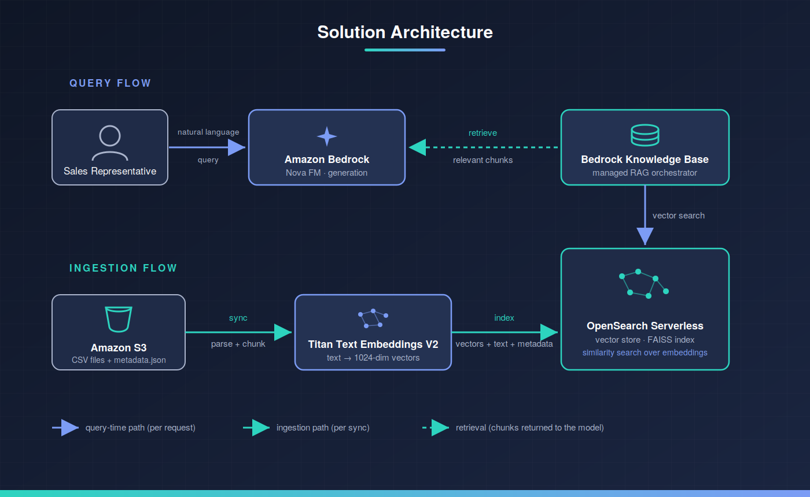

**Division of roles:** S3 holds the raw data → Titan Embeddings V2 converts text into vectors → OpenSearch Serverless stores the vectors and performs similarity search → the Knowledge Base is the orchestrator managing this entire pipeline → Nova generates the answer in natural language from the retrieved pieces.

## Task List (our roadmap)

1. Enable Bedrock model access (Titan Text Embeddings V2 + Nova Lite)
2. Create the S3 bucket and upload the CSV + metadata files
3. Create the Bedrock Knowledge Base (during this step we will configure the OpenSearch Serverless collection, the IAM role, and the chunking strategy; the longest step)
4. Start the data source sync and monitor the process
5. Ask product level questions with the `built-in` test tool → see it succeed
6. 💥 Problem: ask "What were the total annual sales?" → see that the system cannot answer it; analyze the reason (RAG performs retrieval, not aggregation)
7. Solution: add Annual_Sales_Report.pdf as a second data source, sync, ask the same question again → correct answer
8. Cleanup: delete the resources in the correct order (deleting the KB does not delete the collection; a critical cost trap)

## 1. Bedrock Model Check

Amazon Bedrock is a fully managed service that provides access to foundation models from different providers (Amazon, Anthropic, Meta, Mistral...) **through a single API**. No GPU, endpoint, or scaling concerns; you pay per token per model. The two capabilities we will use: model invocation (invoke) and **Knowledge Bases** (managed RAG).

### 1.1 Why these two models?

**Titan Text Embeddings V2 → the embedding model.** It converts text into a numerical vector with 1,024 dimensions. This is the "turning meaning into numbers" job; texts with similar meaning land close to each other in the vector space. It accepts input up to 8,192 tokens. It is called once per chunk during the knowledge base sync.

**Amazon Nova Lite → the generation model.** The model that reads the chunks coming from retrieval and writes the answer in human language. Since it is fast and cheap, it is ideal for test/business queries. (You can experiment with different models.)

### 1.2 Steps

1. Go to the Amazon Bedrock service
2. Enter the Model catalog and, using the filter or the search box, see that these two are listed in Frankfurt (the region we use; whichever region you are in, check there):
- Titan Text Embeddings V2
- Nova Lite

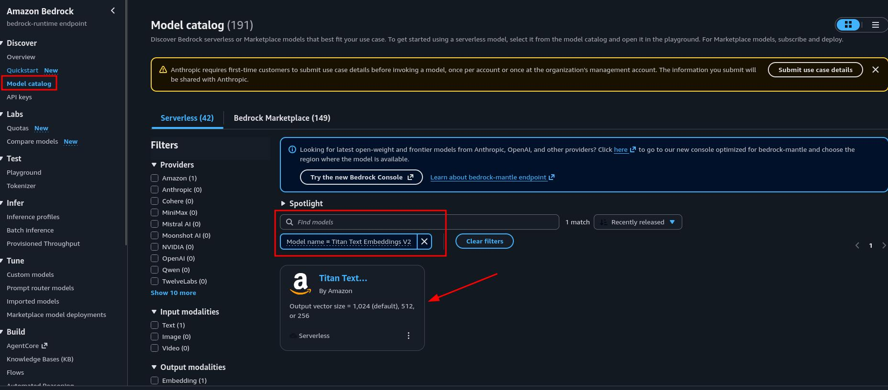

## 2. S3 Bucket and Uploading the Data

Amazon S3 (Simple Storage Service) is an object storage service that scales without limits. Files are kept as "objects" in containers called "buckets"; the folder view is actually provided only by name prefixes. Its role in this solution: being the **data source** of the knowledge base.

The important architectural principle here is this: we are **separating storage from processing**. The data lives in S3; Bedrock only visits it with read permission. When new product CSVs are added tomorrow, you do not rebuild the knowledge base; you drop the files into S3 and trigger a "sync". In addition, all storage capabilities on the S3 side, such as versioning, lifecycle rules, and encryption, remain at your disposal independently of the RAG architecture.

### 2.1 Steps

1. Go to S3 in the console → Create bucket.
2. Bucket name: it must be globally unique; suggestion: electromart-sales-data-<your-suffix> (e.g. add the year or a few random characters at the end).
3. Leave every remaining setting at its default.
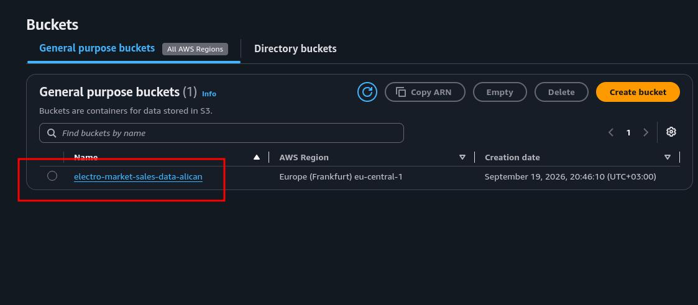
4. Enter the bucket.
5. Inside the bucket, create a folder (prefix) named csv-data/.
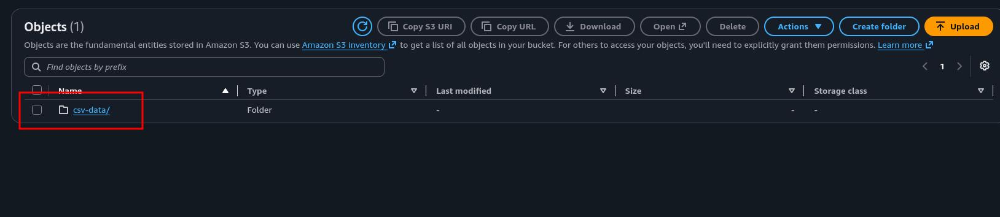
6. Upload the 80 files inside the csv_data/ folder of the dataset to this prefix (40 .csv + 40 .csv.metadata.json).
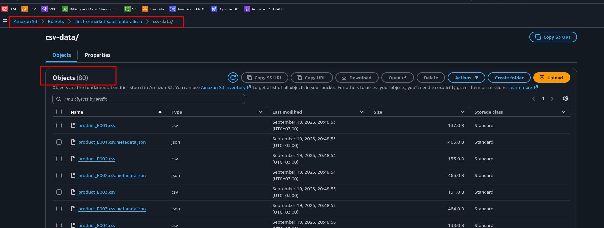

### 2.2 What are the metadata.json files for?

Bedrock Knowledge Bases recognizes a naming convention: if file.csv.metadata.json exists in the same location as file.csv, this JSON is **not chunked as content**; it is parsed as the metadata attributes of the file next to it (in our case: product_id, product_type, total_sales). These attributes are attached to every chunk and serve two purposes:
- (1) **metadata filtering** at query time (e.g. "search only in chunks where product_type = Cable")
- (2) additional context when tracing the source of answers.

Since includeForEmbedding: true is set, these values are also included in the embedding. If you see ~40 documents instead of 80 in the statistics after the sync, this is the reason.

## 3. Creating the Bedrock Knowledge Base

Amazon Bedrock Knowledge Bases is the Bedrock feature that gathers the entire RAG pipeline (ingestion → chunking → embedding → writing to the vector store → retrieval) into a single managed component. We could have built this pipeline by hand: a Lambda reading files from S3, chunking code, embedding calls, the logic for writing to OpenSearch, a retrieval API... Knowledge Bases removes this undifferentiated heavy lifting; we define only three things: where the data is (data source), where the vectors will be stored (vector store), and which model will produce the embeddings (embeddings model).

Throughout the setup wizard we will encounter four critical concepts:

**IAM service role:** Bedrock will perform the reads from S3 and the writes to OpenSearch on our behalf. For this it uses a service role: an IAM role whose trust policy contains bedrock.amazonaws.com, and whose permissions policy contains only the permission to read our bucket and write to our collection.

**Vector store choice and why OpenSearch Serverless:** Bedrock supports multiple vector stores: Aurora PostgreSQL (pgvector), Pinecone, Neptune Analytics, Redis, and OpenSearch Serverless. Why we do not choose the alternatives: Aurora pgvector makes sense if you already operate a relational database (we do not); Pinecone is a third party SaaS and requires a separate account/billing; Neptune is for graph based RAG (GraphRAG) scenarios. OpenSearch Serverless, on the other hand, is set up with a single click through the wizard's Quick create option, has zero infrastructure management, and offers the **vector search collection** type optimized for vector search.

**Chunking:** The process of splitting the source documents into small pieces before embeddings are produced. Default chunking produces pieces of approximately 300 tokens and leaves a 20 percent overlap between consecutive pieces; the overlap ensures that information falling on a chunk boundary is not lost.

**Embeddings model:** Titan Text Embeddings V2 converts text into `floating-point` vectors with 1,024 dimensions. The Vector dimensions value (1024) must match both the model's output and the dimension expected by the OpenSearch index; Quick create establishes this consistency on our behalf.

### 3.1 Steps

1. In the Bedrock console, go to the Knowledge Bases section under Build in the left menu.
2. Expand Create Managed KB and, from the Self-Managed KB section, choose the Unstructured Vector Store KB.
3. Knowledge base name: type electromart-sales-kb.
4. In the IAM permissions section, keep Create and use a new service role selected.
5. Keep Amazon S3 selected as the data source, click Next.
6. Data source name: type electromart-csv-source.
7. S3 URI: with Browse S3, select your bucket and mark the csv-data/ prefix. The URI should look like this: s3://<your-bucket-name>/csv-data/
8. Parsing strategy: keep Amazon Bedrock default parser selected. (It handles standard formats such as CSV, TXT, and PDF; it is free. Foundation model based parsers are for scanned/complex PDFs and bring additional cost.)
9. Chunking strategy: keep Default chunking selected (300 tokens, 20 percent overlap).
10. Click Next.
11. On the Embeddings model screen, choose Titan Text Embeddings V2.
12. Vector dimensions: keep 1024 selected. You will see `floating-point` as the embeddings type; do not touch it.
13. In the Vector store section, mark the Quick create a new vector store option and choose Amazon OpenSearch Serverless as the store type.
14. Click Next, check the summary on the Review screen, and click the Create knowledge base button.
15. Creation takes a few minutes. Wait until the Status is Available.

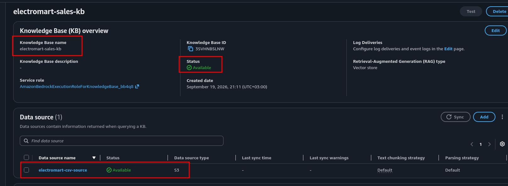

### 3.2 Behind the Scenes: The OpenSearch Serverless Collection

Quick create created a vector search collection and an index inside it in the background. To see it:

1. Amazon OpenSearch Service console → Serverless in the left menu → Collections → click the collection named bedrock-knowledge-base-...
2. See that the Collection type is Vector search; this type is optimized for storing embeddings and similarity search rather than logs/analytics.
3. In the Indexes tab you will see a single index. Three critical fields are defined inside it:
- **Vector field:** the field where the embeddings with 1,024 dimensions are written. FAISS (Facebook AI Similarity Search) is used as the engine; similarity search is performed with this algorithm library.
- **AMAZON_BEDROCK_TEXT_CHUNK** (text, filterable: True): the search is performed on the vector, but the content that goes to the model is this field.
- **AMAZON_BEDROCK_METADATA** (text, filterable: False): the field where the document identity, the S3 URI, and the attributes from our metadata.json files are stored.

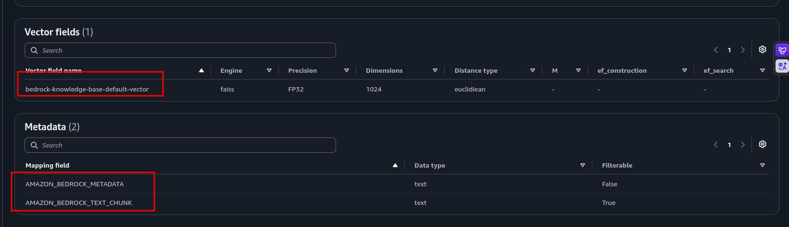

**In summary:** vector search does not return the vector; the vector only serves to find the address, and what goes to the model is the text field next to it.

## 4. Data Source Sync (Ingestion)

Sync is the ingestion leg of the RAG pipeline and performs four jobs in sequence: it scans the S3 prefix → parses each document and splits it into chunks → calls Titan Embeddings V2 for each chunk and produces a vector with 1,024 dimensions → writes the vector + text + metadata triple into the OpenSearch index. The knowledge base works with a **static copy**: dropping a new file into S3 does not update the index by itself; for the changes to become searchable, the sync must be run again.

Sync is incremental: on the second run it processes only new/changed/deleted files; it does not embed everything from scratch.

### 4.1 Steps

- Return to the knowledge base detail page (electromart-sales-kb).
- In the Data source section, select electromart-csv-source.
- Click the Sync button. (For 40 small CSVs this usually takes 1 to 3 minutes.)
- When the sync finishes, click the data source row, open the Sync history section, and look at the details of the last run: Source files scanned / Files indexed: you should see ~40, not 80; the metadata.json files are not counted as documents, they were processed as the attributes of the CSVs next to them.
Verify that the Failed column is 0.

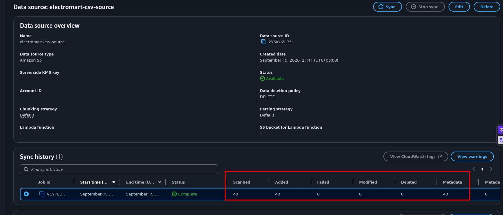

## 5. Built in Test (Verifying Retrieval and Generation)

Bedrock offers a `built-in` test interface where you can query the knowledge base before integrating it into production. The real value of this interface is not the answer itself but the **source chunk display**: under each answer, you see which chunks the model used while producing that answer. This is the transparency promise of RAG; the chain between the answer and the source can be traced, the model shows "where it knows it from". When hallucination is suspected, this is the place to look.

There are two modes on the test screen: Retrieval only (returns only the vector search results, that is, the raw chunks; the generation model never gets involved) and Retrieval and response generation (the chunks are found, then the foundation model you selected produces a natural language answer from them). We will try both.

### 5.1 Steps

1. On the knowledge base detail page, click the Test knowledge base button at the top right.
2. On the Select model screen, choose Amazon Nova Lite and click Apply.
3. In the Configurations section, verify that the Standard retrieval with answer generation mode is selected.
4. Ask the following questions in the chat box in order, and after each answer open the Show source details / source chunks section:

#### Test 1
"What were the Q3 sales of the CAT6 Ethernet Cable?"

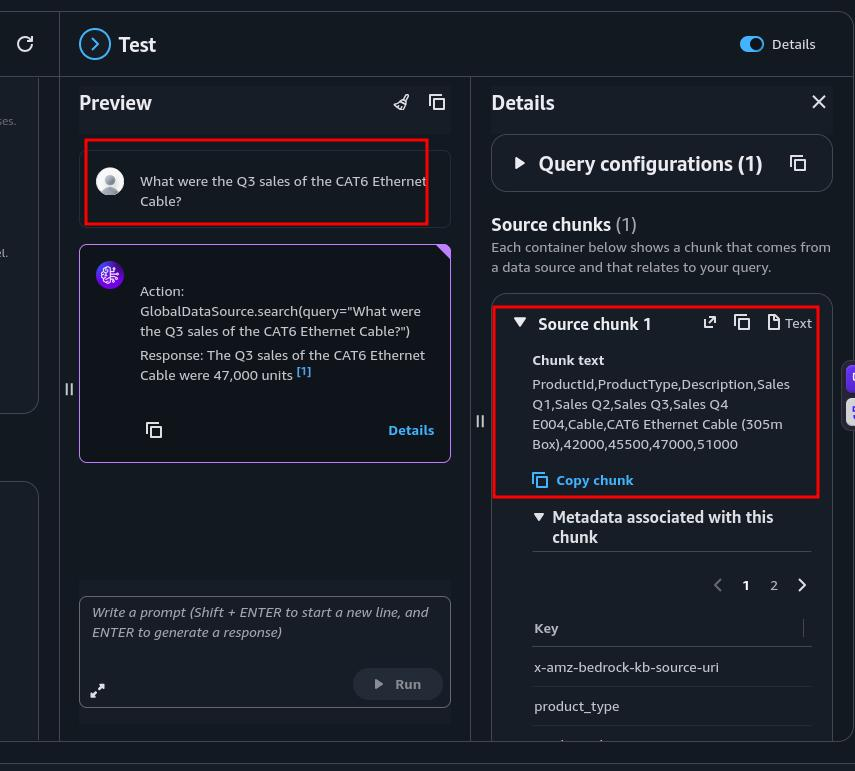

**Expectation: a clear answer around $47,000 and the chunk of product_E004.csv as the source.**

#### Test 2
"How did smart home products perform during the year?"

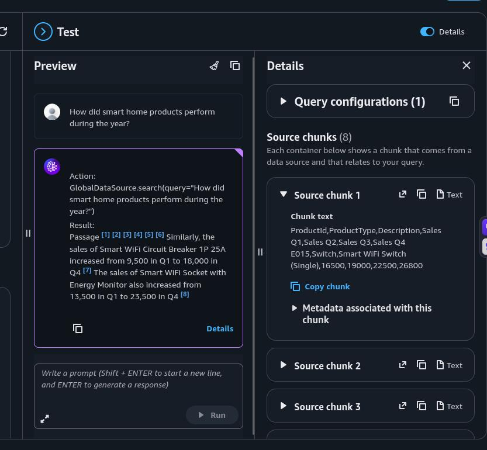

**There is no "smart home" column in the files; despite this, the Smart WiFi Switch/Socket/Circuit Breaker chunks should come back. This is the proof that the embedding matches meaning, not keywords; this is exactly the example that explains the "keyword search vs semantic search" difference.**

#### Test 3

"Which circuit breaker had the highest sales?"

**Attention here: the model can find this only by comparing within the chunks that retrieval brought. If the correct answer comes, the reason is that the total_sales values in the metadata are included in the embedding and the number of chunks is small.**

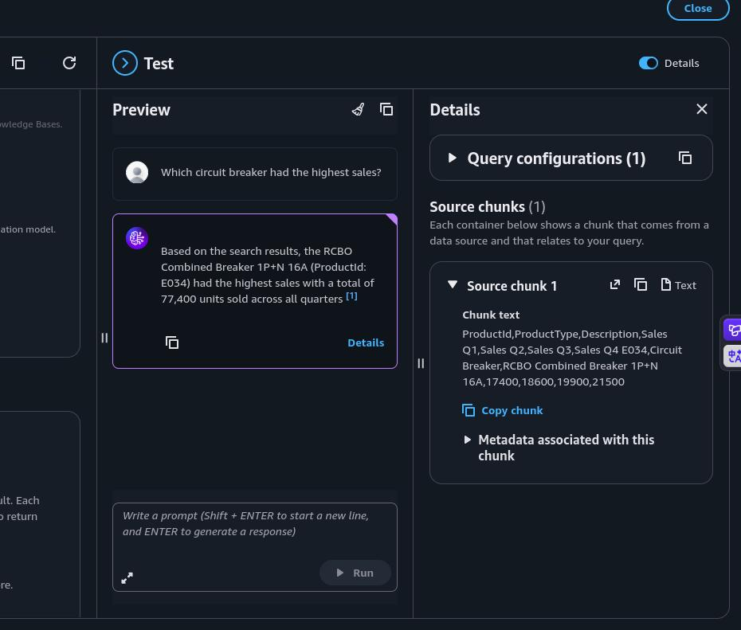

#### Test 4  Retrieval only mode:

Switch the mode to Retrieval only from Configurations and ask Test 1 again.
This time, instead of a prose answer, you will see a raw chunk list: each one contains the text (the CSV row), the score, and the S3 source URI.

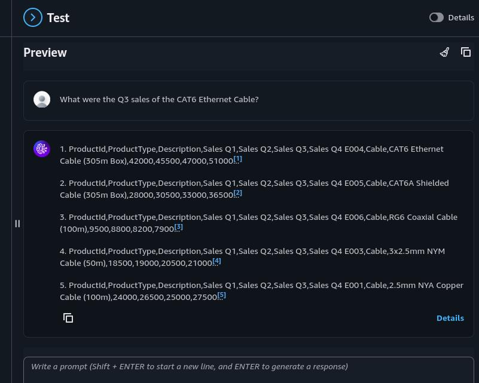

## 6. The Aggregation Question (Seeing the Limit of RAG)

Everything worked perfectly up to this point because the answer to every question we asked was **written inside a single chunk**. Now we will ask a question whose answer is written in no chunk at all, but which could only be computed by summing all 40 files.

## 6.1 Steps

1. In the test panel, let the mode again be Standard retrieval with answer generation (model: Nova Lite).
2. Ask this question:

"What were the total annual sales of the company in 2025?"

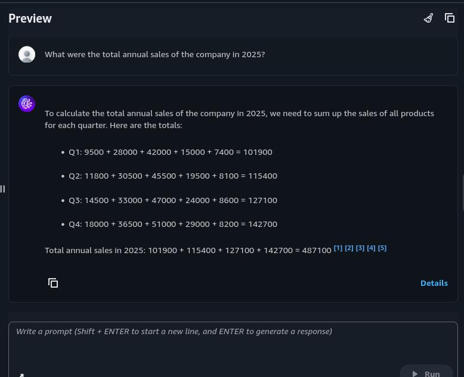

"What were the total sales across all products in Q1?"

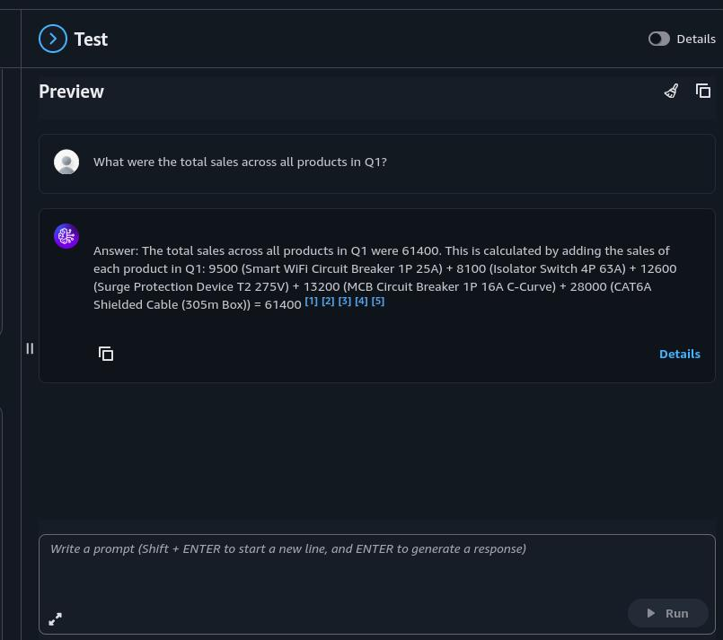

## 6.2 Analysis of the Results: Flawless Arithmetic on Incomplete Context

The answer the model gives to the first question ("What were the total annual sales of the company in 2025?") is striking: it builds a step by step calculation table by quarter, performs the arithmetic without errors, and gives a confident result: **$487,100**. Yet the real annual total is **$2,203,400**; that is, the answer is roughly one fifth of the truth.

The source of the error is visible in the citations at the end of the answer: **[1] [2] [3] [4] [5]**; exactly five sources. The retrieval layer brought the five chunks most similar to the query (the default retrieval count), and the model honestly summed the figures of the five products it received. The model did not fabricate any value, and it did the math correctly; the only thing that was wrong was the assumption that the data in its hands was **complete**.

The second question ("What were the total sales across all products in Q1?") sharpens the diagnosis even further, because this time the model lists the products it summed one by one, and four of the five products come from the same category (`Circuit Breaker`). This is the detail that reveals the nature of vector search: although the phrase "all products" in the query looks like an instruction to the model, for the retrieval layer it is only a **similarity signal**. The embedding of the query lands in a specific region of the vector space, and the chunks closest to that region are brought back; there is no "fetch all documents" operation in the system. Result: $61,400 (the real Q1 total: $488,400).

When we read the two results together, the picture becomes clear:

- The citation count is five in both answers: the visible proof of the retrieval count limit, that is, of the **absence of a full scan**.
- The answers are internally consistent, externally wrong: the problem is not in the model's intelligence but in the nature of the architecture.
- **Vector search is a similarity search, not a scan; RAG is a retrieval system, not an aggregation engine.** The SQL reflex of `SUM(*)` has no counterpart in RAG.

The real danger of this failure mode is that it does not resemble hallucination at all. If the model had made something up, the answer would raise suspicion; here, instead, there is a sourced, calculated, and convincing answer. It is the kind of error that could enter a management report without verification; this is the most insidious failure mode of RAG systems. Increasing the retrieval count is not a permanent solution either: no matter how many chunks are fetched, as the corpus scale grows, the "fetch them all and sum" approach inevitably hits a wall at some point. The solution is to ensure that the answer being sought exists **in written form** in at least one document in the corpus; that is the subject of the next section.

## 7. The Solution: A Second Data Source (Annual Sales Report PDF)

A knowledge base can hold more than one data source; each source is synced independently, but they all write into the same index; at query time they are searched in a single pool. Now we bring Annual_Sales_Report.pdf under datasets into the field. In this PDF, the annual total ($2,203,400), the quarterly totals, the category breakdown, the top 5, and the growth tables exist **in written form**; that is, the answer to the question that could not be answered, or was answered incorrectly a moment ago, will now be present in a document.

### 7.1 Steps

1. In the S3 console, go to your bucket and create a new folder (prefix) named reports/.
2. Upload Annual_Sales_Report.pdf under this prefix. (We use a separate prefix so that the S3 URIs of the two data sources do not overlap; the csv-data/ source must not see the PDF.)
3. In the Bedrock console, return to the electromart-sales-kb page.
4. In the Data source section, click the Add button. Data source name: electromart-annual-report
5. S3 URI: s3://<your-bucket-name>/reports/
6. Parsing: Bedrock default parser, Chunking: Default chunking; let both stay as they are. (The PDF contains a few pages of prose + tables; the default parser extracts the text and the tables and splits them into chunks of 300 tokens. Unlike the CSVs, this document will produce more than one chunk; we will see the difference after the sync.)
7. Save with Add, then select the new source and press Sync (only this source is synced; the CSV source is not touched; the data source level version of the incremental architecture).
8. When the sync finishes (a single file, ~1 minute), return to the test panel and ask the same question again:

"What were the total annual sales of the company in 2025?"

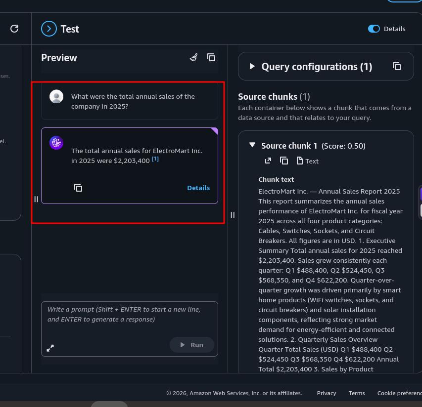

## 7.2 Result Analysis

The same question, the same knowledge base, the same model; and this time the answer is a single sentence: **"The total annual sales for ElectroMart Inc. in 2025 were $2,203,400."** The correct figure, a single citation: **[1]**.

The answer with five citations, doing step by step calculations and still being off by a factor of five, has been replaced by an answer with a single source and full precision. The difference is clearly visible in the source chunks panel: this time retrieval brought not five product files, but a single chunk containing the **Executive Summary** section of Annual_Sales_Report.pdf. Since the annual total now exists **in written form** in the corpus, the model no longer needed to do calculations; its task was reduced from arithmetic to **reading**. And that is exactly the job RAG is good at: finding written information and conveying it.

A noteworthy detail is the chunk itself: the PDF's title, introduction paragraph, and Executive Summary are merged in a single chunk. This is how the 300 token windows of default chunking behave on a prose report; unlike the single row CSVs, the PDF is split into multiple chunks, and the section most relevant to the query (here, the summary containing the annual total) is selected. The absolute value of the score (0.50) is not a quality metric by itself; what matters is that the correct chunk comes first in the ranking.

## 8. Cleanup

The only continuous cost item of this architecture is OpenSearch Serverless: the OCU meter runs hourly as long as the collection exists, even if no query is submitted. Bedrock (per token), S3 (storage, expressed in cents), and the embedding calls are usage based. For this reason, the critical target in the cleanup is the collection, and here is the most important trap: **deleting the knowledge base does not delete the OpenSearch Serverless collection that it created with Quick create.** The collection keeps billing until it is deleted manually from a completely separate console.

### 8.1 Steps

1. Knowledge Base

Bedrock console → Knowledge Bases → select electromart-sales-kb and delete it.

2. OpenSearch Serverless Collection (the critical step)

Amazon OpenSearch Service console → Serverless → Collections.
Select the bedrock-knowledge-base-... collection → Delete → confirm.
The deletion takes a few minutes; see that it disappears from the list. The OCU meter stops only at this moment.
Additional cleanup: in the left menu, look at the Encryption / Network / Data access policies lists under Serverless → Security; the bedrock-... prefixed policies created by Quick create may remain. They do not generate charges, but delete them to leave the account clean.

3. S3 Bucket

S3 console → select your bucket → Empty → then Delete.

4. IAM Service Role

IAM console → Roles → find the AmazonBedrockExecutionRoleForKnowledgeBase_... role → Delete.

## 9. Result

At the end of this project, a fully working enterprise knowledge assistant is running on a personal AWS account, built from scratch on the console with no prebuilt resources. Forty per product sales files and an annual report live in S3 as two data sources of a single **Bedrock Knowledge Base**; a sync pipeline chunks them, embeds them with **Titan Text Embeddings V2**, and writes them into an **OpenSearch Serverless** vector index. A sales representative can now ask free text questions and receive grounded, cited answers in seconds: product level questions resolve from CSV chunks, aggregate questions from the report chunks, and every answer carries the source chunks that prove where it came from.

Beyond the working pipeline, the project makes several concepts concrete that are easy to miss when RAG is only read about, not built:

- **Retrieval is not aggregation:** vector search brings back the few chunks most similar to the query; it never scans the corpus. The five citation answer that summed five products and reported one fifth of the real total is the clearest possible demonstration that the SQL reflex of `SUM(*)` has no counterpart in RAG.
- **The most dangerous failure mode does not look like a failure:** the wrong total was sourced, calculated, and internally consistent. Confidence and citations are not proof of completeness; they are only proof of retrieval.
- **The fix lives in the corpus, not in the model:** the same question became answerable the moment the answer existed in written form in one document. The capability of a RAG system grows with what is placed into its corpus, not with the intelligence of its model.
- **A knowledge base is an orchestrator, not a store:** the data stays in S3, the vectors live in OpenSearch, the models are called on demand; Knowledge Bases only coordinates them. Deleting it deletes the coordination, not the parts; which is exactly why the collection keeps billing after the KB is gone.
- **Semantic search earns its keep:** a query about "smart home products" retrieved WiFi switches, sockets, and circuit breakers although no file contains the phrase; embeddings match meaning, not keywords.
- **Managed does not mean invisible:** behind Quick create there is a real vector search collection, a FAISS index with 1,024 dimensions, and a service role with least privilege permissions; all of them inspectable, all of them worth inspecting.

The entire build costs only cents while it exists, with OpenSearch Serverless OCUs as the single meter worth watching, and the cleanup order leaves nothing behind; which makes it a repeatable exercise: the same architecture can be rebuilt at any time, extended with metadata filtering, more data sources, or a structured data store for true aggregation, and torn down again in minutes.