# Serverless ETL Pipeline with AWS Glue: From CSV to Partitioned Parquet

An end to end serverless ETL project for a retail scenario, built entirely on the **AWS Console**: raw CSV files are cataloged with a **Glue Crawler**, a Spark job that cleans, joins and transforms the data is built in the **Glue Studio** visual editor without writing code, the output is written to the curated zone as **Parquet** partitioned by `year/month`, and **Athena** measures the query cost difference between the raw and curated layers; the project ends with a cleanup that leaves zero cost behind.

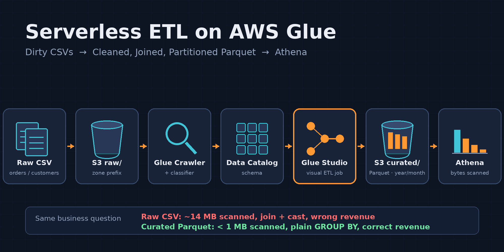

## What This Project Demonstrates

- Building the **zone** concept inside a single S3 bucket with prefixes (`raw/`, `curated/`, `athena-results/`) and restricting IAM permissions at the prefix level
- Schema discovery with **Glue Crawler**: how the CSV classifier detects headers and when a custom classifier is required, the one table per folder rule, and designing around the crawler's 10 minute minimum billing
- Using the **Glue Data Catalog** as the shared metadata layer between the Crawler, the Glue job and Athena
- Building a Spark job with **Glue Studio Visual ETL**: `Filter`, `Drop Duplicates`, `Change Schema`, `Join`, `SQL Query` and a partitioned Parquet target; reading the PySpark script generated behind the scenes
- Letting the Glue job create the catalog table itself (no second crawler needed)
- Asking the same business question on raw CSV and curated Parquet with **Athena**, and measuring the `bytes scanned` difference and the effect of **partition pruning**
- A complete **cleanup** in the correct deletion order: job → crawler → catalog → Athena → S3 → CloudWatch Logs → IAM

## Architecture

A local Python script generates synthetic `orders.csv` and `customers.csv` files; the files are uploaded to the `raw/` zone of a single S3 bucket, one prefix per table. A Glue Crawler scans `raw/` and creates the `orders` and `customers` tables in the Data Catalog. A visual ETL job built in Glue Studio reads these two tables; it fixes column types, drops invalid and cancelled records, joins on `customer_id`, derives the `total_amount`, `year` and `month` columns, and writes the result to the `curated/` zone as Snappy Parquet partitioned by `year/month`; at the same time it creates the `orders_enriched` table in the Data Catalog itself. Athena queries the raw CSV tables first and then the curated table; the amount of data scanned and partition pruning are compared.

## Services Used

`Amazon S3` · `AWS Glue Data Catalog` · `AWS Glue Crawler` · `AWS Glue Studio (Visual ETL)` · `Amazon Athena` · `AWS IAM` · `Amazon CloudWatch Logs`

## Prerequisites

- An AWS account (the crawler runs once and the job runs once or twice; the total cost is at the cent level)
- Python 3.x on the local machine (only for data generation; no extra packages are required)
- Region: the guide uses `eu-central-1` (Frankfurt); any region works as long as it is used consistently

## Problem (Solution Request)

A retail chain drops order (`orders`) and customer (`customers`) files, exported daily as CSV from its ERP system, into S3. Analysts try to query these files directly with Athena and run into four problems: every query scans the whole file (cost and time), columns arrive as strings (`unit_price` cannot be summed, dates cannot be filtered), cancelled and corrupt records leak into reports, and the two files have to be joined again in every query. The request: a rerunnable ETL pipeline that catalogs the raw data, cleans and joins it, and produces an analysis ready **curated** layer with proper column types and partitions; without managing servers.

**Why Athena CTAS is not enough:** CTAS produces a one time transformation; the cleaning and join logic stays embedded in the query, and rerunning it when new files arrive each day, handling errors and monitoring it all remain on the analyst. A Glue job turns this logic into a named, parameterized, schedulable and observable pipeline component; the same job runs on another set of files tomorrow.

**Why not EMR:** EMR (including Serverless) is powerful for teams that want to manage their own Spark code; the need here is a handful of standard transformations. Glue Studio lets you build these transformations visually, generates the Spark script itself, integrates natively with the Data Catalog, and has no cluster or application lifecycle to manage.

## Task List

1. Generating synthetic `orders.csv` and `customers.csv` with a local Python script (including deliberately dirty records)
2. Amazon S3: a single bucket, zone prefixes, uploading the files under `raw/`
3. AWS IAM: Glue service role (managed policy + an inline S3 policy restricted to prefixes)
4. Glue Data Catalog database + custom CSV classifier + Crawler: a single run, inspecting the tables and the schema
5. Athena baseline: a report query with a join on raw CSV, recording `bytes scanned` and the type problems
6. Glue Studio Visual ETL job: source → Filter → Drop Duplicates → Change Schema → Join → SQL Query → partitioned Parquet target; job details and the run
7. Verification: the curated table and its partitions in the catalog, the same query in Athena, the `bytes scanned` comparison and partition pruning
8. Evaluating the architecture as a whole (the generated PySpark script, rerun behavior)
9. Cleanup

## 1. Local Data Generation

Before building the pipeline we need two files that mimic an ERP export. We generate them with a local Python script; no AWS resource is used at this stage. The script uses only the standard library (`csv`, `random`, `datetime`), so no package installation is needed.

The generated data is **deliberately dirty**: roughly 1 percent of the orders have a negative `quantity`, 0.5 percent have an empty `customer_id`, 0.5 percent repeat an existing `order_id` (duplicates), 0.3 percent carry a `customer_id` with no match in the customer table (orphans), and 5 percent have the `cancelled` status. Without these records the `Filter` and `Join` steps in the ETL job would have no purpose; real ERP exports arrive exactly like this.

The data size was deliberately chosen at roughly 15 MB: large enough for the `bytes scanned` difference to be visible in Athena, small enough not to stretch the crawler and job runtimes. The presence of numeric columns also matters for the Glue Crawler's CSV header detection; we will see why in section 4.

### 1.1 Steps

- On the local machine, create a folder for the project and save the script below inside it as `generate_data.py` (the script creates the `data/` subfolder itself):

```python
import os
import csv
import random
from datetime import date, timedelta

random.seed(42)

N_CUSTOMERS = 5000
N_ORDERS = 200000
OUT_DIR = "data"
os.makedirs(OUT_DIR, exist_ok=True)

SEGMENTS = ["Consumer", "Corporate", "Small Business"]
COUNTRIES = {
    "DE": ["Berlin", "Munich", "Hamburg", "Frankfurt"],
    "TR": ["Istanbul", "Ankara", "Izmir", "Adana"],
    "FR": ["Paris", "Lyon", "Marseille"],
    "NL": ["Amsterdam", "Rotterdam", "Utrecht"],
    "ES": ["Madrid", "Barcelona", "Valencia"],
    "IT": ["Rome", "Milan", "Turin"],
}
CATEGORIES = {
    "Electronics": (49.0, 1499.0),
    "Home & Kitchen": (9.0, 399.0),
    "Clothing": (7.0, 199.0),
    "Sports": (12.0, 549.0),
    "Books": (4.0, 59.0),
    "Toys": (5.0, 129.0),
}
STATUSES = ["completed"] * 70 + ["shipped"] * 15 + ["pending"] * 10 + ["cancelled"] * 5
PAYMENTS = ["credit_card", "debit_card", "paypal", "bank_transfer"]
CHANNELS = ["web", "mobile", "store"]
FIRST = ["Anna", "Mehmet", "Luca", "Sophie", "Ayse", "Pierre", "Julia", "Marco", "Elif", "Noah"]
LAST = ["Schmidt", "Yilmaz", "Rossi", "Martin", "Kaya", "Bernard", "Weber", "Conti", "Demir", "Jansen"]

START = date(2026, 1, 1)
END = date(2026, 9, 30)
DAYS = (END - START).days


def rand_date(start, span_days):
    return start + timedelta(days=random.randint(0, span_days))


# --- customers ---
customers = []
for i in range(1, N_CUSTOMERS + 1):
    country = random.choice(list(COUNTRIES))
    customers.append({
        "customer_id": f"C{i:05d}",
        "full_name": f"{random.choice(FIRST)} {random.choice(LAST)}",
        "email": f"user{i}@example.com",
        "segment": random.choice(SEGMENTS),
        "country": country,
        "city": random.choice(COUNTRIES[country]),
        "signup_date": rand_date(date(2023, 1, 1), 1095).isoformat(),
    })

with open(f"{OUT_DIR}/customers.csv", "w", newline="") as f:
    w = csv.DictWriter(f, fieldnames=customers[0].keys())
    w.writeheader()
    w.writerows(customers)

# --- orders ---
customer_ids = [c["customer_id"] for c in customers]
orders = []
for i in range(1, N_ORDERS + 1):
    category = random.choice(list(CATEGORIES))
    lo, hi = CATEGORIES[category]
    r = random.random()
    if r < 0.005:
        cid = ""                                   # empty customer_id
    elif r < 0.008:
        cid = f"C{random.randint(90000, 99999)}"   # orphan customer_id
    else:
        cid = random.choice(customer_ids)
    qty = random.randint(1, 5)
    if random.random() < 0.01:
        qty = -qty                                 # negative quantity
    orders.append({
        "order_id": f"O{i:07d}",
        "customer_id": cid,
        "order_date": rand_date(START, DAYS).isoformat(),
        "status": random.choice(STATUSES),
        "product_category": category,
        "quantity": qty,
        "unit_price": round(random.uniform(lo, hi), 2),
        "payment_method": random.choice(PAYMENTS),
        "channel": random.choice(CHANNELS),
    })

# duplicate order_id rows
duplicates = random.sample(orders, int(N_ORDERS * 0.005))
orders.extend(dict(d) for d in duplicates)
random.shuffle(orders)

with open(f"{OUT_DIR}/orders.csv", "w", newline="") as f:
    w = csv.DictWriter(f, fieldnames=orders[0].keys())
    w.writeheader()
    w.writerows(orders)

print(f"customers: {len(customers)} rows")
print(f"orders: {len(orders)} rows (including {len(duplicates)} duplicates)")
```

- Run the script:

```bash
python3 generate_data.py
```

### 1.2 Verification

- The output should be two lines: `customers: 5000 rows` and `orders: 201000 rows (including 1000 duplicates)`.
- Check the file sizes; `orders.csv` should be about 14 MB and `customers.csv` about 400 KB:

```bash
ls -lh data/
head -3 data/orders.csv
head -3 data/customers.csv
```

- The first line in the `head` output should be the header (`order_id,customer_id,order_date,...` and `customer_id,full_name,email,...`).

Let's also confirm that the dirty records really exist; we will meet them again in Athena in section 5 and in the `Filter` step in section 6:

```bash
# negative quantity
grep -c ',-[1-5],' data/orders.csv
# empty customer_id (second column empty)
grep -c '^O[0-9]*,,' data/orders.csv
# cancelled
grep -c ',cancelled,' data/orders.csv
```

All three numbers should be greater than zero (roughly 2000, 1000 and 10000).

## 2. Amazon S3 (Single Bucket, Zone Prefixes)

S3 is the storage layer of the data lake in this project. We separate all three zones with prefixes inside a **single bucket**: `raw/` (the files coming from the ERP, never touched), `curated/` (the Parquet written by the Glue job) and `athena-results/` (Athena query results). The reason for choosing prefixes over separate buckets: zones that belong to the same dataset are gathered under a single lifecycle, a single access policy and a single cleanup point. Since IAM permissions can be granted at the prefix level (we will see this in section 3), there is no loss of isolation; separate buckets make sense when there is different ownership, a different region or a different compliance requirement.

Under `raw/`, each table has its **own prefix** (`raw/orders/`, `raw/customers/`). This is not a preference but a rule of how Glue Crawler works: the crawler infers a schema for every leaf folder it scans and groups files with the same schema into one table; had `orders.csv` and `customers.csv` been in the same folder, the crawler would either have produced a schema conflict instead of two tables or created tables named after the files. The folder name will also become the table name; that is why we use nothing but lowercase letters and underscores.

The bucket name has to be globally unique; add a suffix of your own to the `retail-datalake-` prefix (for example your initials and a number). The guide refers to it as `retail-datalake-<suffix>`; use your own name everywhere.

### 2.1 Steps

- Go to the S3 service in the console; make sure the region at the top right is `eu-central-1` (Frankfurt).
- Click Create bucket.
- Leave General purpose selected as the Bucket type.
- Enter `retail-datalake-<suffix>` in the Bucket name field.
- Object Ownership: leave ACLs disabled (the default).
- Block Public Access settings: leave Block all public access checked; no zone of the data lake will be open to the internet.
- Bucket Versioning: leave Disable (raw files are written once, and curated can be regenerated by the job; versioning would only complicate the cleanup here).
- Default encryption: leave the defaults, Server side encryption with Amazon S3 managed keys (`SSE-S3`) and Bucket Key Enable.
- Click Create bucket.

Now let's create the zone prefixes:

- Click `retail-datalake-<suffix>` in the bucket list.
- On the Objects tab, click Create folder, enter `raw` as the Folder name and click Create folder.
- Enter the `raw/` folder; create two folders inside it named `orders` and `customers` the same way.
- Return to the bucket root; create two more folders named `curated` and `athena-results`. (The Glue job will create the table folder under `curated/` itself; `athena-results/` is for Athena's result files.)

Let's upload the files:

- Enter the `raw/orders/` folder, click Upload, select the local `data/orders.csv` file with Add files and click Upload.
- Upload `data/customers.csv` to the `raw/customers/` folder the same way.

### 2.2 Verification

- Three prefixes should be visible at the bucket root: `athena-results/`, `curated/`, `raw/`.
- `raw/orders/` should contain only `orders.csv` (about 14 MB) and `raw/customers/` only `customers.csv` (about 400 KB). **One file and one schema** per folder matters for the crawler.
- On the bucket's Properties tab, confirm that Block public access is On and Default encryption is `SSE-S3`.

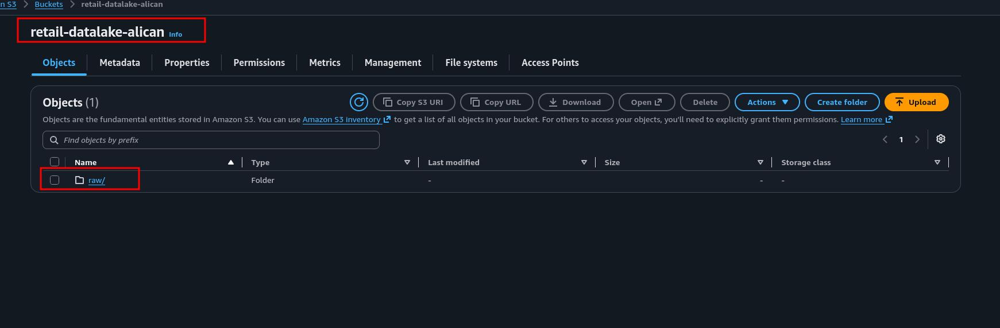

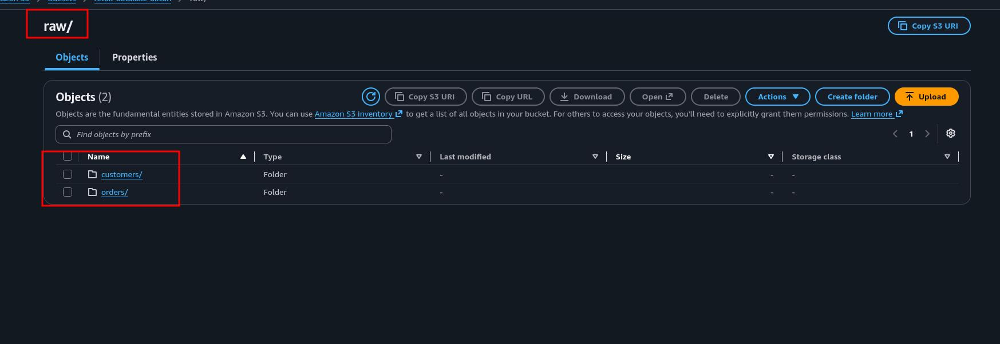

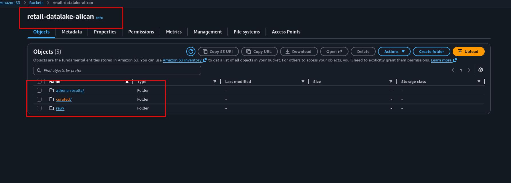

## 3. AWS IAM (Glue Service Role)

Glue needs to act on our behalf in two places in this project: the crawler will read the files under `raw/` and write to the Data Catalog, and the ETL job will read the same files, write Parquet under `curated/` and send its run logs to CloudWatch. Both are done with a single **service role**. The role has two parts: the **trust policy** (who may assume the role; here `glue.amazonaws.com`) and the **permissions policy** (what the assumer may do).

We build the permissions side in two layers:

**The `AWSGlueServiceRole` managed policy:** covers Glue's own internal needs: creating databases and tables in the Data Catalog, writing to CloudWatch Logs, EC2 network interface operations (for jobs running inside a VPC), and access only to S3 buckets whose names start with `aws-glue-*`. This last point matters: the managed policy **cannot touch our bucket**. Glue Studio keeps the job script and temporary files in a bucket it creates itself, named `aws-glue-assets-<account-id>-eu-central-1`; the `aws-glue-*` permission in the managed policy exists exactly for that.

**The inline S3 policy:** the part that adds access to the project bucket and restricts it at the prefix level. `raw/` is read only (nobody should write to the ERP export), `curated/` is read and write (the job will produce Parquet and must be able to delete old files when it runs again). The `athena-results/` prefix is not in this role; Athena writes there, not Glue, and Athena runs with the permissions of our console user.

**Why the role name starts with `AWSGlueServiceRole-`:** when the Glue console assigns a role to a crawler or a job, it uses the `iam:PassRole` permission. The `AWSGlueConsoleFullAccess` managed policy that AWS provides for Glue limits this permission to roles whose names start with `AWSGlueServiceRole`. It makes no difference for an admin user; a user with restricted permissions following the same steps, however, would not see the role in the list. Following the naming convention keeps the guide working at every permission level.

### 3.1 Steps

- Go to the IAM service in the console.
- Select Roles from the left menu.
- Click Create role.
- Select AWS service as the Trusted entity type.
- In the Use case section, select Glue from the Service or use case dropdown; leave the Glue option below it selected and click Next. (This choice writes the `glue.amazonaws.com` principal into the trust policy.)
- On the Permissions screen, type `AWSGlueServiceRole` in the search box and check this policy's checkbox. (Not the similarly named `AWSGlueServiceNotebookRole` or `AWSGlueConsoleFullAccess`; exactly `AWSGlueServiceRole`.)
- Click Next.
- Enter `AWSGlueServiceRole-retail-etl` as the Role name.
- Click Create role.

Now let's add bucket access as an inline policy:

- Click `AWSGlueServiceRole-retail-etl` in the Roles list.
- On the Permissions tab, select Create inline policy from the Add permissions dropdown.
- Select the JSON tab in the Policy editor.
- Paste the policy below (replace `<suffix>` with your own bucket name; it appears in three places):

```json
{
  "Version": "2012-10-17",
  "Statement": [
    {
      "Sid": "ListProjectBucket",
      "Effect": "Allow",
      "Action": "s3:ListBucket",
      "Resource": "arn:aws:s3:::retail-datalake-<suffix>"
    },
    {
      "Sid": "ReadRawZone",
      "Effect": "Allow",
      "Action": "s3:GetObject",
      "Resource": "arn:aws:s3:::retail-datalake-<suffix>/raw/*"
    },
    {
      "Sid": "ReadWriteCuratedZone",
      "Effect": "Allow",
      "Action": [
        "s3:GetObject",
        "s3:PutObject",
        "s3:DeleteObject"
      ],
      "Resource": "arn:aws:s3:::retail-datalake-<suffix>/curated/*"
    }
  ]
}
```

- Click Next.
- Enter `retail-datalake-s3-access` as the Policy name.
- Click Create policy.

**IMPORTANT:** `s3:ListBucket` is a bucket level permission and expects the bucket ARN (without `/*` at the end) as its resource; `GetObject` and `PutObject` are object level and expect the prefix ARN (`/raw/*`). Mixing the two is the most common IAM mistake: if ListBucket is given `/*`, the crawler stops with "Access Denied"; if GetObject is given the bucket ARN without `/*`, no file can be read. Make sure Save changes is clicked after editing the policy: since the crawler only uses the first two statements, a mistake in the third statement surfaces not in the crawler but at the moment the job writes. This is exactly what happened in this project; the crawler ran without a problem, while the job stopped with `is not authorized to perform: s3:PutObject ... because no identity-based policy allows the s3:PutObject action`, and the fix was rewriting the curated statement and saving it.

### 3.2 Verification

- Click `AWSGlueServiceRole-retail-etl` in the Roles list; on the Trust relationships tab, see the `"Service": "glue.amazonaws.com"` line.
- The Permissions tab should show two rows: one managed policy (`AWSGlueServiceRole`, Type: AWS managed) and one inline policy (`retail-datalake-s3-access`, Type: Customer inline).
- Click `retail-datalake-s3-access` and check that the bucket name is written correctly in all three places in the JSON; a typo comes back as Access Denied at the crawler stage, and by then the 10 minute minimum billing has already been charged.

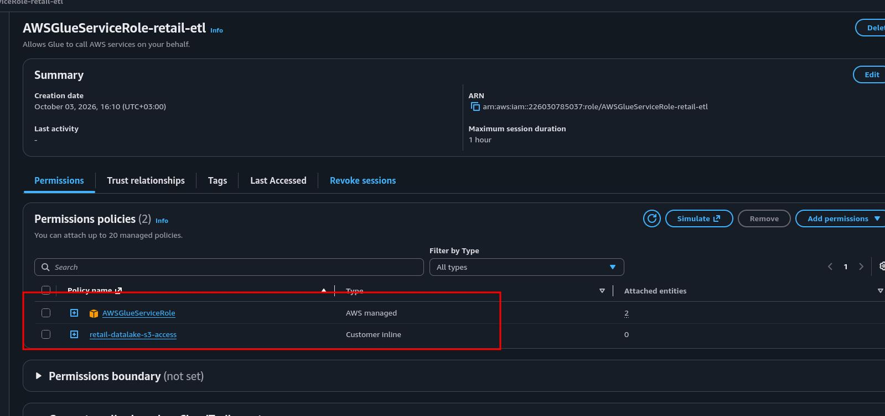

## 4. AWS Glue Data Catalog, Classifier and Crawler

The **Data Catalog** is AWS's central metadata store: it holds which S3 path a table lives in, its format, its columns and their types; it does not hold the data. In this project all three services feed on the same catalog: the crawler writes, the Glue job reads and writes, Athena reads. Without the catalog, the schema would have to be explained to every service separately. A **database** in the catalog is only a logical grouping; we open one named `retail_db` and keep both the raw and the curated tables there.

A **Crawler** is the component that scans an S3 path, infers the file format and the schema with **classifiers**, and writes the result to the catalog as a table. There are three design decisions here:

**Custom CSV classifier before the crawler:** the built in CSV classifier decides whether the first row is a header with these rules: every value in the first row must parse as a string, and the header row must be "sufficiently different" from the data rows; that is, at least one subsequent row must contain a column that parses as something other than a string (a number, for example). In a file whose columns are all text the classifier cannot tell the header apart and names the columns `col0, col1, ...`. There is no problem in `orders.csv` because `quantity` and `unit_price` are numeric; `customers.csv`, however, has **all text columns**, and the built in classifier catalogs it as `col0 ... col6`. The solution is a **custom classifier** that explicitly declares the presence of a header. Custom classifiers run before the built in ones, in the order they are added to the crawler; they apply to all of the crawler's data sources, do not affect type inference for `orders` (`bigint`, `double`), and only fix the fact that the first row is a header.

**A separate data source per table:** had the crawler been given the single `raw/` path, it could have merged the two subfolders into one table and turned the folder name into a partition column if it found their schemas similar enough. Rather than leaving this to a heuristic, we give `raw/orders/` and `raw/customers/` as two separate data sources. Each path produces its own table and the table name comes from the folder name: `orders` and `customers`.

**A single run:** crawler billing works on a 10 minute minimum; a scan that takes 30 seconds is billed as 10 minutes (about 15 cents with 2 DPUs). That is why we set the crawler up on demand and run it once, with no schedule. In a real pipeline, when new files arrive each day, either a scheduled crawl or an incremental crawl that only adds new partitions is used; we evaluate this in section 8.

**IMPORTANT:** adding the classifier after the crawler has been created does not work. The crawler remembers the data it has already scanned, and a classifier added later does not take effect for existing tables; deleting the table and running again does not change the result either. AWS documentation says to create a **new crawler** in this situation. This is why the order is database → classifier → crawler; skipping the order costs a crawler that has to be deleted and recreated, and one more run billed at 10 minutes.

### 4.1 Steps: Database

- Go to the AWS Glue service in the console.
- In the left menu, select Databases under the Data Catalog heading.
- Click Add database.
- Enter `retail_db` as the Name; leave Location and Description empty.
- Click Create database.

### 4.2 Steps: Custom Classifier

- In the left menu, select Classifiers under the Data Catalog heading.
- Click Add classifier.
- Enter `csv-with-header` as the Classifier name.
- Classifier type: CSV.
- Column delimiter: Comma (,).
- Quote symbol: `Double-quote (")`.
- Column headings: select the Has headings option.
- Leave the other settings (Allow files with single column, Trim whitespace, Custom datatype, CSV Serde) at their defaults.
- Click Create.

### 4.3 Steps: Crawler

- In the left menu, select Crawlers under the Data Catalog heading.
- Click Create crawler.
- Step 1 (Set crawler properties): enter `retail-raw-crawler` as the Name; click Next.
- Step 2 (Choose data sources and classifiers): leave Not yet selected for the question Is your data already mapped to Glue tables?
- Click Add a data source; in the window that opens:
  - Data source: S3
  - Location of S3 data: In this account
  - S3 path: `s3://retail-datalake-<suffix>/raw/orders/` (the trailing `/` matters)
  - Subsequent crawler runs: leave `Crawl all sub-folders` selected
  - Click Add an S3 data source
- Add the second source the same way: `s3://retail-datalake-<suffix>/raw/customers/`
- The Data sources list should show two rows.
- On the same screen, in the Custom classifiers section below, check the checkbox of the `csv-with-header` row; click Next.
- Step 3 (Configure security settings): under the Existing IAM role option, select `AWSGlueServiceRole-retail-etl` from the dropdown. Leave Lake Formation configuration and Security configuration at their defaults; click Next.
- Step 4 (Set output and scheduling): select `retail_db` from the Target database dropdown. Leave Table name prefix empty. Do not touch Advanced options. In the Crawler schedule section, leave On demand selected as the Frequency; click Next.
- Step 5 (Review and create): after seeing the two data sources, the `csv-with-header` classifier, the correct role and the `retail_db` target, click Create crawler.

### 4.4 Steps: Running the Crawler

- Select the `retail-raw-crawler` row in the Crawlers list and click Run crawler.
- The State column goes `Starting` → `Running` → `Stopping` → `Ready` in turn; the whole run takes 1 to 3 minutes.
- On the Crawler runs tab at the bottom of the crawler detail page, see the last run: Status `Completed`, Table changes `2 created`. We do not run the crawler again from this point on.

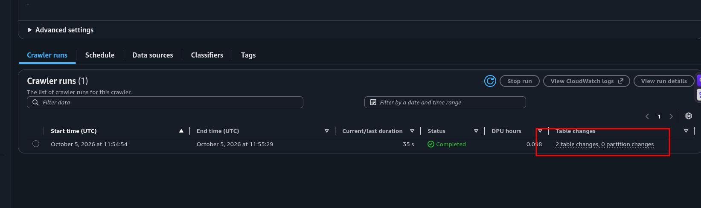

### 4.5 Verification

- Go to Data Catalog → Tables from the left menu; the `orders` and `customers` tables should be listed inside `retail_db`. The Classification column should read `csv` for both.

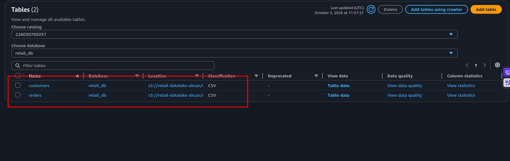

- Click the `orders` table:
  - Location: `s3://retail-datalake-<suffix>/raw/orders/`
  - On the Schema tab, 9 columns: `order_id`, `customer_id`, `order_date`, `status`, `product_category` string; `quantity` bigint; `unit_price` double; `payment_method`, `channel` string.
  - In Advanced properties, `recordCount` should be about 201000 and `skip.header.line.count` should be 1. The latter keeps Athena from reading the header row as data.
- Click the `customers` table: 7 columns should arrive with their real names: `customer_id`, `full_name`, `email`, `segment`, `country`, `city`, `signup_date`; all string.

Two things to notice: `order_date` and `signup_date` arrived as **string**; the CSV classifier does not infer date types, so that conversion will be the job's work. And although `quantity` arrived as bigint it contains negative values, and although `customer_id` arrived as string it contains empty values; the crawler only infers **types**, it does not check **quality**. We will see these in numbers in Athena in section 5.

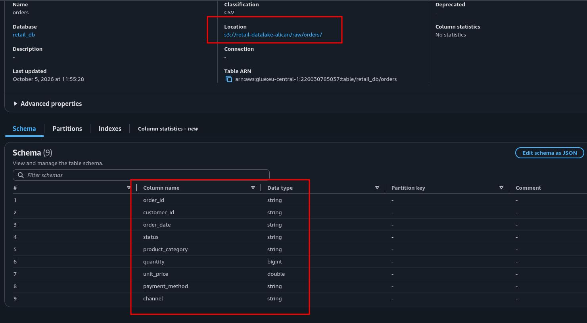

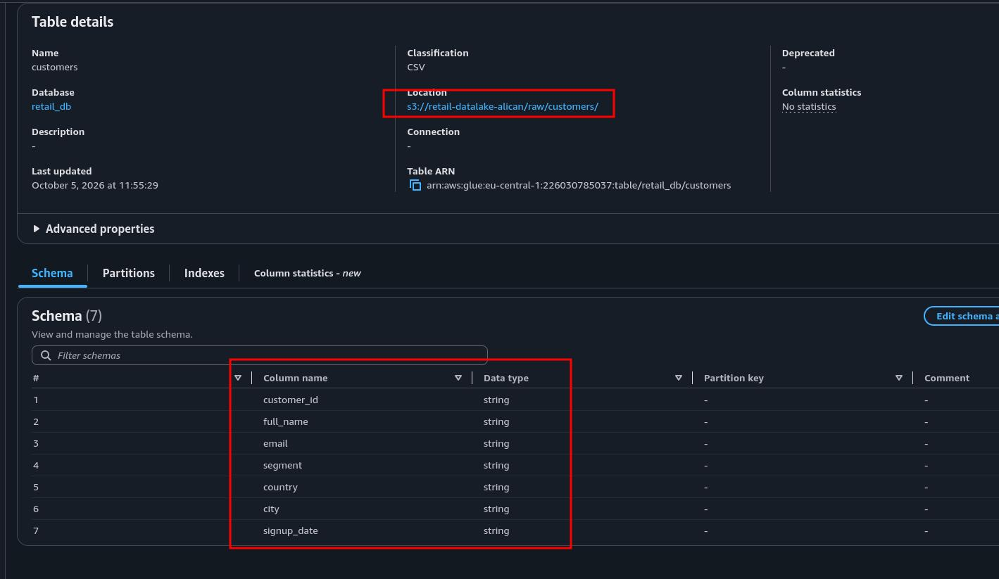

## 5. Amazon Athena: Raw Layer Baseline

Athena is a serverless engine that queries data in S3 with SQL through the table definitions in the Data Catalog; there are no servers, and the charge is per data scanned (5 dollars per TB). We use Athena twice in this project: now, to measure a **baseline** on raw CSV, and in section 7, to repeat the same measurement on curated Parquet. Without a baseline, "Parquet is better" is a slogan; with a baseline, it is a number.

We record four things here: the amount of data each query scans (in CSV every query reads the whole file, even with a filter or `LIMIT`), the failure of date functions on the `order_date` that arrived as string, the count of quality problems the crawler did not detect, and the fact that the join has to be repeated in every query. Athena's charge at this data size is far below a cent per query; the point is not absolute cost but the ratio.

### 5.1 Steps: Result Location

Athena writes the output of every query to S3; this location has to be defined before the first query.

- Go to the Athena service in the console; the Query editor opens. (Click the Launch query editor button if it appears.)
- Switch to the Query Settings tab at the top and click Manage.
- Enter `s3://retail-datalake-<suffix>/athena-results/` in the Location of query result field (or pick it with Browse S3).
- Leave the other settings at their defaults; click Save.
- Return to the Editor tab. In the left panel, Data source `AwsDataCatalog`; select `retail_db` from the Database dropdown; `customers` and `orders` should appear under Tables.

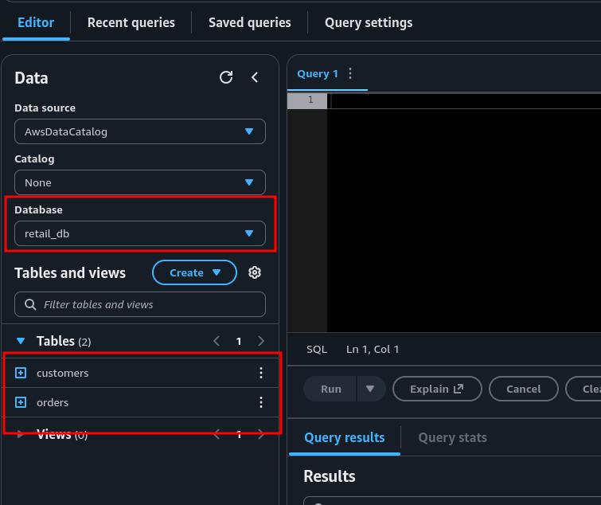

### 5.2 Steps: Queries

After running each query, note the Run time and Data scanned values in Query stats.

Row count and header check:

```sql
SELECT COUNT(*) AS total_rows FROM orders;
```

The result should be exactly `201000`. Had the header row been counted it would have come back as 201001; `skip.header.line.count = 1` is working. Data scanned is about 14 MB: the whole file was read for a single number.

The type problem; first the version that does not work:

```sql
SELECT month(order_date) AS m, COUNT(*) FROM orders GROUP BY 1;
```

Error: `Unexpected parameters (varchar) for function month`. Because `order_date` is a string, date functions do not work directly. The analyst has to write a cast in every query:

```sql
SELECT month(CAST(order_date AS date)) AS m, COUNT(*) AS orders
FROM orders
GROUP BY 1
ORDER BY 1;
```

9 rows (January to September), about 22,000 orders per month. The cast was recomputed on every row and 14 MB was scanned again.

Quality problems; records the crawler could not see but that break the report:

```sql
SELECT
  COUNT(*)                                                       AS total_rows,
  COUNT(DISTINCT order_id)                                       AS distinct_orders,
  SUM(CASE WHEN quantity < 0 THEN 1 ELSE 0 END)                  AS negative_quantity,
  SUM(CASE WHEN customer_id IS NULL OR customer_id = '' THEN 1 ELSE 0 END) AS missing_customer,
  SUM(CASE WHEN status = 'cancelled' THEN 1 ELSE 0 END)          AS cancelled
FROM orders;
```

Expected: `total_rows` 201000, `distinct_orders` 200000 (1,000 duplicates), `negative_quantity` about 2000, `missing_customer` about 1000, `cancelled` about 10000. We will see these numbers drop to zero in the curated table in section 7.

Orders with no match in the customer table (orphans):

```sql
SELECT COUNT(*) AS orphan_orders
FROM orders o
LEFT JOIN customers c ON o.customer_id = c.customer_id
WHERE c.customer_id IS NULL
  AND o.customer_id <> '';
```

About 600. These records will drop in the join; whether that should be an inner or a left join depends on the business rule, and we decide in section 6.

The baseline business query: revenue by month and customer segment. This is the report the analyst actually wants:

```sql
SELECT
  date_format(CAST(o.order_date AS date), '%Y-%m') AS order_month,
  c.segment,
  COUNT(*)                                        AS orders,
  ROUND(SUM(o.quantity * o.unit_price), 2)        AS revenue
FROM orders o
JOIN customers c ON o.customer_id = c.customer_id
GROUP BY 1, 2
ORDER BY 1, 2;
```

27 rows (9 months × 3 segments). Data scanned is about 14.5 MB (the sum of the two files). This report is **wrong**: cancelled orders are included in revenue, negative quantities pull revenue down, duplicates inflate it. The analyst has to exclude these with `WHERE` in every query and rewrite the join every time; the cleaning logic lives not in the pipeline but in the head of whoever is querying.

### 5.3 Verification

- You should have four measurements: Data scanned for the `COUNT(*)` query (~14 MB), Data scanned for the baseline business query (~14.5 MB), the five numbers from the quality query, and the orphan count. We will use them in the comparison table in section 7.
- Under `athena-results/` in S3 there should be one `.csv` and one `.csv.metadata` file per query; Athena's write permission comes from the console user, not from the Glue role.

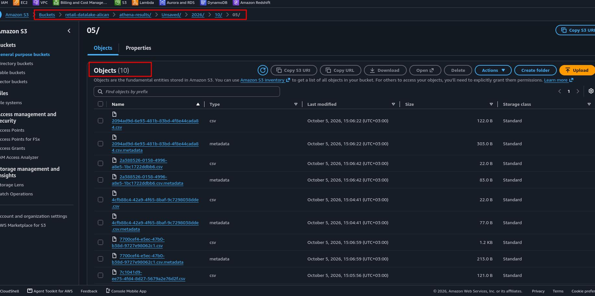

## 6. AWS Glue Studio: Visual ETL Job

Glue Studio is the editor that builds Spark jobs on a visual canvas: you connect source, transform and target nodes, and Glue generates the PySpark script behind the scenes and runs it on serverless Spark. The output of every node is a **DynamicFrame** (a Spark DataFrame with schema flexibility added); the next node takes it as input.

The job's work is to answer each of the problems we saw one by one in Athena in section 5 with a node:

| Problem (section 5) | Node | What it does |
|---|---|---|
| Negative `quantity`, `cancelled` orders | Filter | `quantity > 0` and `status` in the valid list (`completed`, `shipped`, `pending`) |
| Duplicate `order_id` | Drop Duplicates | deduplication on `order_id` |
| Empty and orphan `customer_id` | Join (inner) | orders with no match in the customer table drop out |
| Name clash with `customers.customer_id`, PII | Change Schema | `customer_id → cust_id`; `full_name`, `email` are dropped |
| String dates, no derived columns | SQL Query | `CAST(... AS date)`, `total_amount`, `year`, `month` |
| Full scan on every query | S3 target | Snappy Parquet, `year/month` partitions, catalog table |

Three design decisions:

**Filter and Drop Duplicates before the join:** shrinking the row count before entering the join reduces shuffle cost in Spark; it makes no difference at 200 thousand rows, it does at 200 million. Habits start from the right place.

**Inner join:** orders carrying an empty or orphan `customer_id` find no match in the customer table and drop out of an inner join. This is a business rule decision: in this project we say "an order whose customer is unknown does not enter the revenue report". The alternative is a left join that keeps these rows with `segment = NULL` and shows an "unknown" segment in the report; what changes is the business rule, not the ETL logic.

**The SQL Query node:** we do the date cast and the derived columns with Spark SQL instead of Change Schema. Change Schema's string to date conversion is not flexible about formats; `CAST(order_date AS date)` is deterministic on ISO dates. If this node's output schema comes up empty in the editor, the **Infer schema** button on the Output schema tab starts a **data preview session** and infers the schema from real data. Sessions are billed per minute at 2 DPUs independently of the job and stay open idle for 30 minutes if not closed (about 45 cents); if one was used, it must be stopped from ETL jobs → Interactive Sessions.

We fill in Job details **before** the canvas; a possible data preview session also uses the IAM role and Glue version assigned to the job.

### 6.1 Steps: Job Details

- Go to the AWS Glue service in the console; in the left menu, select Visual ETL under the ETL jobs heading.
- Select Visual ETL under Get Started; an empty canvas opens.
- Switch to the Job details tab above the canvas:
  - Name: `retail-orders-etl`
  - Description: `Raw orders + customers CSV -> cleaned, joined, partitioned Parquet (curated zone)`
  - IAM Role: `AWSGlueServiceRole-retail-etl`
  - Type: Spark
  - Glue version: the newest version in the list (`Glue 5.1 - Supports spark 3.5, Scala 2, Python 3` or later)
  - Language: Python 3
  - Worker type: G 1X (4 vCPU, 16 GB)
  - Requested number of workers: `2`
  - Generate job insights: leave checked
  - Job bookmark: Disable
  - Number of retries: `0`
  - Job timeout (minutes): `10`
- Expand the Advanced properties section; see that the Script filename, Script path and Temporary path fields were filled automatically under `s3://aws-glue-assets-<account-id>-eu-central-1/...`. The console creates this bucket itself on first use; the `aws-glue-*` permission in the managed policy from section 3 exists exactly for this.
- Click Save at the top right. (Saving with an empty canvas is fine; the job details are bound to the job.)

The reasoning behind four settings: **2 workers × G.1X = 2 DPUs** is more than enough for this data size and costs about 1.5 cents per minute. **Job bookmark Disable**: a bookmark lets the job remember the S3 files it has already processed and skip them on the next run; it is valuable for incremental loads, but it is off here because in this project we want to run the job once more on the same data and observe its behavior (we evaluate this in section 8). **Retries 0**: if there is an error, we want to see it rather than have the job retry three times and bill three times over. **Timeout 10 minutes**: the default is 2880 minutes (48 hours); a realistic upper bound is always set so that a stuck job does not burn DPUs all night.

### 6.2 Steps: Source Nodes

- Return to the Visual tab. Click the `+` (Add nodes) button at the top left of the canvas; in the panel that opens, select AWS Glue Data Catalog from the Sources tab.
- Click the node that appears and, in the Data source properties panel on the right: Database `retail_db`, Table `orders`.
- On the Node properties tab above, set the Name field to `Orders (raw)`.
- Again `+` → Sources → AWS Glue Data Catalog; Database `retail_db`, Table `customers`; Name `Customers (raw)`.
- Two independent source nodes should be visible on the canvas. The Output schema tab of each node lists the columns and types you saw in section 4; they come from the catalog.

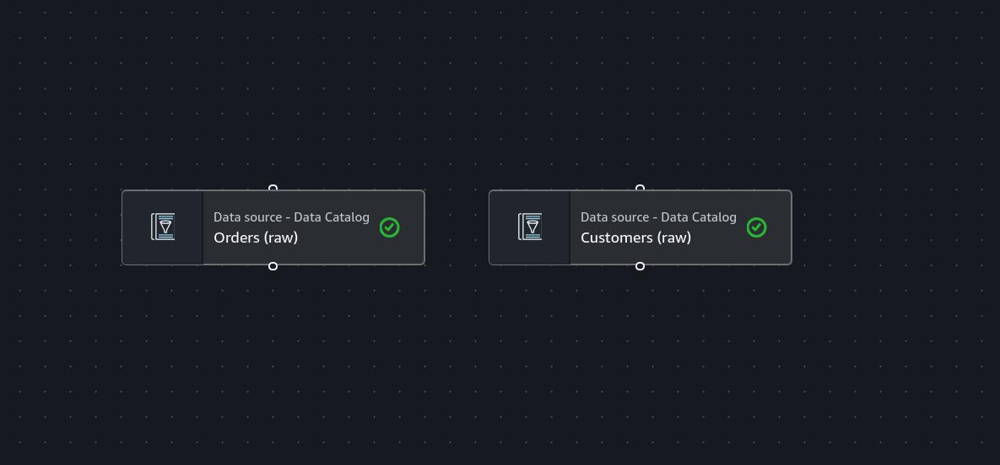


### 6.3 Steps: Orders Branch (Filter → Drop Duplicates)

- Select the `Orders (raw)` node; `+` → Transforms → Filter. The new node is connected automatically to the selected node (if not, select `Orders (raw)` under Node properties → Node parents).
- On the Transform tab:
  - Filter rows on: select the all conditions (AND) option (it may also appear on screen as "Global AND").
  - Add condition: Key `quantity`, Operation `>`, Value `0`.
  - Add condition: Key `status`, Operation `matches`, Value `^(completed|shipped|pending)$`.
The Filter node offers comparison operators (`=`, `!=`, `<`, `>`) on numeric columns but only the regex based `matches` on string columns. There are two ways to say "everything except cancelled": a negative lookahead (`^(?!cancelled$).*`) or listing the valid values explicitly. The second is both more readable and, when an unexpected status (such as `refunded`) arrives from the ERP one day, keeps it out instead of silently adding it to revenue; a whitelist is safer than a blacklist.
- Node properties → Name: `Filter invalid orders`.
- With `Filter invalid orders` selected, `+` → Transforms → Drop Duplicates.
- On the Transform tab, select the Match specific keys option and check `order_id` in the Keys list. (Match entire rows would also have worked, since the two duplicate rows are identical; key based deduplication also catches the real world case of "same order, different timestamp".)
- Node properties → Name: `Deduplicate orders`.

### 6.4 Steps: Customers Branch (Change Schema)

- Select the `Customers (raw)` node; `+` → Transforms → Change Schema.
- The column list appears on the Transform tab:
  - In the `customer_id` row, change the Target key field to `cust_id`. (So that `customer_id` does not exist in both tables after the join; Glue Studio warns about conflicts on identically named columns.)
  - In the `full_name` and `email` rows, check the Drop checkbox. They are not needed for the revenue report, and not carrying personal data into the curated layer is a good habit.
  - Do not touch the other columns; leave their types as string, the `signup_date` cast will be done in the SQL node.
- Node properties → Name: `Rename and drop PII`.

### 6.5 Steps: Join

- Select the `Deduplicate orders` node; `+` → Transforms → Join.
- On the Node properties tab, both `Deduplicate orders` and `Rename and drop PII` should be checked in the Node parents list; check the second one if it is missing.
- On the Transform tab:
  - Join type: Inner join.
  - Join conditions → Add condition: `customer_id` on the left (Deduplicate orders), `cust_id` on the right (Rename and drop PII).
- Name: `Join orders with customers`.
- The Output schema tab should show 9 + 5 = 14 columns: the 9 order columns plus `cust_id`, `segment`, `country`, `city`, `signup_date`.

### 6.6 Steps: SQL Query (cast and derived columns)

- With `Join orders with customers` selected, `+` → Transforms → SQL Query.
- On the Transform tab, a single input appears under Input sources; the SQL aliases field defaults to `myDataSource`, leave it as is.
- Paste the following into the SQL query field:

```sql
SELECT
  order_id,
  customer_id,
  CAST(order_date AS date)              AS order_date,
  status,
  product_category,
  CAST(quantity AS int)                 AS quantity,
  unit_price,
  ROUND(quantity * unit_price, 2)       AS total_amount,
  payment_method,
  channel,
  segment,
  country,
  city,
  CAST(signup_date AS date)             AS signup_date,
  year(CAST(order_date AS date))        AS year,
  month(CAST(order_date AS date))       AS month
FROM myDataSource
```

- Name: `Cast and derive columns`.
- The Output schema tab should show 16 columns: `order_date` and `signup_date` **date**, `quantity`, `year`, `month` **int**, `total_amount` **double**. If the schema is empty, click Infer schema (see the session note in the section introduction).

### 6.7 Verification (6A)

- The canvas should have 7 nodes and this flow: `Orders (raw)` → `Filter invalid orders` → `Deduplicate orders` → `Join orders with customers` ← `Rename and drop PII` ← `Customers (raw)`; after the join, `Cast and derive columns`.
- Click Save at the top right; see the "Successfully updated job" message. The job has not run yet; there is no target.

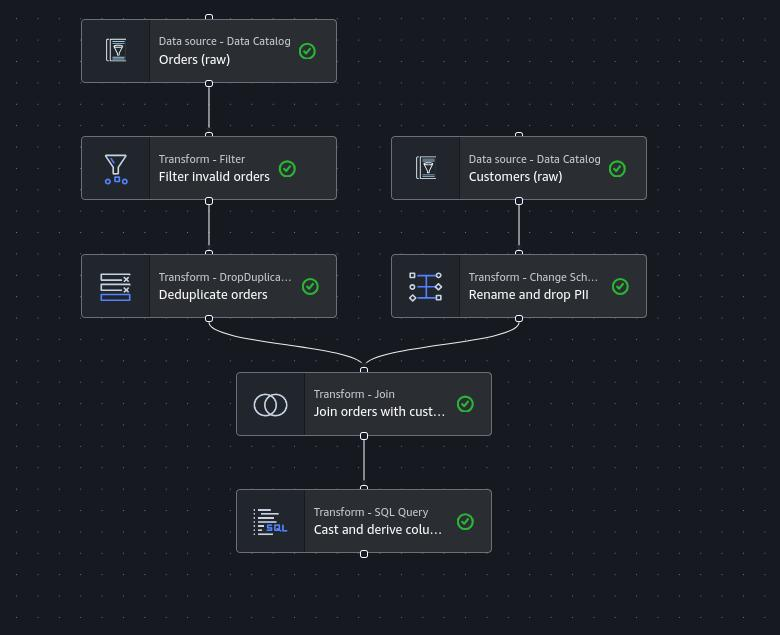

### 6.8 Steps: S3 Target (Parquet, Partitions, Catalog)

The target node does three things at once: converts the format to Parquet, splits the output into `year/month` folders, and creates the `orders_enriched` table in the Data Catalog. Without the third, seeing the curated table in Athena would require a second crawler (and 10 more billed minutes); having the job update the catalog itself is one of Glue's real advantages over the crawler.

- Select the `Cast and derive columns` node; `+` → Targets → Amazon S3.
- On the Data target properties tab for S3:
  - Format: Parquet
  - Compression Type: Snappy
  - S3 Target Location: `s3://retail-datalake-<suffix>/curated/orders_enriched/` (you can pick `curated/` with Browse S3 and append `orders_enriched/`; the folder does not exist yet, the job will create it)
  - Data Catalog update options: Create a table in the Data Catalog and on subsequent runs, update the schema and add new partitions
  - Database: `retail_db`
  - Table name: `orders_enriched`
  - Partition keys: Add a partition key → `year`; again Add a partition key → `month`. The order matters: first `year`, then `month`; this order determines the `year=2026/month=3/` structure in S3.
- Node properties → Name: `Curated Parquet (S3)`.
- Click Save at the top right.

**Why Snappy:** Parquet's default and most balanced compression; low CPU cost, read as splittable by Athena and Spark. Gzip produces smaller files but has high read CPU; it makes sense for cold archives, while Snappy is the standard for a queried curated layer.

**Why partition by `year/month`:** the analysts' queries are monthly; when `WHERE year = 2026 AND month = 3` is written, Athena reads only that folder. Partitioning by `order_date` would have produced 270 folders and 270 small files; the small files problem is the price of too many partitions. The rule: the partition column is the one the queries filter on most often and whose cardinality is reasonable.

### 6.9 Steps: Running and Monitoring the Job

- Click Run at the top right of the canvas; the "Successfully started job run" message appears.
- Switch to the Runs tab. Run status goes `Starting` → `Running` → `Succeeded` in turn; 2 to 4 minutes in total including the Spark environment coming up.
- When the run finishes, click the row; in Run details, note the following: Run time, DPU hours (2 workers × a few minutes ≈ 0.05 to 0.1 DPU hours, about 3 to 5 cents), Glue version and Worker type.
- On the same page, the Output logs and Error logs links go to CloudWatch. Output logs shows the Spark driver's lines; if there is no error, Error logs is empty or contains only warnings.

If the job fails, the first `Exception` line in Error logs almost always tells the reason. The two most likely errors in this project: `AccessDenied` (wrong bucket name in the IAM inline policy or missing `PutObject` for `curated/*`) and `AnalysisException: cannot resolve column` (a column name in the SQL node does not match the join output; check the column you renamed to `cust_id` in Change Schema). In this project the first run stopped with `AccessDenied` (see the warning in section 3). Before fixing and rerunning, two cleanups were needed: deleting the partial files written under `curated/orders_enriched/` (since the Glue sink appends, leftovers produce duplicates) and deleting the `orders_enriched` table if it had been created in the catalog. And one more: `ConcurrentRunsExceededException`; the job's Max concurrency value is 1, and if Run is clicked while the previous run is in the `Stopping` state this message appears; waiting and trying again is enough.

### 6.10 Verification (6B)

- The last run on the Runs tab is `Succeeded`.
- In S3, under `retail-datalake-<suffix>/curated/orders_enriched/`, there should be a `year=2026/` folder containing 9 folders `month=1/` ... `month=9/`, each with one or a few files named `run-...-part-...snappy.parquet`.

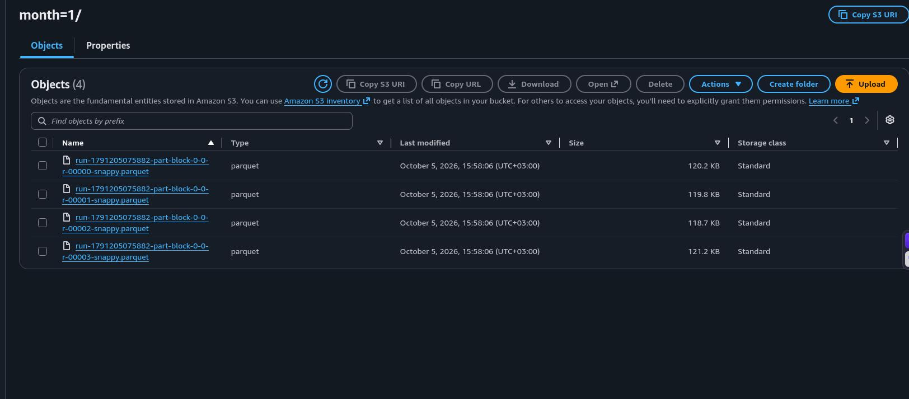

- The `orders_enriched` table should appear under Data Catalog → Tables: Classification `parquet`, Location `s3://retail-datalake-<suffix>/curated/orders_enriched/`.

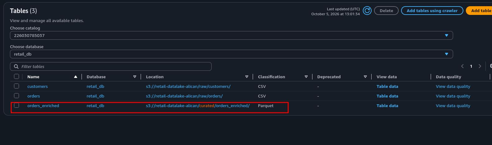

- The table's Schema tab should list 14 columns (`order_id` ... `signup_date`) and, separately, 2 partition keys (`year`, `month`). Partition columns live not inside the data files but in the folder names; that is why they are shown separately in the schema.

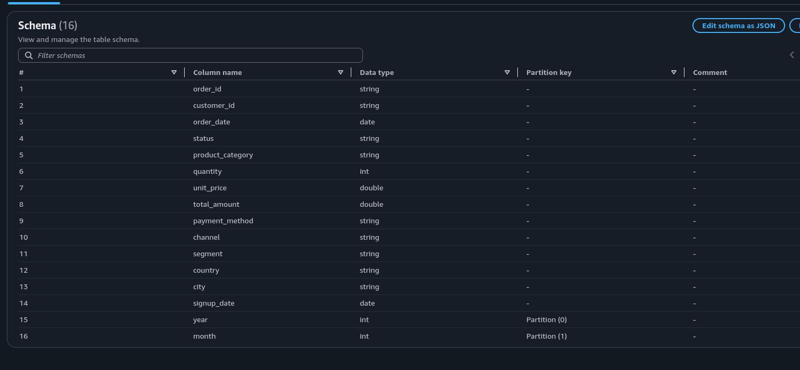

- The table's Partitions tab should show 9 partitions (`year=2026, month=1` ... `month=9`).

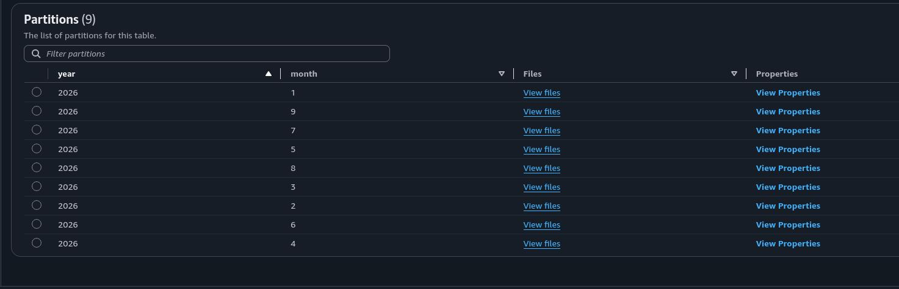

- No temporary files such as `_SUCCESS` or `_temporary` should remain under `curated/orders_enriched/`; the Glue sink leaves it clean.

## 7. Amazon Athena: Curated Layer and Comparison

We run the same queries from section 5 on the curated table and measure two things: the amount of data scanned and the simplicity of the query. With Database `retail_db` selected in the left panel, `orders_enriched` should appear under Tables; refresh the panel if it does not.

### 7.1 Steps

Row count and quality check:

```sql
SELECT
  COUNT(*)                                              AS total_rows,
  COUNT(DISTINCT order_id)                              AS distinct_orders,
  SUM(CASE WHEN quantity < 0 THEN 1 ELSE 0 END)         AS negative_quantity,
  SUM(CASE WHEN status = 'cancelled' THEN 1 ELSE 0 END) AS cancelled
FROM orders_enriched;
```

Expected: `total_rows` = `distinct_orders` (no duplicates), `negative_quantity` 0, `cancelled` 0. The total row count is about 187,000: from 201,000, 1,000 duplicates, ~2,000 negatives, ~10,000 cancellations and ~1,600 orders with no customer or an orphan customer dropped out. Note the Data scanned value; in Parquet, `COUNT(*)` reads only file metadata, so the data scanned is at the KB level.

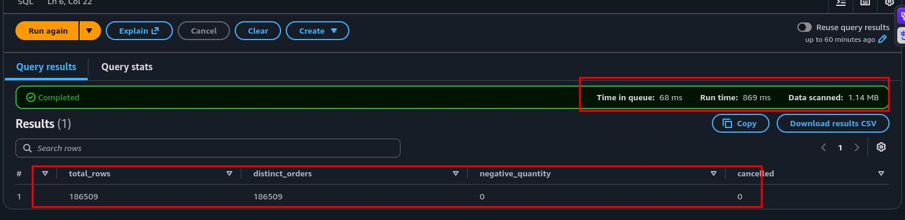

The date is now a real date; no cast:

```sql
SELECT month(order_date) AS m, COUNT(*) AS orders
FROM orders_enriched
GROUP BY 1
ORDER BY 1;
```

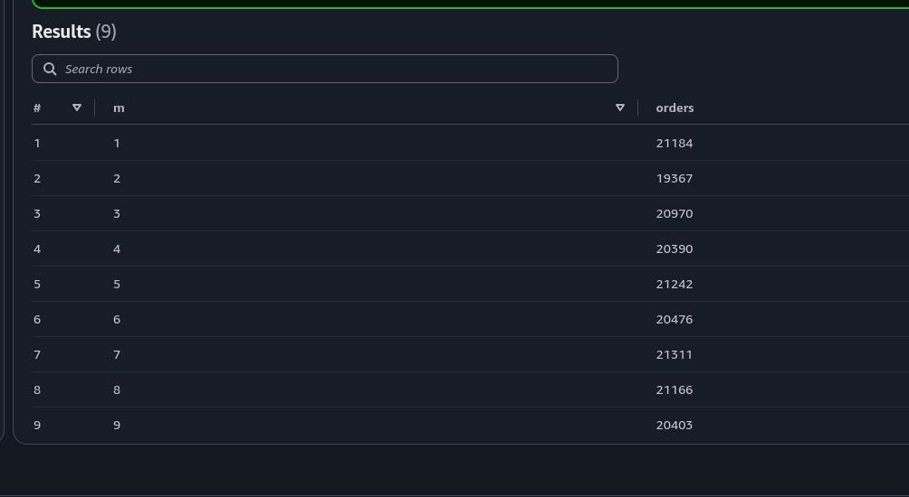

The query that failed in section 5 runs exactly as written.

The curated version of the baseline business query; no join, no cast, no `WHERE`:

```sql
SELECT
  year, month, segment,
  COUNT(*)                   AS orders,
  ROUND(SUM(total_amount), 2) AS revenue
FROM orders_enriched
GROUP BY 1, 2, 3
ORDER BY 1, 2, 3;
```

27 rows. Compare the Data scanned value with the ~14.5 MB from section 5; since Athena reads only the columns that appear in the query (`segment`, `total_amount` and the partition columns), it is typically under 1 MB. This report is now **correct**: cancelled, negative and duplicate records are not included in revenue, and the cleaning rule lives inside the pipeline, not inside the query.

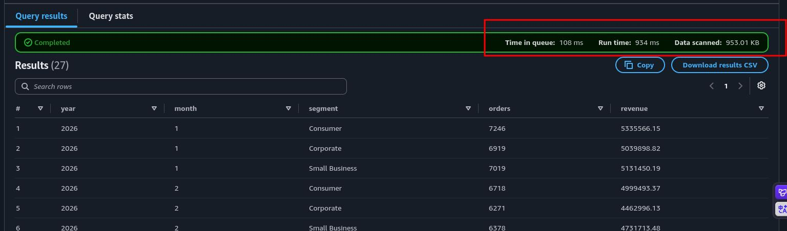

Partition pruning:

```sql
SELECT segment, COUNT(*) AS orders, ROUND(SUM(total_amount), 2) AS revenue
FROM orders_enriched
WHERE year = 2026 AND month = 3
GROUP BY 1;
```

Data scanned should be about one ninth of the previous query: Athena never opened any folder other than `year=2026/month=3/`. If you run the same filter on the raw table with `WHERE order_date LIKE '2026-03%'`, it still scans 14 MB; in CSV the filter is applied after the data is read.

### 7.2 Verification and Comparison

The values measured on the two layers:

| Query | Raw CSV (section 5) | Curated Parquet (section 7) |
|---|---|---|
| `COUNT(*)` | ~14 MB | < 100 KB |
| Monthly revenue / segment | ~14.5 MB, join + cast + wrong result | < 1 MB, plain `GROUP BY`, correct result |
| Single month filter | ~14 MB | ~1/9 of the previous query |
| Quality counters | 1,000 dup, ~2,000 negative, ~10,000 cancelled | 0, 0, 0 |

The ratio is roughly 20 to 50 times; since Athena's bill is proportional to data scanned, the same ratio translates directly into cost. Had the data been 14 GB instead of 14 MB, the difference would have been dollars, not cents.


## 8. Evaluating the Architecture as a Whole

Take a look at the job's Script tab: the 8 nodes on the canvas have turned into a PySpark script of about 100 lines. Every node is a `# Script generated for node ...` block; Filter is a `Filter.apply`, Drop Duplicates a `dropDuplicates`, the SQL node a `sparkSqlQuery`, and the target a `getSink(... enableUpdateCatalog=True, partitionKeys=["year","month"])`. What the visual editor does is not avoiding code but generating it; it leaves the script behind as an artifact the team can understand, version and extend by hand when needed. It is possible to copy the script and open the same job in Script editor mode; from that moment on the canvas is disabled, with no way back.

The shortcomings of the pipeline in its current state, and the next steps:

**Rerunning:** if you run the job once more on the same data, the Glue sink **appends**; a second Parquet file is written under `month=3/` and `COUNT(*)` doubles. Enabling the job bookmark prevents the same S3 file from being processed a second time (the right tool for incremental loads); for a full regeneration you either clean the target partitions before writing (`purge_s3_path`) or move to a table format that supports overwrite, such as Iceberg. An ETL job that is not idempotent does not go to production.

**Triggering:** the job currently runs by hand. Glue's own trigger (a schedule or the completion of another job), EventBridge (when a new file lands in S3) and Step Functions (a validation → job → notification chain) are the three common options.

**The crawler's place:** in this project the crawler was used only for the initial schema discovery; the job itself created the curated table and added its partitions. When a new folder arrives on the raw side each day, the options are a scheduled crawl, an incremental crawl that scans only new folders, or `ALTER TABLE ADD PARTITION` in Athena; each is weighed against the 10 minute minimum bill.

**Data quality:** the Filter node eliminated three known errors; an unknown one (`unit_price = 0`, for example) passes silently. Glue Data Quality adds a rule set to the job (`ColumnValues "unit_price" > 0`) and either stops the job when a rule breaks or writes the result to the catalog; it is the natural second iteration of this project.

## 9. Cleanup

Nothing costs money while idle; but to leave no residue in the account, the deletion order follows the dependencies: job and sessions → crawler and classifier → catalog → S3 (two buckets) → CloudWatch → IAM.

### 9.1 Steps

- AWS Glue → ETL jobs → Interactive Sessions: if there is a session other than `Stopped`, select it → Stop session (if data preview was used).
- ETL jobs → Visual ETL: select `retail-orders-etl` → Actions → Delete job(s) → confirm.
- Data Catalog → Crawlers: select `retail-raw-crawler` → Actions → Delete → confirm.
- Data Catalog → Classifiers: select `csv-with-header` → Delete → confirm.
- Data Catalog → Databases: select `retail_db` → Delete → confirm. Deleting the database deletes the `orders`, `customers` and `orders_enriched` tables inside it together; the data in S3 is not deleted, only the metadata goes.
- S3 → `retail-datalake-<suffix>`: Empty → type `permanently delete` in the confirmation box → Empty. Then return to the bucket list → select the bucket → Delete → type its name → Delete bucket.
- S3 → `aws-glue-assets-<account-id>-eu-central-1`: Glue Studio's bucket for scripts and temporary files; empty and delete it the same way. (If you have other Glue jobs, delete only the `retail-orders-etl.py` file under `scripts/`.)
- CloudWatch → Log management: select the groups `/aws-glue/jobs/output`, `/aws-glue/jobs/error`, `/aws-glue/jobs/logs-v2`, `/aws-glue/crawlers` and those starting with `/aws-glue/sessions/...` → Actions → Delete log group(s) → confirm.
- IAM → Roles: select `AWSGlueServiceRole-retail-etl` → Delete → type its name → Delete. The inline policy is deleted with the role; the managed policy is only detached.
- Athena → Query editor: the query history remains but consumes no resources; since the result location in Settings now points to a bucket that no longer exists, it is set again in the next project.

### 9.2 Verification

- Glue: the Visual ETL, Crawlers, Classifiers and Databases pages are empty.
- S3: neither bucket is in the list.
- No group starting with `/aws-glue/` in CloudWatch Log groups.
- No `AWSGlueServiceRole-retail-etl` in IAM Roles.
- The next day, in Billing → Cost Explorer, the sum of the AWS Glue and Athena lines should stay under 1 dollar: two crawler runs, one failed and one successful job run, and a handful of Athena queries.

## 10. Result

At the end of this project, a working serverless ETL pipeline is running on a personal AWS account, built from scratch on the console with no prebuilt resources. Two raw CSV files assumed to come from an ERP were cataloged with a **Glue Crawler**; a Spark job built in **Glue Studio** without writing code filtered, deduplicated, joined and retyped these tables, wrote them to the curated zone as **Parquet** partitioned by `year/month`, and created the catalog table itself. **Athena** answered the same business question on both layers: on the raw side, a query that scans 14 MB, requires a cast and a join, and gives the wrong result; on the curated side, a query that scans under 1 MB, a plain `GROUP BY` and the correct result.

Beyond the working pipeline, the project makes several concepts concrete that are easy to miss in preconfigured environments:

- **The crawler infers types, it does not check quality:** `quantity` arrived as bigint but contained negative values; `customer_id` arrived as string but contained empties. Schema discovery and data quality are two separate jobs, and the second is always the pipeline's job.
- **Header detection is a heuristic:** `customers.csv`, whose columns are all text, became `col0 ... col6` with the built in classifier. A custom classifier is the solution, but only in a **new** crawler; the crawler remembers what it has already scanned.
- **The cleaning rule lives in the pipeline, not in the query:** to get the correct revenue on the raw layer, every analyst had to exclude the cancellations, negatives and duplicates in their own `WHERE` clause. On the curated layer that rule is applied once, in one place, for everyone.
- **A visual editor is not about avoiding code but about generating it:** eight nodes became a readable, versionable PySpark script of about a hundred lines.
- **Minimum billing shapes the design:** the crawler's 10 minute minimum, the job's 1 minute minimum, the data preview session running idle; all of them are the reason behind the "run once, close immediately" habit.
- **IAM errors surface where the permission is used:** since the crawler only used the read statements, the error in the write statement did not show until the job ran.

The setup costs only cents while it exists and leaves nothing behind after the cleanup; that makes it a repeatable exercise. The same architecture can be extended to incremental loading with job bookmarks, to quality checks with Glue Data Quality rules, or to orchestration with Step Functions, and torn down again at any time.